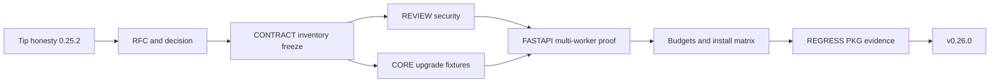

<!-- Generated from docs/ROADMAP.md — edit the docs/ copy, then run scripts/sync_status_roadmap.py -->

# Capability roadmap

Hedron advances through cumulative, capability-driven `0.x` phases. Phase 0.0 is the documentation
and foundation baseline and publishes no package. Each implementation phase `0.N` produces initial
release `v0.N.0`; phase 0.10 therefore produces `v0.10.0`, not a patch of 0.1. Python package
metadata omits the tag prefix. Independently versioned packages may publish a different package
version when the roadmap says so: phase 0.30 remains the Hedron `v0.30.0` train while the first
monorepo-developed `fastapi-workbench` release is `1.0.0`.

Phase numbers describe capability maturity, not calendar commitments or progress toward an
arbitrary stable-version deadline. No Hedron `1.0` phase is scheduled. Patch releases such as `v0.8.1`
remain maintenance releases within their owning phase and do not create new roadmap phases. Scope
may move to a later phase, but an initial release may not claim phase completion with a partially
implemented public contract.

## Release-wide definition of done

Every implementation phase from 0.1 onward—and its corresponding initial release—requires:

- accepted owning RFCs and updated architectural decisions;
- documented and typed public APIs;
- implementation specifications and automated acceptance coverage;
- secure defaults, threat scenarios, and secret redaction;
- applicable accessibility contracts and keyboard behavior;
- performance and payload measurements for new critical paths;
- CLI or Component Explorer visibility for new inference;
- migration notes, examples, and compatibility evidence;
- a working increment of the reference application using packaged-style imports.

## Production-grade package contract (0.26+)

Phases 0.26–0.35—and any later phase using the same label, including 0.42—apply one additional
contract to every publishable distribution in scope. A package is **production-grade for its
declared Supported surface** only when all of the following are true:

- the Supported, Experimental, and excluded surfaces are inventoried; installing the package does
  not silently enable an experimental capability;
- the Supported public API has an explicit stability tier, compatibility window, deprecation path,
  and upgrade test from the previous supported line;
- clean wheel and source installs pass on every advertised Python/platform or language-runtime
  combination, with locked dependency floors/ceilings and import-without-optional-dependencies tests;
- the package has a threat model, adversarial tests for its trust boundaries, secret-redaction
  coverage, dependency/license inventory, SBOM, and release provenance;
- relevant browser, accessibility, performance, concurrency, cancellation, cleanup, and bounded-
  resource evidence is attached to the release gate rather than asserted only in prose;
- operators have configuration, health, diagnostics, rollback, and failure-mode guidance, while an
  independent packaged example exercises the Supported path;
- all package-owned production-grade gates are Verified, with no Deferred row hidden behind the
  package-level maturity claim.

This label is scoped. It does **not** require every experimental backend or namespace to graduate,
does not turn notebook/docs tooling into a public application server, does not promise a commercial
SLA or certification, and does not schedule Hedron `1.0`. Independently versioned distributions may
use their own compatibility-based versions; phase 0.30 therefore publishes `fastapi-workbench`
`1.0.0` without declaring Hedron `1.0`. Experimental surfaces may remain in a clearly named
namespace or extra, but they are excluded from the package-level Supported inventory and may not be
required for a production-grade workflow.

## Phase 0.9 authoring break — HDJ replaces HDN

D-041 makes phase 0.9 an intentional clean break. The HDN parser, evaluator, formatter,
`RenderProgram`, source discovery, build artifacts, CLI/Explorer paths, and public APIs are removed.
There is no compatibility flag, legacy runtime package, dual discovery period, or automated HDN
converter. Applications that need old HDN behavior remain on the 0.8 line and manually rewrite
templates when adopting 0.9.

The replacement is the `hedron-jinja` distribution importing as `hedron_jinja` and the explicit,
versioned `.hdj` source format defined by D-043/RFC-0031. A static feature/capability prologue makes
each template's surface inspectable while the body remains ordinary Jinja/HTML. Typed Python
components remain canonical. Jinja owns trusted template composition; Hedron owns explicit component
bindings, prop/slot validation, rendering, metadata, diagnostics, assets, and framework policy.

## 0.0 — Specification and project foundation (documentation baseline; no package release)

**Outcome:** Hedron has an agreed product definition and an implementation-ready engineering baseline.

### Scope

- Accept the vision, philosophy, design principles, and non-goals.
- Adopt the RFC and architectural decision process.
- Resolve supported Python, FastAPI, Starlette, Pydantic, HTMX, and browser ranges in the compatibility contract.
- Decide the repository, package, namespace, configuration, identifier, and diagnostic-code layouts.
- Accept the RFCs and public contracts required by phases 0.1 and 0.2.
- Define CI, typing, formatting, release, and compatibility policies, and record the pre-publication license decision.
- Establish the canonical specification as the self-contained authority for implementation.

### Exit gate

- All 29 baseline RFCs and their referenced public contracts are Accepted as planned designs; roadmap phases still control availability.
- Decisions D-001 through D-032 are resolved, with no open decision that can materially change the phase 0.1 core architecture.
- Compatibility, project layout, configuration, identifiers, diagnostics, built-ins, and engineering checks are explicit enough to create the package skeleton without inventing public behavior.
- The canonical specification is self-contained and requires no historical source corpus.

## 0.1 — Typed rendering core (`v0.1.0`)

**Outcome:** `hedron-core` can define, validate, compose, and safely render components without FastAPI installed.

### Scope

- Hedron `Model`, `Props`, `FormModel`, `EventPayload`, `Field`, `Secret`, `TrustedHtml`, `SafeUrl`, and `UrlPurpose` types.
- Component protocol, native node algebra, children, slots, fragments, page metadata, and deterministic identity.
- Context-aware HTML serializer with deterministic attribute behavior.
- Framework-neutral render context, `RenderResult`, component registry, diagnostics, and trace stages.
- Initial built-ins sufficient to express semantic pages, forms, layouts, and navigation.
- Unit, snapshot, adversarial escaping, typing, and benchmark foundations.

### Exit gate

- Core tests run with no FastAPI, Flask, Django, or Node.js installation.
- Representative pages and fragments render deterministically and pass the component, security, and accessibility core suites.
- The reference application’s static component tree renders outside an HTTP request.

## 0.2 — Secure FastAPI application MVP (`v0.2.0`)

**Outcome:** Developers can build and test a secure component-oriented FastAPI CRUD application with HTML and HTMX.

### Scope

- `HedronRoute`, `HedronRouter`, thin `Hedron()` application, response classes, and plain-FastAPI `HTML(...)` integration.
- Pages, explicit addressable components, component references, typed actions, automatic forms, and validation fragments.
- Stable and self-targeting component identities, refresh controls, lazy resources, polling, pagination, and infinite-scroll helpers.
- Full-page versus HTMX fragment behavior, safe targets, loading/error/retry states, redirects, out-of-band swaps, `HX-Trigger` events, history policy, and approved HTMX headers.
- FastAPI dependency injection, security, lifespan, middleware, `BackgroundTasks`, `StaticFiles`, dependency overrides, and exception compatibility.
- Typed `SessionState` framework adapter, explicit URL/form state, and documented boundaries between request, session, cache, and browser-local state.
- Contextual security controls, CSRF integration, safe redirects, private authenticated caching defaults, security headers, and route-exposure diagnostics.
- Accurate `text/html` OpenAPI responses, deterministic operation IDs, and `x-hedron-*` metadata.
- Minimal CLI inspection and registry-backed Explorer for routes, components, previews, HTMX inference, and security findings.

### Exit gate

- The authenticated CRUD portion of the reference application works in both `Hedron()` and plain FastAPI router modes.
- FastAPI conformance, security, HTMX, OpenAPI, sync/async endpoint, and dependency-cleanup suites pass.
- A new user reaches a scaffold working page in under five minutes using published
  install instructions (`hedron new` → uvicorn), then extends that same app for HTMX
  and forms.

## 0.3 — Styles, assets, themes, and HDN prototype (`v0.3.0`)

**Outcome:** Developers gain complete presentation control without adding Node.js. The release also
shipped the first HDN prototype; D-039 later reclassified that language/runtime as experimental and
reopened its product premise.

### Scope

- Experimental HDN parser, expression evaluator, render-program compiler/runtime, formatter,
  diagnostics, and source-map prototype.
- `inspect` and `eject` workflows, retained as RFC-0031 migration inputs.
- Scoped CSS AST compiler, typed style symbols, keyframe scoping, explicit globals, variants, cascade layers, and token contracts.
- Theme registration, light/dark **token modes**, accessible tokens, and application override layers
  (system `prefers-color-scheme` and `data-theme` selectors; no first-party toggle UI yet).
- Fingerprinted asset pipeline, component-relative assets, external CSP-compatible bundles, and offline production manifests.
- Component-folder discovery for templates, styles, examples, tests, documentation, and registered browser modules.
- Web Component registration, typed custom-event contracts, light-versus-Shadow-DOM policy, and lifecycle-safe behavior across HTMX swaps.
- Incremental development watching and atomic registry/build replacement.

### Exit gate

- The reference application contains a narrow Python/HDN parity proof; it does not establish a
  complete typed language contract.
- Clean builds are deterministic, production requires no runtime CSS compilation, and strict CSP passes.
- Scoped-style, theme, asset, and build acceptance suites pass. HDN evidence is a prototype snapshot
  governed by the design hold, not a compatibility-protected language gate.

## 0.4 — Developer platform and ecosystem contracts (`v0.4.0`)

**Outcome:** Hedron is inspectable, extensible, and practical for contributors and component-package authors.

### Scope

- Full Component Explorer navigation, component graph and inverse consumers, request simulator, render/HTMX/style/asset traces, examples, and dependency overrides.
- Explorer panels for source, legacy HDN inventory, styles, assets, accessibility, security, performance, async timing, caches, packages, settings, and inference explanations.
- CLI `new`, `dev`, `build`, `check`, `inspect`, `eject`, `components`, `routes`, `graph`, `preview`, and component audit commands.
- Stable text, JSON, and SARIF diagnostics with remediation and suppression policy.
- Pytest helpers, async clients, Syrupy-style snapshots, Playwright browser hooks, axe-style accessibility checks, visual-regression hooks, named examples, and adapter-conformance framework.
- Plugin metadata, deterministic discovery, capability audit, lifecycle, compatibility gates, rollback, and Explorer extension contracts.
- Production build manifests, package component conventions, project scaffolding, and author documentation.

### Exit gate

- Every framework inference introduced through 0.4 has an Explorer or CLI explanation and override.
- A third-party sample package contributes a component, example, style, asset, diagnostic, and Explorer metadata using public contracts.
- Explorer, CLI, plugin, build, testing, accessibility, and production-exposure acceptance suites pass.

## 0.5 — Data application toolkit (`v0.5.0`)

**Outcome:** Hedron can build Streamlit-approachable data tools while retaining normal web application architecture.

### Scope

- Deterministic `Auto()` renderer registry and bounded Data Intelligence inspection.
- `DataTable`, `DataEditor`, typed columns, typed change sets, validation results, and optimistic-concurrency conflicts.
- In-memory and paged sync/async data-source protocols; Narwhals-based optional dataframe normalization.
- `list[dict]`, Hedron-model, Pandas, Polars, and PyArrow inputs without mandatory dataframe dependencies.
- Tabulator-backed Web Component with keyboard editing, virtualization, local pending state, manual batch, row, and cell save modes, insert/delete, and CSV export.
- Structured row/field validation and conflict UX for reload, retain-and-retry, compare, and cancel behaviors.
- Server-authoritative writable-field policy, CSRF, authorization, audit hooks, bounded queries, and private caching.
- `cache_data`, `cache_component`, explicit invalidation tags/versioning, single-flight behavior, scope metadata, and Explorer cache traces.
- `Metric`, `FileUpload`, `DownloadButton`, `CodeViewer`, `JSONViewer`, `Progress`, `Status`, `Toast`, `Expander`, `Tabs`, `Sidebar`, and explicit `Grid` components.
- First-party **light/dark styling controls**: `ColorMode` / theme-mode API, accessible toggle UI,
  preference persistence (cookie/session/local with documented defaults), and explicit override of
  system preference while keeping contrast, forced-colors, and reduced-motion contracts.

### Exit gate

- The reference application securely edits a paged async dataset, handles validation and stale-update conflicts, and demonstrates intelligent rendering and utility components.
- Light/dark styling can be switched from the reference UI without breaking scoped styles or accessibility contracts.
- Forged writes, cache-scope leaks, unsafe uploads/downloads, inaccessible grid behavior, and implicit large-data collection are covered by acceptance tests.

## 0.6 — Visualization and first-party integrations (`v0.6.0`)

**Outcome:** Hedron supports production-quality dashboards and common Python content workflows without bloating the core.

### Scope

- Stable visualization adapter and source contracts.
- Matplotlib static output, Plotly interactive figures, and Altair/Vega-Lite specifications.
- Accessible descriptions, alt text, tabular fallbacks, data/payload limits, local browser runtimes, and strict CSP.
- Markdown, syntax highlighting, image processing, email validation, and trusted sanitizer integration paths.
- Trusted icon and SVG registries with explicit active-content policy.
- SQLAlchemy/SQLModel data adapters and Authlib/FastAPI security conveniences without owning persistence or identity.
- AG Grid Community interoperability and a stable adapter boundary for separately licensed DataEditor backends.
- Explorer visualization, data schema, payload, assets, accessibility, cache, and security panels.
- Compatibility ranges, lazy imports, precise missing-extra guidance, and upstream contract tests.
- HTMX 2 browser conformance for focus, titles, live regions, OOB swaps, history misses, request
  races, error fragments, and custom-element teardown around first-party integrations.
- A shared typed FastAPI/HTMX interaction contract—`HtmxRequest`, `InteractionResult`, and
  `InteractionPolicy` or equivalent—that represents request context, primary content, validated
  targets/swaps, OOB updates, event timing, history changes, status, concurrency, and cache policy
  without hiding the resulting HTML, HTTP status, or `HX-*` headers.
- Semantic HTML response handling for FastAPI validation and common interaction outcomes: 202 job
  acceptance, 204 no-swap events, 401/403 session and authorization states, 409 conflicts, 422
  validation fragments, 429 retry states, and stable 5xx error regions. Ordinary non-HTMX API
  requests retain framework-native JSON behavior.
- Route-declared fragment regions and target-aware rendering with authorization-safe allowlists;
  boosted navigation preserves titles, canonical/history behavior, progressive full-page
  navigation, and declared assets rather than treating every page child as an interchangeable
  fragment.
- Correct page/fragment cache variation and keys (`HX-Request`, history restoration, and
  `HX-Target` only when output varies by target), plus form/search policies for `hx-sync`, disabled
  controls, indicators, `aria-busy`, CSRF, focus restoration, and idempotency where required.
- Explorer interaction debugging for ordinary, boosted, fragment, history-restore, validation,
  conflict, and error requests, including primary/OOB destinations, event timing, history effects,
  asset requirements, cache variation, and the inference/override source.
- Explicit fragment asset/head policy: predeclared shell assets by default, with conformance-gated
  evaluation of pinned `head-support`, Idiomorph, response-targets, and View Transitions where core
  HTMX behavior is insufficient.

### Exit gate

- The complete data-and-chart reference workflow runs offline with locally served assets and no secret-field leakage.
- Initial visualization and content adapters pass security, accessibility, payload, browser-lifecycle, and optional-dependency tests.
- HTMX navigation and swaps do not lose required assets, focus, accessible status, or browser-local
  widget state; any selected extension has pinned local assets and documented fallbacks.
- The reference application demonstrates the typed interaction contract, declared fragment regions,
  semantic 422 validation, a conflict/error path, OOB updates, correctly varied page/fragment
  caching, synchronized submission, and independently navigable boosted URLs.

### Phase 0.6 closure gate

Phase 0.7 implementation does not begin merely because `0.6.0` metadata is internally
consistent. The 0.6 behavioral contracts are dependencies of every later framework adapter and
must first be closed with linked evidence:

- typed interaction headers cannot bypass local-URL, selector, cache, or approved-header policy;
- OOB swap/select behavior, declared fragment-region authorization, target-aware rendering, and
  `private` / `no-store` / target-specific cache behavior pass integration and browser tests;
- chart fallback output and trusted SVG/icon paths pass adversarial active-content tests;
- Plotly and Vega browser runtimes are pinned, fingerprinted, locally served, and exercised offline;
- SQLAlchemy/SQLModel adapters apply bounded query operations rather than collecting an unbounded
  result before paging; and
- every checked 0.6 acceptance requirement names an automated test or immutable evidence artifact.

Unclosed behavior is fixed in the 0.6 maintenance line or explicitly reclassified as experimental;
it is not silently inherited as a portable 0.7 contract.

## 0.7 — Framework adapters and production operations (`v0.7.0`)

**Outcome:** Hedron has a proven portable adapter boundary, capability-accurate framework
integrations, and a documented production operating model.

### Entry gate

- The phase 0.6 closure gate is green.
- Adapter, operations, jobs, and observability acceptance specifications exist with stable IDs and
  named evidence commands.
- Supported Flask, Django, ASGI/WSGI server, cache-backend, and browser ranges are recorded in the
  compatibility matrix before adapter implementation begins.
- Adapter-neutral interaction, URL, asset/build-manifest, session/auth signal, lifecycle, and
  diagnostic contracts have accepted public ownership in `hedron-core`; concrete framework request
  and response objects remain in their adapter packages.
- The Explorer dependency direction is resolved so adapter packages do not acquire FastAPI through
  a required development or runtime dependency.

### Staged delivery

#### 0.7A — Portable adapter foundation

- Move adapter-neutral interaction values and policies out of the FastAPI package boundary while
  keeping raw request, response, session, and dependency objects framework-owned.
- Define protocols for request context, page/fragment selection, safe response headers, URL
  reversal, static/build assets, authenticated-state signals, lifespan resources, and diagnostics.
- Publish a capability matrix that separates the portable baseline from ASGI-only, WSGI-only, and
  framework-specific behavior. Identical rendering and HTTP semantics are required where portable;
  cancellation, dependency injection, validation, lifespan, and background work are capability
  claims rather than fictional parity.
- Restructure Explorer services and adapter bridges to consume sanitized core registry/trace
  contracts without creating circular dependencies.

#### 0.7B — FastAPI production operations

- Container, multi-worker, reverse-proxy/root-path, external static-host, and offline deployment
  proof with deterministic configuration and graceful shutdown.
- Structured async diagnostics, deadlines, cancellation checkpoints, bounded concurrency,
  single-flight backend contracts, and lifecycle-ordered plugin resources.
- A precisely specified `hedron.gather()` and `hedron.run_sync()` contract covering sibling failure,
  partial results, `ContextVar` propagation, thread capacity, cancellation, and CPU-heavy rejection.
- External cache conformance plus logging, traces, health/readiness, cache/job failure reporting,
  component-package audit, and supply-chain operating guidance.

#### 0.7C — Flask adapter

- A separately installable `hedron-flask` distribution using native Flask routing, request context,
  security hooks, CSRF/session integrations, error handling, lifecycle, and `url_for` behavior.
- A native Flask reference slice and shared conformance suite; WSGI limitations are reported in the
  capability matrix rather than hidden behind FastAPI-shaped APIs.

#### 0.7D — Django adapter

- A separately installable `hedron-django` distribution using native URL configuration, middleware,
  CSRF, sessions, forms/validation, async capability, lifecycle, and `reverse` behavior.
- A native Django reference slice, Django QuerySet data-source decision, and shared conformance suite.

#### 0.7E — Jobs and cross-adapter behavior

- FastAPI `BackgroundTasks` helpers remain limited to small post-response work; a pluggable durable
  `JobBackend` contract defines submission, idempotency, authorization/tenant scope, status states,
  retry/failure semantics, retention, cancellation requests, and cleanup.
- A 202 interaction renders an accessible bounded-polling status component, uses `Retry-After`, and
  provides useful non-HTMX behavior without requiring a live transport.
- Cross-adapter HTMX 2 conformance covers supported headers, DELETE query parameters,
  boost/history, 204 and validation/error responses, 3xx header behavior, proxies, and deployment
  prefixes through each framework's request-aware reverse router.

#### 0.7F — Optional transport decision

- Define an independently versioned HTMX extension asset contract with exact versions/digests,
  local serving, CSP declarations, load order, compatibility tests, and Explorer inventory.
- Time-box evaluation of the official SSE extension against bounded polling. SSE adoption is not a
  phase exit requirement; if evidence is insufficient it remains deferred to phase 0.10.
- WebSocket components remain deferred to phase 0.10 unless an accepted RFC demonstrates a genuinely
  bidirectional requirement.

### Exit gate

- Every advertised adapter has an explicit `supported`, `experimental`, or `deferred` stability
  label. Supported adapters pass their declared compatibility, packaging, security, and conformance
  matrices; unfinished adapters do not count toward the phase gate.
- Portable semantics pass once through a shared suite, and every framework capability claim has a
  native test. ASGI/WSGI differences are documented rather than normalized into misleading parity.
- The FastAPI reference application deploys behind a prefixed reverse proxy with multiple workers,
  an external cache and job conformance implementation, and externally hosted static assets.
- Native Flask and Django reference slices prove routing, CSRF/session behavior, validation,
  reverse URLs, assets, and error responses without importing FastAPI.
- Any selected HTMX extension passes offline asset, CSP, authentication, reconnect/cancellation,
  lifecycle, and cross-adapter conformance; removed HTMX 1 attributes remain rejected.
- Adapter, operations, jobs, and observability acceptance ledgers link every completed requirement
  to a test command and evidence artifact; checkbox state alone is insufficient.

## 0.8 — Hardening and compatibility baseline (`v0.8.0`)

**Status:** Published.
**Outcome:** Hedron has explicit stability classifications, a tested compatibility baseline, and
release-quality evidence. The baseline makes later changes deliberate and measurable without
pretending the product is feature-complete.

### Scope

- Public API, registry metadata, plugin protocol, compiled artifact, and rendered-markup stability
  classifications; HDN is explicitly experimental under D-039.
- Enforce the compatibility matrix, versioning rules, numeric deprecation window, upgrade
  tooling, changelog, and migration guides established for the compatibility baseline.
- Complete security threat-model review, dependency and browser-asset audit, accessibility audit, and performance budgets.
- Packaging tests for wheels and source distributions across supported platforms and Python versions.
- Documentation usability testing, error-message review, example verification, and no-Node/offline test path.
- Chromium, Firefox, and WebKit HTMX conformance for history, focus, OOB, races, extension teardown,
  CSP, and reduced motion; pinned core/extension asset and license audit.
- Release tests prove that intermediary and application caches cannot confuse pages, fragments, or
  target-specific variants; the complete interaction-status matrix preserves authorization,
  accessibility, retry semantics, and useful non-HTMX fallbacks.
- Produce an SBOM, dependency and browser-asset vulnerability report, license inventory, build
  provenance/attestation, rollback rehearsal, and immutable acceptance evidence bundle.
- Establish the evidence template later phases use for new capabilities and compatibility changes.

### Exit gate

- The 0.8 evidence index is closed using immutable artifacts tied to the `v0.8.0` source tag.
- No unresolved critical/high security issue, release-blocking accessibility defect, undocumented breaking change, or unowned compatibility failure remains.
- The full reference application is deployable from built distributions in a clean environment.
- Stability labels and migration obligations accurately describe the shipped surface.

## 0.9 — HDJ authoring and HDN removal (`v0.9.0`)

**Status:** Published.
**Outcome:** Hedron replaces its experimental custom template language with the explicit,
versioned `.hdj` format over Jinja/HTML/HTMX, and removes HDN completely rather than carrying a
compatibility subsystem.

### Entry gate

- D-041/D-043 and RFC-0031 define the immediate removal boundary, explicit `.hdj` format,
  standards-first freedom,
  unambiguous component tag grammar, dynamic-value trust policy, capability/CSP separation,
  metadata merging, packaging, and release evidence.
- The core render boundary preserves nested component metadata without making Jinja a core
  dependency or accepting metadata-lossy public HTML strings.

### Scope

- Ship `hedron-jinja` and the `hedron[jinja]` extra without adding Jinja to `hedron-core` or the
  default installation.
- Implement format-v1 `.hdj` prologue parsing, exact allowance-profile expansion,
  declared/inferred capability comparison, `.hdj` loader isolation, static dependency graphs, and
  explicit page/fragment/library composition. Dynamic and foreign dependencies are not 0.9 inputs.
- Implement `TemplateSpec`, `HedronJinja`, explicit inline/body component tags, named slots, typed
  view checks, strict escaping, trusted-content/URL filters, bounded render sessions, and complete
  `RenderResult` metadata merging.
- Preserve static standard Jinja composition and let trusted authors use native HTML, CSS, JavaScript,
  Web Components, and the pinned HTMX attribute/event surface directly. Add typed Hedron bridges
  only for components, assets, routes/security values, metadata, and diagnostics.
- Inventory locally inferable browser capabilities and enforce an explicit application allowlist
  without silently banning author-written source or enabling inline/eval/remote behavior. Full
  SecurityPolicy/CSP reconciliation is phase 0.11.
- Remove HDN source discovery, compiler/runtime/formatter code, format constants, registry fields,
  manifest entries, build output, public exports, CLI/Explorer surfaces, examples, and tests.
- Bump the build-manifest format and coordinated package versions so 0.8 artifacts fail closed.
- Publish manual rewrite guidance only; do not ship an HDN parser or converter in 0.9.

### Exit gate

- No first-party source or runtime package imports, discovers, compiles, loads, runs, or emits HDN.
- `hedron-jinja` passes typed component, slot, escaping, trust-boundary, direct-render, resource,
  metadata, package-isolation, and page/fragment tests.
- Representative HDJ applications prove static Jinja inheritance/macros, component/metadata
  parity, strict dynamic contexts, native markup, and bounded rendering. Browser-backed HTMX
  history/OOB/lifecycle proof is the 0.10 gate.
- Upgrade documentation states the intentional break and identifies 0.8 as the last HDN-capable line.

## 0.10 — Live interaction and navigation (`v0.10.0`)

**Status:** Published. Owned Deferred follow-up `EXPLORER-10-001` remains for `0.10.x`.
`BROWSER-10-001` / `PERF-10-001` were **Superseded** in **0.24** under `polling_only`
([LIVE_DISPOSITION](docs/api/LIVE_DISPOSITION.md)). `EXAMPLES-10-001` is Verified (poll + stream
+ SSE + Job SSE + WS + preload in `examples/live-interaction`).
**Outcome:** Hedron supports evidence-backed live updates, streaming where it materially helps, and
measured navigation preloading while preserving ordinary HTTP/HTML fallbacks.

### Scope

- Official HTMX SSE extension integration with pinned local assets, authenticated reconnect,
  resume semantics, bounded retry, cancellation, CSP, proxy buffering guidance, and Explorer traces.
- WebSocket components only for accepted bidirectional use cases, with authorization, origin,
  backpressure, disconnect, deployment, and accessible fallback contracts. Page/session-scoped
  channels may stream intermediate updates to declared regions, read current values only from
  declared client components, and run bounded persistent producers with authenticated reconnect,
  batching/debounce, disconnect cancellation, resource budgets, and traceable ownership.
- Focused chunked-list and streamed-document primitives; no implicit conversion of every component
  into a streaming lifecycle.
- Timed camera/microphone image and audio input sessions plus chunked audio/video generator output,
  with explicit permission, duration and cadence, codec/bandwidth budgets, backpressure, origin,
  reconnect, cancellation, teardown, and accessible non-streaming fallbacks. Optional WebRTC may
  improve accepted low-latency cases but never becomes an implicit public peer or correctness path.
- `ChatMessage`, `ChatInput`, and bounded generator/token-stream output composed from typed
  transcripts, explicit submit actions, accessible status, optional attachments, and polling/SSE
  fallbacks; chat history and model-provider state remain application-owned.
- `Dialog` / modal interaction with native `<dialog>` fallback, focus trapping and restoration,
  escape/close semantics, background inertness, fragment-addressable content, and no hidden
  application-wide rerun scope.
- Opt-in navigation preload for safe GET requests with cache correctness, bounded speculative
  traffic, privacy controls, cancellation, `HX-Preloaded` observability, and measurable benefit.
- HDJ registered fragment head management, a two-phase template streaming experiment,
  version-aware HTMX attribute/selector semantics, and browser-backed navigation/history/OOB/
  lifecycle validation without weakening atomic `RenderResult` metadata.

### Exit gate

- Polling and ordinary navigation remain supported fallbacks; live/preload behavior never becomes a
  hidden correctness dependency.
- Chromium, Firefox, and WebKit pass auth, reconnect, lifecycle, history, cache, CSP, reduced-motion,
  proxy, and offline asset matrices from published artifacts.
- Load/backpressure tests demonstrate bounded resources, and performance evidence justifies each
  enabled transport or preload policy.

## 0.11 — Native framework depth (`v0.11.0`) — **published**

**Outcome:** Flask and Django integrations feel native beyond their initial routing slices, and the
first-party data boundary supports Django QuerySets without compromising bounded execution or
framework-neutral core ownership.

**Status:** Published as `v0.11.0` (2026-08-04). See [STATUS.md](docs/STATUS.md) and
[acceptance/RELEASE_0_11.md](docs/acceptance/RELEASE_0_11.md).

### Entry gate

- The 0.9 authoring break and 0.10 live-interaction evidence are green.
- Flask/Django ergonomic layers and QuerySet behavior have accepted revisions with explicit
  framework ownership, security boundaries, and capability labels.

### Scope

- Flask Blueprint/application-factory integration and Django reusable-app integration.
- A portable `hedron.testing` adapter harness with a common app-fixture protocol, route lookup,
  session/cookie setup, and response/fragment assertions, implemented by thin FastAPI, Flask, and
  Django adapters. It exposes only guarantees shared by the selected host; native test clients and
  framework-specific assertions remain available rather than being hidden behind a lowest-common-
  denominator facade.
- A bounded Django QuerySet `DataSource` with ordering, filtering, projection, tenant/auth hooks,
  transaction ownership, and query-count diagnostics.
- Django-native form bridging where it reuses portable interaction and error contracts.
- Optional Celery/RQ bridges implementing the existing `JobBackend` contract.
- HDJ finite fingerprinted dynamic-dependency manifests, explicit foreign-Jinja/package namespaces,
  native adapter route/CSRF/context/response facades, SecurityPolicy/CSP reconciliation, and
  CLI/build/Explorer production inventory.
  A loader namespace alone is never accepted as a dependency bound.

### Exit gate

- Flask and Django conveniences remain thin native integrations rather than parallel runtimes.
- QuerySet operations stay lazy and bounded and pass query-count, concurrency, transaction, and
  tenant-isolation evidence.
- The same portable app-fixture scenarios pass against every claimed adapter, while adapter-native
  tests prove host-specific CSRF, session, URL, error, and lifecycle behavior.

## 0.12 — Data and visualization scale (`v0.12.0`) — **published**

**Outcome:** Hedron handles richer editing, distributed/lazy data, and geospatial or high-volume
visualization through bounded, inspectable adapters.

**Status:** Published as `v0.12.0` (2026-08-05). See [STATUS.md](docs/STATUS.md) and
[release-gate-0.12.toml](docs/acceptance/release-gate-0.12.toml) (zero Deferred; D-047).

### Scope

- `hedron.testing.data` contract fixtures for bounded sources, transform plans, editable-grid
  deltas, and chart-event payloads. Builders generate valid boundary cases and explicitly labeled
  adversarial cases; assertions cover stable row/trace identity, authorization context, query and
  payload budgets, cancellation, and accessible fallback metadata without embedding a dataframe
  implementation in the testing package.
- DataEditor formulas, merged cells, richer Excel-formatting compatibility, pivots, tree grids,
  collaborative editing, additional grid adapters, and spreadsheet import/export beyond CSV.
  Grid contracts include saved column/filter/sort/selection views, stable row identities, typed
  cell/edit/selection/viewport/drag/pagination events, and conformance for AG Grid Community's
  client and infinite row models without treating Enterprise-only behavior as an OSS guarantee.
  Drag, fill, resize, reorder, and other spatial operations also expose keyboard and single-pointer
  direct-control alternatives without trapping screen-reader browse/focus modes.
- A typed column-configuration catalog shared by `DataTable` and `DataEditor`, including numeric,
  text, checkbox, select/list, date/time, link, image, progress, and compact chart presentations,
  with explicit display-versus-write policy.
- Dask/distributed data sources, explicit server transform plans, and advanced lazy-query pushdown.
- Beginner `AreaChart`, `BarChart`, and `ScatterChart` components plus direct Vega-Lite,
  PyDeck/deck.gl, GraphViz, and Mermaid adapters; chart selections and events cross a typed,
  authorized interaction boundary rather than exposing raw browser callbacks. Plotly events cover
  hover, click/click-annotation, box/lasso selection, relayout/viewport, restyle/legend, and bounded
  extend/prepend updates with stable trace/point identity, debounce/coalescing, and
  accessible alternatives. Charts and maps provide author-reviewed summaries, detailed
  descriptions, synchronized table/list views, non-color encodings, and equivalent keyboard/direct
  selection paths where the adapter declares interactive selection.
- A backend-neutral chart annotation/overlay contract plus optional Chart.js, Great Tables,
  Sigma.js/NetworkX graph, and Three.js model-viewer adapters. Annotations, selections, model URLs,
  binary formats, and graph layouts remain typed and policy bounded.
- ECharts, Datashader, MapLibre, Folium, Bokeh, HoloViews/hvPlot, Pygal, geospatial layers,
  Plotly resampling, Snowflake-backed bounded sources, and advanced Vega server transforms,
  introduced individually behind optional extras.
- HDJ `hedron.data` and `hedron.charts` provider parity, including bounded high-volume presentation,
  asset/capability manifests, and accessible fallback evidence.

### Exit gate

- No adapter implicitly collects an unbounded source; query/transform plans, limits, cancellation,
  tenant policy, and memory/network budgets are visible in Explorer and testable.
- Editing/import formulas and collaborative changes pass authorization, injection, conflict,
  provenance, and recovery suites.
- Every visualization has accessible fallback/description behavior, local-asset/CSP evidence,
  payload limits, lifecycle cleanup, and an independently justified dependency cost.
- Data/chart adapters run the shared contract fixtures with reproducible boundary and adversarial
  cases; their tests assert semantic event results rather than browser-library internals.

## 0.13 — Advanced async and observability (`v0.13.0`) — **published**

**Outcome:** Applications can prepare component data concurrently and adapt resource use without
introducing a second hidden runtime or losing trace and cancellation semantics.

**Status:** Published as `v0.13.0` (2026-08-05). See [STATUS.md](docs/STATUS.md) and
[release-gate-0.13.toml](docs/acceptance/release-gate-0.13.toml) (zero Deferred for 0.13-owned rows).

### Scope

- Deterministic async test controls for `prepare()` and jobs: a controllable clock, scripted
  dependency outcomes, cancellation/disconnect triggers, and ordered task/trace assertions. These
  utilities test declared lifecycle boundaries and must not replace the host event loop or claim to
  reproduce arbitrary production scheduling.
- Optional component-level async `prepare()` lifecycle with explicit ownership, deadlines,
  cancellation, partial failure, caching, and deterministic render handoff.
- Adaptive concurrency controls driven by measured backend capacity rather than unbounded task
  creation.
- First-party distributed tracing integrations with redaction, sampling, stable span ownership, and
  correlation across HTTP, cache, jobs, data sources, preparation, and rendering.
- HDJ async filter/global I/O declarations, operation budgets, deadlines, cancellation, and trace
  correlation while preserving deterministic final render handoff.
- Optional `SecurityAuditSink` (or equivalent) protocol for framework-boundary security events
  (`csrf_rejected`, `htmx_target_rejected`, `explorer_denied`, `production_gate_failed`, …) with a
  default redacted structured-log sink and no secrets in payloads
  ([#9](https://github.com/eddiethedean/hedron/issues/9)).
- Make Celery/RQ `JobBackend` status and idempotency keys durable across workers (prefer shared
  Redis/queue-backed status), or stop labeling them durable and tighten the production gate and
  What’s ready / Jobs docs to match
  ([#11](https://github.com/eddiethedean/hedron/issues/11)).
- Reconcile live-transport Supported vs experimental labeling: single source of truth in What’s
  ready + STABILITY; `capability_matrix()` and FAQ/upgrade/ADAPTERS/JOBS language match Accepted
  0.24 **`polling_only`** (prior ops IDs `BROWSER-10-001`, `PERF-10-001`, `LIVE-011-BROWSER`
  **Superseded**) while polling remains the Supported production fallback
  ([#13](https://github.com/eddiethedean/hedron/issues/13)).
- Register every emitted `HED-*` code in `hedron_core.codes` with CI failing on unregistered
  codes (`scripts/check_hed_codes.py`). Expanding `error-codes.md` to the full catalog remains
  deferred to 0.17
  ([#15](https://github.com/eddiethedean/hedron/issues/15)).

### Exit gate

- Sync rendering remains the deterministic final stage; disconnects and deadlines cancel owned work
  without leaking tasks or corrupting caches.
- Concurrency/load evidence covers overload, degradation, shutdown, partial failure, and trace
  exporter failure across supported ASGI/WSGI capability boundaries.
- Applications can disable adaptive behavior and tracing without changing component semantics.
- Scenario tests can reproduce deadline, cancellation, partial-failure, overload, and exporter
  failure outcomes without wall-clock sleeps; real-load evidence remains a separate release gate.
- Multi-worker job status is readable across processes when backends claim durability; production
  gate and public maturity labels agree.
- Security audit sinks receive expected event types on CSRF/HTMX/gate failures without leaking
  secrets; live-transport labels do not contradict What’s ready. Full `error-codes.md` expansion
  is owned by 0.17 (#15).

## 0.14 — Portable runtimes and acceleration (`v0.14.0`) — **published**

**Outcome:** Profiling-backed acceleration and cross-language runtimes can participate in Hedron
without fragmenting the component, security, rendering, or artifact contracts.

### Scope

- A versioned, language-neutral conformance-test kit with machine-readable fixtures, golden
  render/diagnostic artifacts, negative cases, and a runner that reports capability-level
  differences. Fixture versioning and normalization rules are public so implementations cannot
  pass merely by matching a particular Python runtime's incidental formatting.
- A language-neutral component specification and conformance fixture format extracted only from
  proven Python contracts.
- Conformance code generation and experimental Java and Node runtimes.
- Optional Rust acceleration for measured parser, serializer, style, or data hot paths, with pure
  Python retained as the semantic reference and supported fallback.
- Optional HDJ Jinja-code-generator instrumentation for exact loop/macro budgets, contracted custom
  extension evidence, scoped-style/validated-attribute helpers, broader contextual analysis, and
  language-neutral checker fixtures. These additions must preserve public Jinja semantics and a
  pure-Python fallback.

### Exit gate

- Cross-language implementations pass the same escaping, identity, diagnostics, artifact-version,
  rendering, accessibility, and adversarial conformance fixtures as Python.
- Native acceleration has reproducible platform wheels, source-build and pure-Python fallback paths,
  memory-safety/fuzz evidence, and benchmarks showing material end-to-end benefit.
- Runtime or accelerator absence never changes public semantics, security policy, or deterministic
  output.
- Every experimental runtime and accelerator is tested through the published conformance kit in
  addition to its native unit tests; failures identify the fixture, contract version, and violated
  capability.

## 0.15 — Data-app surface completeness (`v0.15.0`) — **Published as `v0.15.0`**

**Outcome:** Hedron covers the remaining high-value Streamlit data-app surface — and accepted
NiceGUI-adjacent controls, maps, media delivery, and layout patterns — with typed, request-oriented
controls, media, browser context, identity, and connection ergonomics without adopting whole-script
reruns, Vue/WebSocket outbox mutation, or global mutable application state.

### Entry gate

- The [Streamlit feature cross-check](https://github.com/eddiethedean/hedron/blob/main/docs/STREAMLIT_FEATURE_CROSSCHECK.md) is refreshed against the
  audited Streamlit documentation version and every accepted gap has an owning RFC or an explicit
  revision to an existing RFC.
- The [NiceGUI feature cross-check](https://github.com/eddiethedean/hedron/blob/main/docs/NICEGUI_FEATURE_CROSSCHECK.md) is refreshed against the
  audited NiceGUI documentation/element catalog and every 0.15-accepted gap has an owning RFC or an
  explicit revision to an existing RFC ([RFC-0033](docs/rfcs/RFC-0033-MAP-GEOJSON.md),
  [RFC-0034](docs/rfcs/RFC-0034-MEDIA-DOWNLOAD-RANGE.md),
  [RFC-0035](docs/rfcs/RFC-0035-SURFACE-CHROME.md),
  [RFC-0036](docs/rfcs/RFC-0036-SCENARIO-MARKS.md)). Vue/Quasar outbox, `run_javascript`, implicit
  binding, and SPA `sub_pages` remain deliberate non-parity.
- [RFC-0039](docs/rfcs/RFC-0039-INTERACTION-ERGONOMICS.md) (interaction authoring ergonomics) is
  **Accepted**, or remains Draft only with every open question explicitly resolved or Deferred in
  the RFC before implementation claims Supported ergonomics. Parent-region target inference and
  broader brainstorm items (beginner barrels, `form.invalid` helpers, interaction stories) stay
  out of 0.15 unless folded into a revised RFC-0039 acceptance.
- The 0.10 interaction primitives and 0.12 adapter/column contracts are stable enough that this
  phase composes them instead of creating parallel widget, transport, or data runtimes.

### Scope

- A first-party `hedron.testing.app` scenario harness for high-value application flows: navigate
  registered routes, retain cookies/session state, submit typed controls or declared actions,
  request HTMX fragments, follow explicit redirects, and assert returned HTML, headers, component
  identities, diagnostics, and response mode. Scenarios execute ordinary host HTTP requests and
  use the production renderer; they do not simulate a Streamlit-style whole-script rerun or invent
  browser state not represented by a request.
- First-class `hedron.testing` helpers for HTMX-first apps that compose with the scenario harness
  and portable adapter clients:
  - `InteractionResult` / mutation response asserts for `HX-Redirect`, `HX-Push-Url`,
    `HX-Retarget`/`HX-Reswap`, OOB swaps, and Toast markup
    ([#22](https://github.com/eddiethedean/hedron/issues/22));
  - fragment-client ergonomics (`as_adapter`, target-aware clients, non-200 fragment asserts for
    validation/error HTML)
    ([#23](https://github.com/eddiethedean/hedron/issues/23));
  - Toast markup asserts (Dialog / Tabs / Pagination / Lazy helpers deferred to 0.17
    ([#24](https://github.com/eddiethedean/hedron/issues/24)));
  - fail-closed `FragmentRegion` / `InteractionPolicy` authorization helpers (undeclared
    `HX-Target` rejection and UI-target ⊆ declared-regions coverage)
    ([#25](https://github.com/eddiethedean/hedron/issues/25));
  - shell panel-swap and progressive-enhancement dual-path asserts (fragment without chrome vs
    full document / 303), complementary to the 0.19 progressive-enhancement contract
    ([#26](https://github.com/eddiethedean/hedron/issues/26),
    [#8](https://github.com/eddiethedean/hedron/issues/8)).
- Interaction authoring ergonomics over existing HTMX contracts
  ([RFC-0039](docs/rfcs/RFC-0039-INTERACTION-ERGONOMICS.md)): `app.region` / `@app.fragment` one-liner
  registration, `swap(...)` builders over `InteractionResult`, and dev-gated region-mismatch
  diagnostics plus Explorer “what will this click do?” preview — without weakening fail-closed
  targets, auto-exposing components, or adding implicit widget state.
- Scenario fixtures for authenticated principals, browser-context hints, browser-storage payloads,
  uploads, media/permission outcomes, OIDC callback state, and named connections. Fixtures are
  schema-checked, reset after each test, redact secrets in failures, and make spoofable client data
  explicit to keep authorization tests honest.
- Typed form/control families for number and range input, date/time/datetime input, multiselect,
  toggle/switch, segmented control and pills, color input, rating/feedback, select slider, chip/tag
  input ([RFC-0035](docs/rfcs/RFC-0035-SURFACE-CHROME.md)), and menu button behavior. Native HTML is the
  baseline; browser enhancement preserves submitted-value, validation, keyboard, and no-JavaScript
  semantics.
- `Audio`, `Video`, `PdfViewer`, a responsive image/video `Gallery`, `Carousel` and lightbox
  selection patterns ([RFC-0035](docs/rfcs/RFC-0035-SURFACE-CHROME.md)), and application-logo/page-icon
  helpers plus microphone and camera capture inputs. Media URLs, uploads, ranges, preview,
  selection, authorized download/download-all, lazy loading, autoplay, device permission,
  retention, metadata, typed caption/subtitle and audio-description tracks, transcript/descriptive-
  transcript links, playback controls, live-caption provider hooks, and accessible alternatives
  remain explicit and policy bounded. Automatic captions or descriptions remain author-reviewed
  drafts, not accessibility evidence by themselves.
- Typed download helpers and authorized Range/streaming media responses for players, PDF, and
  file delivery (`Content-Disposition`, size/type limits, authz), complementary to gallery
  download-all ([RFC-0034](docs/rfcs/RFC-0034-MEDIA-DOWNLOAD-RANGE.md)).
- A policy-bounded `Map` / GeoJSON adapter with pinned local assets, CSP, attribution, tile/source
  allowlists, marker/popup events as declared actions, and keyboard/static alternatives
  ([RFC-0033](docs/rfcs/RFC-0033-MAP-GEOJSON.md)). It is not a general Leaflet/Vue runtime and must not
  load arbitrary remote scripts by default.
- Semantic `Timeline`, accessible `ContextMenu` (keyboard and non-pointer alternatives), and
  Progress variants (including circular determinate/indeterminate) composing with existing
  `Progress` / `Skeleton` / `Loading` ([RFC-0035](docs/rfcs/RFC-0035-SURFACE-CHROME.md)).
- `Popover`, sticky/bottom action or chat docks, and semantic spacing primitives, implemented with
  native platform behavior where available and tested for focus order, zoom, reduced motion,
  virtual keyboards, safe-area insets, and fragment swaps.
- Typed clipboard copy, explicit action confirmation, permission-gated geolocation, accessible
  tooltip/help, and directory upload. Clipboard reads remain excluded; confirmation is not
  authorization; geolocation is spoofable and never an authorization factor; directory paths,
  counts, per-file size, total size, and traversal are validated server-side.
- Scenario mark/filter ergonomics for stable component identities (NiceGUI `ElementFilter` /
  `.mark()`-inspired) that compose with `AppScenario` markup asserts without inventing a parallel
  DOM simulator ([RFC-0036](docs/rfcs/RFC-0036-SCENARIO-MARKS.md)).
- `Math` / LaTeX rendering, a bounded object/help inspector, and a sandboxed `IFrame` component with
  local/remote URL, CSP, permissions, referrer, sizing, and untrusted-content policies. Raw trusted
  HTML remains a separate, explicit trust boundary.
- A portable typed `BrowserContext` that separates request-derived headers, cookies, URL, client
  address, and embedding state from browser-reported locale, timezone, color mode, and viewport
  hints. Proxy trust, spoofability, consent, cache variation, SSR defaults, and stale-client-data
  behavior are inspectable.
- A namespaced typed `BrowserStorage` bridge for non-secret local/session preferences, with JSON
  schemas, quotas, expiry, unavailable-storage behavior, consent hooks, and an explicit prohibition
  on treating browser storage as an authentication, authorization, or server-durability boundary.
- Higher-level OIDC login/logout/user-claims conveniences over Authlib and host sessions, including
  provider discovery, nonce/state/PKCE, callback validation, logout, claim normalization, and
  Explorer redaction. Login, MFA, recovery, and reauthentication ergonomics preserve password-
  manager autofill and copy/paste, identify input purpose, and offer a provider-owned path that
  does not require memorization, puzzles, object recognition, or manual transcription. Hedron still
  does not infer authorization or own an identity database.
- Pre-authentication (login) CSRF guidance and optional FastAPI helpers distinct from post-login
  session CSRF, with adapter notes for Flask/Django
  ([#2](https://github.com/eddiethedean/hedron/issues/2)).
- Optional idle and absolute session-timeout helpers or a documented recipe for Starlette sessions
  (created/last-seen stamps, expiry rejection, logout clearing), with an explicit statement that
  signed cookies alone cannot revoke early
  ([#4](https://github.com/eddiethedean/hedron/issues/4)).
- Optional auth-endpoint rate-limit helpers returning `429` with `Retry-After` and documented
  HTML/HTMX error paths, complementary to ingress throttling
  ([#5](https://github.com/eddiethedean/hedron/issues/5)).
- Fail-closed trusted-header identity adapter for identity-aware proxies (allowlisted peer,
  configurable header, no auto-provisioning) for FastAPI with Flask/Django follow-up notes
  ([#7](https://github.com/eddiethedean/hedron/issues/7)).
- Reference-app recipe for rotating refresh sessions and cookie-vs-bearer CSRF split, marked as
  application-owned identity rather than a core IdP
  ([#10](https://github.com/eddiethedean/hedron/issues/10)).
- Auto-wire FastAPI `request.state.hedron_authenticated` (or documented `mark_authenticated`) from
  session/auth helpers so private/no-store cache defaults match Flask/Django `AuthSignal`
  semantics, with explicit anonymous/public override
  ([#16](https://github.com/eddiethedean/hedron/issues/16)).
- A typed resource/connection registry over host dependency injection and lifespan, with named
  configuration, secret-manager hooks, health/reset semantics, scoped reuse, and optional
  SQLAlchemy and Snowflake providers. It does not create a second global service locator, ORM,
  transaction manager, or secret store.
- A maintained Streamlit migration matrix and examples covering controls, media, chat, charts,
  state, authentication, connections, and deliberate non-parity, with diagnostics that point to
  the Hedron request/action equivalent rather than suggesting unsafe call-for-call translation.
- A maintained NiceGUI migration glossary covering control families, storage-tier mapping,
  media/download helpers, maps, and deliberate non-parity (Vue outbox, `run_javascript`, implicit
  binding, SPA `sub_pages`), pointing to Hedron request/action equivalents.

### Exit gate

- Every added control and container passes keyboard, screen-reader, zoom/reflow, forced-colors,
  reduced-motion, fragment-lifecycle, validation-retention, and no-JavaScript fallback suites.
- Capture, media, map, download/Range, iframe, OIDC, browser-context, and connection tests cover
  permission denial, malicious payloads, cross-origin policy, proxy spoofing, secret/claim
  redaction, tenant isolation, cancellation, cleanup, and bounded resource use.
- A reference data/AI application demonstrates typed filters, rich tables, diagrams/maps, chat with
  streamed output, media capture/playback, OIDC identity, and a named data connection while all
  mutations remain explicit actions and ordinary HTTP fallbacks remain usable.
- The scenario harness covers form validation/retention, session and authorization boundaries,
  page-versus-fragment behavior, uploads, browser-context/storage policy, and redirect/error
  contracts. Browser tests remain required for focus, device permission, playback, and enhanced
  client behavior.
- HTMX testing helpers cover InteractionResult headers/OOB/Toast, non-200 fragments, builtin
  markup asserts, FragmentRegion fail-closed checks, and shell panel-swap dual paths
  ([#22](https://github.com/eddiethedean/hedron/issues/22)–[#26](https://github.com/eddiethedean/hedron/issues/26)).
- Interaction authoring ergonomics ([RFC-0039](docs/rfcs/RFC-0039-INTERACTION-ERGONOMICS.md)):
  getting-started guide and `hedron new` scaffold use `app.region` / `@app.fragment` (or the
  documented equivalent) without triple-copying region ids; `swap(...)` is the documented default
  fragment return with `InteractionResult` retained as the advanced envelope; production
  undeclared-target requests remain fail-closed; dev/Explorer paths expose declared vs requested
  targets via stable `HED-*` diagnostics; Explorer can preview method/path/target/swap for a stock
  `RefreshButton.for_region` example; `hedron check` reports at least one target/region mismatch
  class with remediation. No implicit widget state, auto-routed components, or client-callback
  defaults.
- Login CSRF, session timeout, rate-limit, trusted-header, and authenticated-cache helpers have
  tests and guide coverage; the hardened-sessions reference remains labeled application-owned.

## 0.16 — Curated extras and interactive analysis tools (`v0.16.0`)

**Status:** Published as `v0.16.0` (2026-08-06). See [STATUS.md](docs/STATUS.md) and
[acceptance/RELEASE_0_16.md](docs/acceptance/RELEASE_0_16.md).

**Outcome:** Hedron offers a maintained optional toolkit for specialized data-app interactions and
analysis workbenches — including accepted NiceGUI-adjacent editors and specialty extras — without
expanding the core runtime or adopting Streamlit-style rerun semantics or a Vue/WebSocket client.

### Entry gate

- The [streamlit-extras feature cross-check](https://github.com/eddiethedean/hedron/blob/main/docs/STREAMLIT_EXTRAS_FEATURE_CROSSCHECK.md) is
  refreshed against the audited catalog and every accepted extra has an owning RFC revision,
  dependency/asset owner, and explicit first-party-versus-recipe disposition.
- The [NiceGUI feature cross-check](https://github.com/eddiethedean/hedron/blob/main/docs/NICEGUI_FEATURE_CROSSCHECK.md) is refreshed against the
  audited NiceGUI catalog and every 0.16-accepted extra (CodeEditor, calendar/signature/typeahead,
  annotation overlays, optional TerminalView, specialty robotics/IoT) has an owning RFC revision,
  dependency/asset owner, and explicit first-party-versus-recipe disposition
  ([RFC-0037](docs/rfcs/RFC-0037-CODE-EDITOR-EXTRAS.md),
  [RFC-0038](docs/rfcs/RFC-0038-SPECIALTY-EXTRAS.md)).
- The 0.4 plugin/package contracts, 0.12 visualization boundaries, 0.14 portable-runtime evidence,
  and 0.15 control/media/browser/map contracts are stable enough to be reused rather than forked.

### Scope

- Workbench-flow testing helpers that compose `AppScenario` requests with declared interaction
  events and inspect the resulting transform plan, action request, export, and fragment output.
  They provide deterministic fixtures for trees, JSON documents, image regions, and sandbox
  budgets, but never evaluate arbitrary notebook or callable code as part of fixture generation.
- An optional `hedron-extras` distribution with independently installable feature extras, lazy
  imports, pinned local browser assets, capability manifests, precise missing-dependency guidance,
  and conformance tests. It is a curated package over public Hedron contracts, not a privileged
  second component runtime.
- Rich choice and workflow composition: card-based single/multiple choice, avatar/profile recipes,
  a generic selectable `TreeView`, horizontal/vertical `Steps` with explicit action navigation,
  persistent resizable split panes, floating action placement, declared keyboard shortcuts, and
  typed focus/scroll requests by stable component identity.
  All retain semantic controls, focus order, collision handling, non-drag keyboard/single-pointer
  alternatives, and non-JavaScript fallbacks.
- Interactive analysis workbenches: a faceted `DataExplorer` that emits bounded source-transform
  plans, an editable/schema-aware `JSONEditor`, a CSP-safe `CodeEditor` host stub (no pinned CodeMirror 6 bundle)
  distinct from `CodeBlock`/`CodeViewer` with CSP, language allowlists, and no arbitrary eval
  ([RFC-0037](docs/rfcs/RFC-0037-CODE-EDITOR-EXTRAS.md)), a chart/data/export/explore workbench, and a
  typed callable-to-action form adapter. Server authorization, validation, query bounds, side
  effects, and export policy remain explicit.
- Interactive image tools for before/after comparison, normalized rectangular/circular crop bounds,
  box/lasso region selection, and optional annotation/overlay events (NiceGUI interactive-image
  demand) ([RFC-0037](docs/rfcs/RFC-0037-CODE-EDITOR-EXTRAS.md)). Inputs accept only declared
  URL/file/byte sources; orientation, touch/keyboard operation, numeric/step/select-and-place
  alternatives to dragging, output metadata, payload limits, image decoding, and accessible static
  alternatives are part of the contracts.
- Optional calendar, signature-pad, and typeahead/combobox extras or recipes over declared actions
  and fragments, with pinned assets, validation, and no-JavaScript fallbacks where promised
  ([RFC-0037](docs/rfcs/RFC-0037-CODE-EDITOR-EXTRAS.md)).
- Specialized display adapters and recipes for network graphs, 3D models, annotated/token-weighted
  text, architecture-diagram outputs, live job/log consoles, and common link/badge/metric/todo
  compositions. Adapters reuse 0.12 contracts; recipes do not create redundant primitives.
- An optional bounded `TerminalView` / PTY extra only behind explicit command allowlists,
  authentication/authorization, audit, output budgets, and accessibility policy
  ([RFC-0038](docs/rfcs/RFC-0038-SPECIALTY-EXTRAS.md)). It is not a default install and must not imply
  shell access from markup alone.
- Specialty robotics/IoT extras (virtual joystick, deep 3D scene controls, serial/device bridges)
  remain recipe-or-extra with explicit audience labeling ([RFC-0038](docs/rfcs/RFC-0038-SPECIALTY-EXTRAS.md));
  they are not beachhead for CRUD/admin onboarding and must not require a Vue/WebSocket outbox.
- An optional browser-Python/notebook sandbox bridge, such as a pinned JupyterLite/Pyodide runtime,
  isolated from the application origin and server state. Package/network allowlists, CSP, worker
  termination, CPU/memory/output budgets, persistence, accessibility, and offline behavior are
  explicit; arbitrary code never executes in the Hedron server process.
- Optional native-desktop shell recipe (e.g. pywebview over the ASGI app) documented as packaging
  guidance ([RFC-0038](docs/rfcs/RFC-0038-SPECIALTY-EXTRAS.md)), not a second UI runtime or Supported
  multi-window application model.

### Exit gate

- Each shipped extra can be installed and audited independently; absent extras add no core import,
  browser asset, startup, or transitive dependency cost.
- Choice, tree, steps, split-pane, shortcut, editor (JSON/Code), explorer, calendar/signature/
  typeahead, and image tools pass keyboard, screen-reader, touch, zoom/reflow, forced-colors,
  reduced-motion, fragment-lifecycle, and no-JavaScript fallback suites appropriate to the
  component.
- Data, JSON, code-editor, image, graph, model, log, terminal, and sandbox tests cover malicious
  payloads, unauthorized actions, unbounded sources, decompression bombs, remote-origin policy,
  asset integrity, teardown, storage exhaustion, worker termination, and server/session isolation.
- The reference application composes an analysis workbench from the optional package while the
  same domain actions and data sources remain usable through ordinary HTTP and core components.
- Workbench flow tests prove that client selections yield bounded, authorized transform/action
  requests and that each enhanced path retains an ordinary HTTP or static alternative where
  promised.

## 0.17 — Reactive dashboards and agent interfaces (`v0.17.0`)

**Status:** Published as `v0.17.0` (2026-08-06). Spec:
[acceptance/RELEASE_0_17.md](docs/acceptance/RELEASE_0_17.md);
evidence index [acceptance/release-gate-0.17.toml](docs/acceptance/release-gate-0.17.toml).
Owning RFCs: [RFC-0040](docs/rfcs/RFC-0040-INTERACTION-GRAPH.md)–[RFC-0044](docs/rfcs/RFC-0044-SHELL-INTERACTION-RESULT.md).

**Outcome:** Hedron supports cohesive cross-filter dashboards, bounded incremental updates,
server-side notebook previews, and explicitly authorized agent access without adding a universal
client callback runtime or weakening the request/action boundary. HTMX shell authoring primitives
and leftover docs/assert completions ship in the same cut.

### Entry gate

- The [Plotly Dash feature cross-check](https://github.com/eddiethedean/hedron/blob/main/docs/PLOTLY_DASH_FEATURE_CROSSCHECK.md)
  is refreshed for phase 0.17 entry (Dash 4.4.1, Dash AG Grid 35.3.0); every accepted gap cites an
  owning RFC, public stability label (`beta` / `experimental`), and evidence ID.
- The [NiceGUI feature cross-check](https://github.com/eddiethedean/hedron/blob/main/docs/NICEGUI_FEATURE_CROSSCHECK.md)
  binding/timer/refreshable rows are reconciled: accepted dashboard ergonomics map to
  `DashboardBinding` / polling-or-SSE fallbacks ([RFC-0040](docs/rfcs/RFC-0040-INTERACTION-GRAPH.md));
  Vue outbox, implicit element binding, and `run_javascript` remain deliberate non-parity with
  documented migration notes (`MIGRATE-017`).
- RFCs 0040–0044 are Accepted; Zero Deferred for 0.17-owned evidence rows at cut
  (`GRAPH-017`, `PATCH-017`, `XFILTER-017`, `REPLAY-017`, `NOTEBOOK-017`, `MCP-017`, `SHELL-017`,
  `HEDDOC-017`, `ASSERT-017`, `MIGRATE-017`, `REGRESS-017`, `PKG-017`).
- The 0.10 live-transport lifecycle, 0.12 chart/grid event contracts, 0.15 controls and browser
  storage, and 0.16 workbench composition are stable enough to be reused rather than forked.

### Scope

#### Graph (`GRAPH-017`, `REPLAY-017`; [#41](https://github.com/eddiethedean/hedron/issues/41); RFC-0040)

- An interaction-graph test recorder and replay runner that captures declared trigger/action/
  patch exchanges with correlation IDs, redacted payload snapshots, and ordering metadata.
  Replays support explicit stale-result, duplicate-event, disconnect, and patch-conflict schedules
  and assert final regions plus audit/trace output; recordings are contract fixtures, never a way
  to replay privileged production traffic.
- A finite, page-local `DashboardBinding` / `InteractionGraph` layer that declares trigger inputs,
  snapshot-only state, one or more target regions, initialization policy, and chained derived
  bindings. Registration performs missing-dependency, cycle, duplicate-writer, authorization,
  payload, and deterministic-order checks; each edge remains an explicit typed action rather than
  an application-wide rerun or implicit remote API.
- Typed `TriggerContext` and a unified dashboard action lifecycle covering changed inputs,
  component/collection identity, correlation, no-change for all or selected targets, running and
  disabled states, progress, cancellation, errors, redirects/history, debounce/coalescing, stale
  results, and final updates. Side effects, cache policy, and authorization remain declared by the
  underlying action.

#### Patches and collections (`PATCH-017`; [#42](https://github.com/eddiethedean/hedron/issues/42); RFC-0041)

- Versioned, bounded `PropertyPatch` and `CollectionPatch` operations for declared chart, table,
  store, and component state: assign/merge, append/prepend/extend/insert, remove/delete/clear,
  reorder/reverse, and explicitly typed numeric operations. Schema, operation count, payload size,
  version/precondition, target authorization, conflict, rollback, and full-fragment fallback
  behavior are mandatory; arbitrary browser-object mutation is prohibited.
- Stable structured collection identities plus typed map, gather, broadcast, exact-member, and
  ordered-range selectors for repeated/dynamic components. Fragment insertion/removal updates the
  registry safely; selector resolution is inspectable and never substitutes for tenant or object
  authorization.

#### Cross-filter (`XFILTER-017`; RFC-0040 + RFC-0041)

- Cross-filter dashboard composition over Plotly and other 0.12 event adapters, grid selections,
  form controls, URL/session/browser state, data-source transforms, jobs, multi-region results, and
  throttled map viewport (pan/zoom/bounds) events as declared triggers
  ([RFC-0033](docs/rfcs/RFC-0033-MAP-GEOJSON.md) deferred streaming → this composition, not continuous
  pixel WebSocket). Saved dashboard views are explicitly versioned and scoped, and Explorer shows
  the interaction graph with trigger, target, timing, payload, cache, job, transport, and failure
  information.

#### Notebook (`NOTEBOOK-017`; [#43](https://github.com/eddiethedean/hedron/issues/43); RFC-0042)

- A server-side `hedron-notebook` preview helper (optional distribution, D-015) with inline iframe
  and external-link modes, configurable dimensions, proxy/root-path detection, random port/session
  token, error forwarding, clean shutdown, collision handling, and warnings for hosted or publicly
  reachable notebooks. Experimental / Alpha until exit evidence. Distinct from the isolated
  browser-Python/JupyterLite sandbox in 0.16.

#### MCP (`MCP-017`; [#44](https://github.com/eddiethedean/hedron/issues/44); RFC-0043)

- An optional `hedron-mcp` distribution (D-015) using Streamable HTTP. It is disabled and empty by
  default and projects only explicitly opted-in page/component/data resources and typed
  action/function tools. Authentication, authorization, tenant filtering, scopes, read-versus-mutate
  effects, confirmation, schemas, limits, deadlines, cancellation, rate limits, audit/correlation,
  redaction, prompt-injection diagnostics, deployment prefixes, and disconnect behavior are part
  of the contract; MCP never grants authority beyond the authenticated principal. Experimental /
  Alpha until exit evidence.

#### Migration (`MIGRATE-017`; [#45](https://github.com/eddiethedean/hedron/issues/45))

- Maintained Dash migration inventory, coexistence guidance for supported host/framework
  combinations, and diagnostics for layouts, component IDs, callback dependencies, clientside
  code, background work, grid licensing, and state ownership. Tools may generate a review plan but
  never claim automatic semantic conversion of arbitrary callbacks or JavaScript.
- Maintained NiceGUI migration notes covering binding/timer/refreshable → `DashboardBinding` /
  fragment/poll equivalents, storage-tier glossary pointers to 0.15, and explicit non-parity for
  Vue/Quasar outbox, `run_javascript`, and SPA `sub_pages`.

#### Shell DX (`SHELL-017`; RFC-0044)

- Shell and interaction authoring primitives for HTMX in-shell apps: `HtmxLink` / `NavLink`
  ([#28](https://github.com/eddiethedean/hedron/issues/28)), `class_` / theme hooks on content
  builtins ([#29](https://github.com/eddiethedean/hedron/issues/29)), `OobHost` / `AttrHost`
  ([#30](https://github.com/eddiethedean/hedron/issues/30)), `AppShell` / `MainPanel` with a
  document-or-fragment view helper ([#40](https://github.com/eddiethedean/hedron/issues/40)), and a
  stable public `InteractionResult` → Response conversion API that replaces private
  `HedronRoute._convert_interaction_result` use
  ([#35](https://github.com/eddiethedean/hedron/issues/35)).

#### Docs and asserts (`HEDDOC-017`, `ASSERT-017`; RFC-0044)

- Complete the remaining `HED-*` docs half of the diagnostic catalog: expand `error-codes.md` (or
  split by domain) so public docs match `hedron_core.codes`, with CLI/Explorer/SARIF sharing the
  same list ([#15](https://github.com/eddiethedean/hedron/issues/15)).
- Component-aware markup asserts for Dialog, Tabs, Pagination, and Lazy/Loading
  ([#24](https://github.com/eddiethedean/hedron/issues/24)). Toast markup asserts shipped in 0.15
  and are not re-owned by 0.17.

### Exit gate

- Interaction graphs are finite, deterministic, inspectable, and race-tested. Cycles, absent
  required members, ambiguous writers, stale events, unauthorized targets, oversized state, and
  invalid patches fail closed, while ordinary full-fragment HTTP interactions remain functional.
  Evidence: `GRAPH-017`, `PATCH-017`, `XFILTER-017`, `REPLAY-017`.
- Chromium, Firefox, and WebKit pass cross-filter, focus, keyboard, screen-reader, zoom/reflow,
  reconnect, reduced-motion, history, backpressure, patch conflict, dynamic collection, and
  no-JavaScript fallback suites. Multi-worker and tenant tests prove that browser identity or state
  cannot bypass server authorization.
- Notebook preview tests cover proxy prefixes, token leakage, hostile notebook HTML, port reuse,
  server failure, multiple previews, teardown, and hosted-environment warnings. No preview becomes
  a supported production server accidentally (`NOTEBOOK-017`).
- MCP conformance covers discovery, schemas, authentication, authorization, tenant isolation,
  redaction, read/mutate classification, rate and payload limits, cancellation, disconnect,
  adversarial tool inputs, prompt-injection-bearing resources, audit records, and disabled/default-
  empty behavior (`MCP-017`).
- Shell primitives and public `render_interaction` (or equivalent) land with tests (`SHELL-017`);
  `error-codes.md` aligns with the registered catalog (`HEDDOC-017`); Dialog/Tabs/Pagination/Lazy
  asserts land (`ASSERT-017`).
- A reference analytical application demonstrates chart/grid cross-filtering, dynamic repeated
  panels, partial and full-region fallbacks, a cancellable background calculation, a notebook
  preview, and opt-in read-only plus mutating MCP tools over the same explicit domain actions.
- Dashboard graph recordings replay deterministically across supported browsers and workers,
  exercising races, patch conflicts, reconnects, dynamic collections, and authorization failures
  without depending on timing-sensitive sleeps (`REPLAY-017`).
- Migration inventories are published (`MIGRATE-017`); coordinated package verify (`PKG-017`) and
  full regression (`REGRESS-017`) close the cut. Zero Deferred among 0.17-owned gate rows.

## 0.18 — Model demos and inference workflows (`v0.18.0`)

**Status:** Published as `v0.18.0` (2026-08-06). See [STATUS](docs/STATUS.md) and
[release-gate-0.18.toml](docs/acceptance/release-gate-0.18.toml).

**Outcome:** Hedron can turn explicitly registered typed model actions into production-auditable
demos, schedule inference workloads, collect governed evaluation feedback, interoperate with
Gradio endpoints, and compose permissioned visual inference workflows without automatically
publishing arbitrary callables or adding a second application runtime.

### Entry gate

- The [Gradio feature cross-check](https://github.com/eddiethedean/hedron/blob/main/docs/GRADIO_FEATURE_CROSSCHECK.md) is refreshed against the audited
  stable Gradio version, and every accepted gap has an owning RFC revision, public stability label,
  dependency owner, threat model, and evidence plan.
- The 0.7 durable job boundary, 0.10 streaming lifecycle, 0.12 media/visualization adapters, 0.15
  controls/capture/identity/storage, 0.16 workbenches, and 0.17 interaction graph and MCP projection
  are stable enough to be composed rather than forked.

### Scope

- A `ModelDemoScenario` test kit layered on `AppScenario` for versioned examples, typed input and
  artifact fixtures, queue/admission outcomes, streamed progress, cancellation, feedback consent,
  and redaction/retention assertions. It supplies synthetic bounded files and model results only;
  it never loads a real model or treats generated output as trustworthy test data by default.
- An `InferenceInterface` / `ModelDemo` composition layer that builds a reviewable input/result
  surface only from an explicitly registered typed action or callable adapter. Multiple inputs and
  outputs, submit/clear/stop, declared safe live/debounced mode, preprocessing/postprocessing,
  artifacts, descriptions, and component overrides are supported; side effects, authorization,
  rate/resource policy, cache policy, and HTTP/MCP exposure remain independently explicit.
- `ExampleSet` and sample-dataset gallery/table presentation with partial examples, labels,
  provenance, pagination, authorization, and eager/lazy cached results keyed by action/model,
  schema, code, and preprocessing version. Generation cost, invalidation, storage, retention, and
  stale-result behavior are inspectable.
- Demo-oriented `PredictionLabel`, `ParameterViewer`, and multi-speaker `Dialogue` components plus
  media/artifact gallery composition. Ranked scores retain class identity and calibration/precision
  metadata; parameter schemas redact secrets; dialogue uses accessible speaker labels and carries
  diarization/timing metadata without relying on color alone.
- Explicit-consent `PredictionFeedback` and pluggable sinks for rating, label, reason, correction,
  and selected input/output references. Collection notice, tenant scope, redaction, retention and
  deletion, abuse controls, authorization, export, audit, and artifact policy are mandatory;
  feedback is not silently enabled or treated as ground truth.
- An inference execution policy over `JobBackend` with admission control, fair/priority queues,
  bounded queue-position and ETA semantics, named model/resource/GPU concurrency groups, durable
  multi-worker adapters, batch windows and compatible-shape grouping, per-item correlation and
  partial failure, generator/async-generator streaming, progress, cancellation, timeout, retry,
  overload, artifact cleanup, and Explorer timing/resource diagnostics. An in-process queue is
  development-only, not the production durability promise.
- An interaction/API recorder that emits redacted, reviewable Python and HTTP examples only for
  explicitly public endpoints, including file fixtures and session assumptions. A generated
  snippet never expands endpoint authority or records credentials and sensitive values.
- An optional `hedron-gradio` interoperability package for Gradio endpoint discovery, typed
  file/artifact transport, authentication, session state, job status/cancel, and streamed results,
  plus FastAPI coexistence guidance and migration diagnostics for app builders, components,
  events, state, queues/batches, API visibility, raw HTML/JavaScript, file paths, and share links.
  It consumes supported public Gradio protocols and does not embed Gradio's UI runtime in core.
- An optional typed visual inference workflow with versioned JSON, stable node/port identities,
  explicit reference/input, action/model/remote/dataset operator, and artifact/output nodes;
  validation, cycle detection, fan-out/fan-in, parallel scheduling, cancellation, partial failure,
  provenance, and cost/resource diagnostics reuse the same action and inference contracts.
  Read/run/edit/publish permissions, tenant scope, secret references, optimistic conflicts, audit,
  rollback, and immutable published revisions are mandatory. Graph data cannot execute arbitrary
  Python, install packages, access host paths, or automatically create HTTP/MCP endpoints. A
  structured list/outline/table editor exposes nodes, ports, connections, order, parameters, and
  results without requiring a visual canvas or drag gesture.
- Optional Hugging Face model, dataset, Space, OAuth, and ZeroGPU nodes remain vendor adapters over
  the portable workflow contract. Maintained Gradio migration/coexistence examples call out
  deliberate non-parity for mutable globals, default-public event APIs, raw code injection,
  current-directory file exposure, public share tunnels, and deployed host-code-editing modes.

### Exit gate

- Interface generation fails closed for unregistered callables, ambiguous schemas, undeclared side
  effects, missing authorization/resource policy, or accidental API/MCP exposure; equivalent typed
  actions remain usable without the demo layer through ordinary HTTP.
- Examples, cached results, labels, parameters, dialogue, galleries, and feedback pass
  accessibility, consent, provenance, secret/PII redaction, tenant isolation, retention/deletion,
  malicious-file, stale-cache, and cost-control suites.
- Inference scheduling passes multi-worker fairness, capacity, batch isolation, queue rank/ETA,
  overload, generator failure, disconnect/cancel, timeout, retry, resource exhaustion, cleanup,
  and durable-backend failure tests without pinning correctness to one web process.
- Workflow graphs pass schema/version migration, identity, type, cycle, authorization, tenant,
  secret, edit conflict, immutable publish, rollback, parallel/failure, cancellation, remote-call,
  provenance, API-exposure, and arbitrary-code/path adversarial suites.
- Gradio interoperability is contract-tested against the supported upstream range for discovery,
  files, authentication, sessions, status/cancel, streaming, errors, and version mismatch; absence
  of the optional package adds no core dependency, route, asset, or startup cost.
- A reference model application demonstrates examples and governed feedback, ranked/text/media
  outputs, batched streamed inference on a durable backend, a recorded public client call, a remote
  Gradio provider, and an editable-to-immutable published workflow over the same explicit actions.
- Model-demo scenarios cover the corresponding HTTP and job contracts without using real models,
  external credentials, or unbounded artifacts; browser tests remain responsible for enhanced
  media and streaming presentation behavior.

## 0.19 — Accessibility engineering and inclusive authoring (`v0.19.0`)

**Status:** Published as `v0.19.0` (2026-08-07). The current train is **0.36.x**
(last published tip `v0.36.0`).
See [STATUS](docs/STATUS.md) and
[release-gate-0.19.toml](docs/acceptance/release-gate-0.19.toml). Decision: D-050.
Owning RFCs: [RFC-0023](docs/rfcs/RFC-0023-ACCESSIBILITY.md) (umbrella),
[RFC-0051](docs/rfcs/RFC-0051-ACCESSIBILITY-CONTRACT.md)–[RFC-0055](docs/rfcs/RFC-0055-A11Y-GOVERNANCE.md)
(Accepted).

**Outcome:** Hedron makes accessibility obligations, authoring assistance, dynamic interaction
evidence, assistive-technology support, and known limitations inspectable and release-governed
across core and optional packages without claiming that automation or framework markup can certify
an arbitrary application.

### Entry gate

- The [accessibility feature research](https://github.com/eddiethedean/hedron/blob/main/docs/ACCESSIBILITY_FEATURE_RESEARCH.md) is refreshed against
  stable WCAG, HTML, WAI-ARIA, accessible-name, ACT, and ATAG sources. RFC-0023 and RFCs 0051–0055
  define the normative versions, draft/experimental policy, evidence matrix, severity policy,
  waiver governance, and boundaries of any public claim; acceptance checklist
  [RELEASE_0_19.md](docs/acceptance/RELEASE_0_19.md) owns the gate map.
- The component catalog, HDJ authoring, Explorer/testing APIs, themes, data/visualization adapters,
  media/identity controls, extras, dashboards, and inference workflow surfaces through 0.18 are
  stable enough to receive one shared accessibility contract rather than package-specific checklists.
- Gate checker recognizes `0.19` (`python scripts/check_release_gate.py 0.19.0 --allow-planned`).

### Scope

Zero Deferred among 0.19-owned gate rows at cut (same policy as 0.18). Gate IDs:

- **`PROFILE-019`** — Versioned standards profile with WCAG 2.2 A/AA and WAI-ARIA 1.2 as the stable
  baseline, native HTML as the first choice, APG as informative pattern guidance, and explicit
  ACT/engine/browser/AT versions. WAI-ARIA 1.3, WCAG 3, and other drafts remain labeled experiments
  until an accepted baseline revision and interoperability evidence promote them.
- **`CONTRACT-019`** — Machine-readable `AccessibilityContract` catalog for every public registry
  component. A curated `REQUIRED_REVIEWED_CONTRACTS` set ships `reviewed=True` at cut; remaining
  registry names receive unreviewed stubs via `ensure_registry()`. Contracts record native/ARIA
  semantics, keyboard/focus behavior, limitations, and waivers. Composition can add unmet
  obligations; leaf contracts never imply whole-application conformance.
- **`INTERACT-019`** — WCAG 2.2 interaction primitives and conformance cases for focus not obscured
  under sticky/overlay/virtual-keyboard layouts, 24-by-24 CSS-pixel target or spacing policy,
  pointer cancellation, label in name, non-drag single-pointer plus keyboard operation, consistent
  help, redundant-entry support, retained/error/review/undo flows, timeout warning/extension, and
  accessible authentication across login, MFA, recovery, and reauthentication.
- **`ATAG-019`** — ATAG-oriented authoring support across CLI, Explorer, previews, HDJ, inspect/eject,
  generators, templates, examples, transformations, and the workflow editor. Accessibility
  properties are available alongside ordinary properties; accessible choices are at least as
  prominent; metadata survives generation/copy/conversion/optimization; checks locate source and
  explain manual decisions; repair guidance is reversible and author-reviewed; accessibility
  features are on by default and documented. An ATAG conformance claim requires a separate
  applicability report.
- **`EXPLORER-019`** — Explorer accessibility review workspace with standards profile, curated
  reviewed + stub contract table, sample Page structure outline (headings/landmarks via
  `validate_page_structure`), and a review-mode checklist (contrast, target spacing, focus
  obstruction, text spacing, zoom/reflow, reduced motion, forced colors, media/visualization
  fallbacks). Findings distinguish automatic, semi-automatic, and manual status and never
  summarize an empty scan as "accessible." Live browser accessibility trees and live-region event
  logs remain Playwright/`AT-019` evidence rather than an in-Explorer AT tree.
- **`TEST-019`** — Testing APIs for accessibility-tree snapshots and targeted assertions plus an
  `AccessibilityScenario` vocabulary covering keyboard, focus, state/value, announcements,
  pointer/touch alternatives, timeouts, fragments/history, loading/success/error/disconnect, and
  supported open-shadow/same-origin-frame states. Pinned semantic/ARIA validation and axe/ACT-
  aligned scans run after meaningful dynamic states and emit stable JSON/SARIF provenance;
  snapshot changes require review rather than bulk acceptance.
- **`AT-019`** — Automated three-engine (Chromium, Firefox, WebKit) Playwright matrix for
  keyboard-only operation, browser zoom, reduced motion, forced colors / high-contrast where
  automatable, and pinned axe/ACT-aligned scans after representative dynamic states on forms, data
  editor smoke, media, authentication/recovery smoke, dashboard, and inference workflow stubs.
  Records include browser/engine/axe versions, settings, task, result, known issue, and owner.
  Empty scans never summarize as "accessible." Compensated disabled-participant and VoiceOver/
  NVDA/TalkBack manual evaluation is **Deferred → 0.21** (D-050) and does not block Verified
  `AT-019` for `v0.19.0`.
- **`MEDIA-019`** — Media and complex-content authoring helpers: `MediaTrackContract` validates
  caption/subtitle/transcript/audio-description tracks (wired into `Audio`/`Video` track maps),
  plus chart/map accessibility contracts that require alt text or an owned waiver. Full accessible
  player chrome and live-caption provider reviews remain application responsibilities.
- **`COG-019`** — Cognitive and personalization authoring helpers (`CognitivePreferences`, target
  spacing policy) for clear visible labels/instructions, typed help and glossary slots, density and
  text spacing, and user-controlled motion/auto-update/notification intensity. These assist authors
  but do not automatically judge prose clarity or user comprehension.
- **`I18N-019`** — Language/direction and structural validation covering page and passage language,
  bidi isolation, translated label-in-name behavior, localized errors, titles, heading hierarchy,
  landmarks, skip links, reading order, and consistent full-page/fragment navigation. RTL and
  translated variants receive the same reflow, truncation, focus, target, and assistive-technology
  evidence.
- **`GOVERN-019`** — Evidence and governance outputs: rule/version inventory, test and manual
  results, known limitations and alternatives, third-party boundaries, feedback route, waiver
  owner/rationale/affected users/expiry/remediation, and accessibility-statement template data.
  Hedron never automatically emits a WCAG conformance, legal-compliance, certification, or
  ACR/VPAT claim.
- **`PE-019`** — Documented and tested progressive-enhancement contract for forms and mutations:
  no-JS classic POST → full `Page` or redirect; HTMX path remains optional fragment /
  `InteractionResult`; built-ins that stay usable without HTMX are called out in Minimal form /
  Forms and actions ([#8](https://github.com/eddiethedean/hedron/issues/8)).
- **`LANDMARK-019`** — Safe HTML attrs on landmarks / surface components and export of landmark
  helpers as real types (not factory variables)
  ([#27](https://github.com/eddiethedean/hedron/issues/27),
  [#31](https://github.com/eddiethedean/hedron/issues/31)).
- **`SCRIPT-019`** — Allowlisted progressive-enhancement scripts on `Page` (same-origin `SafeUrl`
  asset list; no free-form `<script>` nodes in the component tree)
  ([#39](https://github.com/eddiethedean/hedron/issues/39)).
- **`REGRESS-019`** — Full regression suite at cut.
- **`PKG-019`** — Coordinated package/docs verify (`scripts/verify_pkg_19.py` when implemented).

### Exit gate

- Curated `REQUIRED_REVIEWED_CONTRACTS` components ship reviewed `AccessibilityContract`s;
  remaining registry names have contracts (stubs allowed) with source-linked diagnostics and no
  unowned or expired waiver (`CONTRACT-019`, `GOVERN-019`). Third-party boundaries and untested
  combinations are visible rather than inherited as framework guarantees.
- Chromium, Firefox, and WebKit automation covers representative keyboard, landmark, zoom,
  reduced-motion, and axe scenarios on forms/fragments (`TEST-019`, `INTERACT-019`, `I18N-019`);
  media/cognitive helpers ship as authoring contracts (`MEDIA-019`, `COG-019`). Automatic and
  incomplete/manual findings retain upstream rule versions and cannot be waived by blindly
  regenerating snapshots.
- The published automated AT matrix completes its representative task set with recorded browser/
  engine/axe versions and known limitations (`AT-019`). Human screen-reader and compensated
  user evaluation remain Deferred → 0.21 and do not substitute for or block WCAG-oriented
  automation evidence.
- Accessibility metadata survives full/fragment rendering, inspect/eject, and Explorer review
  surfaces (`ATAG-019`, `EXPLORER-019`, `CONTRACT-019`). Failures preserve safe ordinary-HTML
  alternatives and do not trap input or focus.
- A reference application publishes an evidence inventory and human-approved accessibility
  statement with feedback route, tested environments, known limitations, alternatives, assessment
  method, and date (`GOVERN-019`, `PROFILE-019`), while making no broader claim than the scoped
  evidence supports.
- No-`HX-Request` mutation POSTs succeed through the documented progressive-enhancement path;
  HTMX fragment paths remain covered without making JavaScript mandatory for critical flows
  (`PE-019`, `LANDMARK-019`, `SCRIPT-019`).
- Every 0.19-owned release-gate row is `Verified` (`REGRESS-019`, `PKG-019`).

## 0.20 — Production security floor and adapter parity (`v0.20.0`)

**Status:** **Published** as `v0.20.0` (2026-08-07). See [STATUS](docs/STATUS.md) and
[release-gate-0.20.toml](docs/acceptance/release-gate-0.20.toml). Decision: D-051.
Owning RFCs (Accepted baselines; phase deltas): [RFC-0012](docs/rfcs/RFC-0012-SECURITY.md),
[RFC-0021](docs/rfcs/RFC-0021-BROWSER-RUNTIME.md), [RFC-0028](docs/rfcs/RFC-0028-DEPLOYMENT.md).
Acceptance checklist: [RELEASE_0_20.md](docs/acceptance/RELEASE_0_20.md).

**Outcome:** Post-0.11 host security defaults, deployment helpers, and Flask/Django parity close
remaining correctness and DX gaps without becoming an identity provider or absorbing Deferred
live-browser / load gates. Pluggable CSRF strategies, composable header merge, and `CsrfField`
are **out of scope** here and owned by **0.22** (D-051).

### Entry gate

- Phase 0.19 is Published; accessibility and PE floors
  do not block host-security work.
- Phase 0.11 adapter foundations remain published; deferred live-browser and load gates keep their
  owning destinations (`0.10.x` / `0.11.x`) and are not silently absorbed here.
- Security profiles (`development` / `standard` / `strict`) exist and are stable enough to drive
  shared header application and HTMX hardening on adapters without FastAPI imports in adapter
  packages (`CSP-020` applies profiles; per-header merge remains 0.22).
- Gate checker recognizes `0.20` (`python scripts/check_release_gate.py 0.20.0 --allow-planned`).

### Partial credit (honesty)

Some surfaces already exist on `main`; gates remain `Planned` until issue acceptance criteria and
gate evidence match:

- **#1 / `HTMX-020`:** FastAPI PAGE responses already inject several HTMX meta defaults; profile
  coupling, history/localStorage snapshot policy, and inspectable opt-out still incomplete.
- **#6 / `PROD-020`:** Partial `production_gate` / Explorer-in-production refusal exists; full
  fail-closed insecure-config matrix still incomplete.
- **#12 / `REGION-020`:** `fragment_regions` kwargs exist on Flask/Django routes; starters and
  reference examples still need declared-region truth.
- **#20 / `AUTH-020`:** Flask-Login `AuthSignal` bridge is largely present; gate closes verify,
  docs, and redaction/private-cache evidence.

### Scope

Zero Deferred among 0.20-owned gate rows at cut. Workstreams (dependency order): HTMX/eval floor
and production/mount floor feed adapter parity; scaffolds and wheel smoke follow region/CSP
settlement. Gate IDs:

#### HTMX browser + attribute floor

- **`HTMX-020`** — Documented HTMX browser-runtime hardening preset (part of `standard` /
  `strict`) that disables expression evaluation, response script execution, and
  localStorage/history snapshot persistence for sensitive pages, with inspectable opt-out and
  guide coverage ([#1](https://github.com/eddiethedean/hedron/issues/1)).
- **`EVAL-020`** — Reject `hx-vals` / `hx-headers` `js:` (and equivalent eval forms) on the
  Python `html.*` path by default, with explicit capability opt-in matching HDJ vocabulary;
  defense-in-depth with `HTMX-020` ([#18](https://github.com/eddiethedean/hedron/issues/18)).

#### Production and deployment fail-closed

- **`MOUNT-020`** — Trusted reverse-proxy mount-path helpers: resolve external base from ASGI
  `root_path` and/or allowlisted peer headers, scope session/CSRF cookies with `Path=auto`,
  prefix local redirects / HTMX URLs once, and ignore untrusted forwarded headers by default
  ([#3](https://github.com/eddiethedean/hedron/issues/3)).
- **`PROD-020`** — Production startup gates that fail closed on insecure configuration when
  `HEDRON_ENV=production` (weak/`replace-in-production` secrets, `security="development"`,
  Explorer misuse, optional redirect/CSP risk flags) unless an explicit documented
  risk-acceptance override is set ([#6](https://github.com/eddiethedean/hedron/issues/6)).

#### Adapter parity

- **`REGION-020`** — Flask/Django `fragment_regions` parity with FastAPI (declare regions on
  `hedron_route` / `hedron_view`), updated getting-started and reference apps so real `HX-Target`
  requests succeed, and undeclared targets still 403
  ([#12](https://github.com/eddiethedean/hedron/issues/12)).
- **`CSP-020`** — Apply shared security-profile CSP and related headers for Flask `init_app` /
  after-request and Django middleware/AppConfig, driven without FastAPI imports in adapter
  packages. Applies existing profiles; does **not** invent per-header merge/override (#37 → 0.22)
  ([#14](https://github.com/eddiethedean/hedron/issues/14)).
- **`AUTH-020`** — Flask-Login / `current_user` `AuthSignal` bridge with optional detection,
  fallback to `session["user_id"]`, redaction rules preserved, and private-cache defaults
  following the signal ([#20](https://github.com/eddiethedean/hedron/issues/20)).

#### Adapter DX and CI

- **`SCAFFOLD-020`** — `hedron new --flask` and `--django` scaffolds with secure defaults (env
  secret placeholder, CSRF wiring, one page + fragment with `fragment_regions`, no FastAPI
  dependency in generated pyprojects)
  ([#17](https://github.com/eddiethedean/hedron/issues/17)).
- **`WHEEL-020`** — Extend CI clean-wheel smoke to import `hedron_flask` and `hedron_django`
  (and optionally `hedron_jinja`) and exercise a tiny public API without requiring FastAPI
  ([#19](https://github.com/eddiethedean/hedron/issues/19)).
- **`REGRESS-020`** — Full regression suite at cut.
- **`PKG-020`** — Coordinated package/docs verify (`scripts/verify_pkg_20.py` when implemented).

### Non-goals

- Not an identity provider or managed IdP.
- Does not absorb Deferred live-browser or load/proxy backpressure gates owned by `0.10.x` /
  `0.11.x`.
- Does **not** include pluggable CSRF strategies (#36), composable `SecurityPolicy` header
  merge/override (#37), or `CsrfField` / Form HTMX kwargs (#38) — those are **0.22**.

### Exit gate

- `standard` / `strict` browser HTMX presets and Python `html.*` eval-attribute policy match
  documented security guides; opt-in paths remain inspectable (`HTMX-020`, `EVAL-020`).
- Mount-path helpers and production gates fail closed on untrusted peers / insecure config and ship
  with root vs mounted deployment tests (`MOUNT-020`, `PROD-020`).
- Flask and Django declare fragment regions, emit profile-equivalent security headers, and derive
  authenticated cache signals from Flask-Login when present (`REGION-020`, `CSP-020`, `AUTH-020`).
- Adapter scaffolds run with documented commands; CI fails if adapter wheels are missing or broken
  (`SCAFFOLD-020`, `WHEEL-020`).
- Cross-links from Security, Deployment, Authentication, and getting-started guides stay truthful.
- Every 0.20-owned release-gate row is `Verified` (`REGRESS-020`, `PKG-020`).

## 0.21 — Human assistive-technology evaluation (`v0.21.0`)

**Status:** **Published** as `v0.21.0` (engineering release; owning destination for D-050;
decision **D-052**). Compensated disabled-participant and VoiceOver/NVDA/TalkBack manual
evaluation deferred from `AT-019` / `v0.19.0`. Protocol (`PROTOCOL-021`), regression
(`REGRESS-021`), and packaging (`PKG-021`) are Verified; reference-app task corpus and
`verify_pkg_21` landed. **`SR-021` / `PARTICIPANT-021` / `ARTIFACT-021` / `REMEDIATE-021`
remain Planned** until real sessions — **not Supported**. Tracking:
[#86](https://github.com/eddiethedean/hedron/issues/86) — close when those session gates are
Verified (`check_release_gate.py 0.21.0 --require-sessions`). Engineering publish uses
`check_release_gate.py 0.21.0 --allow-planned`. Owning RFC baseline:
[RFC-0055](docs/rfcs/RFC-0055-A11Y-GOVERNANCE.md)
(amended). Acceptance checklist: [RELEASE_0_21.md](docs/acceptance/RELEASE_0_21.md). Evidence:
[release-gate-0.21.toml](docs/acceptance/release-gate-0.21.toml). Protocol:
[acceptance/human-at/](docs/acceptance/human-at/). What’s new:
[guides/whats-new-0.21.md](docs/guides/whats-new-0.21.md).

**Outcome:** Hedron publishes scoped human assistive-technology and compensated-participant
evidence for the reference application’s critical flows, complements automated `AT-019`
Playwright/axe results, remediates or waives blockers with owners/expiry, and updates the
reference-app evidence inventory and human-approved accessibility statement — without claiming
WCAG conformance, legal compliance, certification, or VPAT/ACR, and without treating one
screen reader as proof for all users.

### Entry gate

- Phases 0.19 and 0.20 are Published (`v0.19.0`, `v0.20.0`); `AT-019` automation remains Verified.
- D-052 Accepted; RFC-0055 human-AT section amended; protocol packet under
  `docs/acceptance/human-at/` present.
- Gate checker recognizes `0.21`
  (`python scripts/check_release_gate.py 0.21.0 --allow-planned`).
- Human-AT packet checker passes (`python scripts/check_human_at_packet.py`).

### Scope

Zero Deferred among 0.21-owned gate rows at cut. Gate IDs:

- **`PROTOCOL-021`** — Written evaluation protocol covering recruitment/compensation, consent,
  accommodations, retention, privacy (git vs private store), severity → waiver/fix path, and
  retest policy ([PROTOCOL.md](docs/acceptance/human-at/PROTOCOL.md),
  [PRIVACY.md](docs/acceptance/human-at/PRIVACY.md)).
- **`SR-021`** — Manual screen-reader matrix on the Verified minimum combos: VoiceOver + Safari
  (macOS); NVDA + Firefox (Windows); TalkBack + Chromium (Android). Each redacted ledger row
  records OS/browser/AT versions, settings, task, result, known issue, owner, and retest date.
- **`PARTICIPANT-021`** — ≥2 compensated disabled-participant sessions with ≥1 screen-reader
  user and ≥1 other disability category (motor, low-vision, or cognitive), against the
  reference-app task corpus
  ([task-scripts.md](docs/acceptance/human-at/task-scripts.md)).
- **`ARTIFACT-021`** — Redacted public evidence ledger validating against
  `ledger.schema.json`; reference-app `EvidenceInventory` / `AccessibilityStatement` updated
  after sessions; raw PII never committed.
- **`REMEDIATE-021`** — Blocker findings fixed or owned `Waiver` with expiry/remediation; empty
  or missing human AT never summarizes as "accessible."
- **`REGRESS-021`** — Full regression suite at cut.
- **`PKG-021`** — Coordinated package/docs verify (`scripts/verify_pkg_21.py` when implemented;
  packet checker + changelog/version gates at cut).

**Verified AT minimum (in scope).** Optional stretch (not gate rows): JAWS, iOS VoiceOver,
NVDA+Chromium second pass, voice/switch lab — may appear as known limitations only.

**Task corpus:** `examples/reference-app` — login, CRUD form (progressive-enhancement POST and
HTMX fragment path), fragment status/refresh, DataEditor smoke.

### Non-goals

- Substituting human AT for `AT-019` automation, or marketing Playwright/axe as human AT sign-off.
- Automatic WCAG / legal / certification / VPAT / ACR claims.
- Expanding Verified matrix to JAWS / iOS VoiceOver / voice-switch as cut blockers.
- CSRF / SecurityPolicy composition (owned by **0.22** / D-051).
- Requiring participant scheduling or hardware procurement to mark engineering prep complete
  (sessions remain a separate Verified-cut step).

### Exit gate

- Protocol packet complete and privacy rules followed (`PROTOCOL-021`).
- Redacted ledger covers Verified SR combos and participant floor for the task corpus
  (`SR-021`, `PARTICIPANT-021`, `ARTIFACT-021`).
- Blockers remediated or waived with owners/expiry; statement and inventory make no broader
  claim than scoped evidence (`REMEDIATE-021`, `GOVERN-019` reuse).
- Every 0.21-owned release-gate row is `Verified` (`REGRESS-021`, `PKG-021`).

## 0.22 — CSRF and SecurityPolicy composition (`v0.22.0`)

**Status:** **Published** as `v0.22.0`. Depends on 0.20 `CSP-020` / production security profiles
so composition builds on applied adapter headers rather than inventing a parallel header path.
Decision: D-051 (split from 0.20). Issues
[#36](https://github.com/eddiethedean/hedron/issues/36)–[#38](https://github.com/eddiethedean/hedron/issues/38)
remain linked for history; **in-repo gates and
[RELEASE_0_22.md](docs/acceptance/RELEASE_0_22.md) are normative.** Contract:
[api/CSRF_COMPOSITION.md](docs/api/CSRF_COMPOSITION.md).

**Outcome:** Apps that own sessions and CSP can plug CSRF strategies without requiring Starlette
cookie sessions, merge/override security headers per name, and use `CsrfField` plus first-class
HTMX kwargs on `Form` without stringly hidden tokens.

### Scope

Zero Deferred among 0.22-owned gate rows at cut. Gate IDs:

- **`CSRF-022`** — Pluggable CSRF strategy protocol in `hedron-core` (validate + optional
  issue/token helpers); default double-submit cookie wrapped as a built-in strategy so named
  profiles stay Compatible; at least one non-Starlette-session strategy for FastAPI; form field
  **or** header accepted; missing/invalid → 403
  ([#36](https://github.com/eddiethedean/hedron/issues/36)).
- **`HEADERS-022`** — Composable `SecurityPolicy` security headers (merge/override per header
  rather than an all-or-nothing `security_headers=False` off-switch); unspecified fields keep
  profile defaults; escape hatch when the host owns all headers; builds on 0.20 `CSP-020`
  applicators (no parallel header path)
  ([#37](https://github.com/eddiethedean/hedron/issues/37)).
- **`FORM-022`** — `CsrfField` wired to the active CSRF strategy, plus first-class HTMX kwargs
  on `Form` so partials stop re-listing hidden tokens and stringly `hx-*` attributes
  ([#38](https://github.com/eddiethedean/hedron/issues/38)).
- **`REGRESS-022`** — Full regression suite at cut.
- **`PKG-022`** — Coordinated package/docs verify at cut (`verify_pkg_22.py`).

### Non-goals

- Absorbing 0.21 human-AT session work (`SR-021` / `PARTICIPANT-021` / …).
- Promoting Alpha charts/notebook/MCP/Gradio or experimental live transports.
- Replacing Django `CsrfViewMiddleware` with Hedron strategies (Django remains host-authoritative
  for validation; `CsrfField` may still render the host token).
- Requiring Flask constructor CSRF kwargs to fully collapse into `SecurityPolicy` (follow-up polish).
- Absorbing themed `Button` (#29) or stable-tier expansion (0.23).

### Exit gate

- Every 0.22-owned release-gate row is `Verified`
  ([release-gate-0.22.toml](docs/acceptance/release-gate-0.22.toml)).
- Security guide, CSRF composition contract, and What’s ready agree on Supported vs Planned claims.

## 0.23 — Stable-tier expansion for Supported CRUD/admin (`v0.23.0`)

**Status:** **Published** as `v0.23.0`. Part of the production-quality maturity program
(**D-053** / [RFC-0056](docs/rfcs/RFC-0056-PRODUCTION-QUALITY.md)). Depends on Published **0.22**;
must not claim 0.21 human AT as API-stable evidence. Locked allowlist + distinct gate
commands below — every 0.23-owned gate is `Verified`.

**Outcome:** The compatibility-protected `stable` tier in
[STABILITY.md](docs/api/STABILITY.md) covers a **narrow curated** Supported CRUD/admin happy path
(beginner facade, regions/`swap`, Poll/job status helpers, security profile ergonomics /
`CsrfField`+`Form`+`Hx`, and related testing helpers) so Beta package maturity no longer
implies unconstrained churn on that primary ship surface. This is **API compatibility
protection**, not a new feature phase and not “every What’s ready Supported row.”

Inventory / facade SSOT for Beginner imports: [STABLE_FACADE.md](docs/api/STABLE_FACADE.md).
Expanded tier: [STABILITY.md](docs/api/STABILITY.md#expanded-stable-tier-023).

### Locked promotion catalog (`STABLE-023`)

Promote **additively** into the stable table (keep the existing minimal tier). Symbols are
capability-Supported today; 0.23 makes them compatibility-protected.

| Bucket | Symbols / contracts | Package / import |
|---|---|---|
| HTMX / regions | `Hedron.region`, `Hedron.fragment`; `FragmentRegion` + router `fragment_regions=`; `swap`, `swap_oob`, `retarget`, `redirect_htmx` | `hedron` |
| Jobs (polling only) | `Poll`; `enqueue_durable`, `job_status_response`; `JobBackend`, `JobStatus`, `JobHandle`, `JobState`, `set_job_backend`, `get_job_backend` | `hedron` / `hedron.jobs` / `hedron_core.jobs` |
| Security / forms | `SecurityPolicy`, `SecurityPolicy.from_name`, profile names `development` / `standard` / `strict`; `SecurityHeadersPolicy`; `CsrfField`, `Form`, `Hx`; `DoubleSubmitCookieCsrf`, `SessionTokenCsrf`, `CsrfStrategy` | `hedron` / `hedron-core` |
| Beginner built-ins | `Stack`, `TextInput`, `TextArea`, `SubmitButton`, `RefreshButton`, `FormErrors`, `FormField`, `Label` | `hedron` |
| Testing | `AppScenario`; `assert_page_document`, `assert_fragment_body`, `assert_htmx_trigger`, `assert_hx_retarget`, `assert_oob_present`, `assert_hx_push_url`, `assert_hx_redirect`, `assert_hx_reswap` | `hedron.testing` |

Already-stable CSRF token helpers, interaction types, `Hedron` / routers, adapter respond
helpers, and portable adapter fixtures remain stable (no change).

### Out of 0.23 (stay `beta` / `experimental`)

| Surface | Why |
|---|---|
| `hedron.experimental` live helpers (`job_status_sse_response`, SSE/WS/stream/preload) | Owned by **0.24** |
| Alpha charts / notebook / MCP / Gradio / `hedron-native` | Non-goal; not root-stable |
| `hedron[data]` / DataEditor, extras toolkit, OIDC product surface | Supported capability OK; not CRUD facade-stable in 0.23 |
| Dialog / Tabs / Pagination / Lazy, Map / media / capture, BrowserStorage | Broader Supported chrome — remain `beta` |
| Dashboard / inference / workflows / InteractionRecorder | Supported capability; API stays `beta` |
| HDJ / Explorer / conformance kit | Optional / dev surfaces |

### Scope

Zero Deferred among 0.23-owned gate rows at cut. Gate IDs and commands (packet refine locked):

- **`STABLE-023`** — `python scripts/check_stable_tier_023.py` — STABILITY expanded-tier
  section matches the locked allowlist; migration notes for boundary adjustments.
- **`FACADE-023`** — `python scripts/check_stable_facade.py` — [STABLE_FACADE.md](docs/api/STABLE_FACADE.md)
  Beginner inventory importable; Alpha / experimental names denied.
- **`INVENTORY-023`** — `python scripts/check_stability_inventory.py` (`FRZ-001` still green).
- **`REGRESS-023`** — `bash scripts/ci_checks.sh test --python 3.12` at cut.
- **`PKG-023`** — `python scripts/verify_pkg_23.py` (packages at `0.23.0`,
  gate checker without `--allow-planned`, focused facade/tier checks).

### Non-goals

- Promoting Alpha charts/notebook/MCP/Gradio or experimental live transports to `stable`.
- Declaring package maturity GA or scheduling `1.0` (D-038 / D-053 optional DoD only).
- Re-implementing CSRF composition (0.22) — **promote** selected symbols only.
- Absorbing live ops disposition (0.24) or archetype/landmines (0.25).
- Promoting every What’s ready Supported row into `stable`.

### Exit gate

- Every 0.23-owned release-gate row is `Verified`
  ([release-gate-0.23.toml](docs/acceptance/release-gate-0.23.toml)).
- Public docs (What’s ready, STABILITY, STABLE_FACADE, production-quality) agree on the
  expanded tier.

## 0.24 — Live-transport production disposition (`v0.24.0`)

**Status:** **Published** as `v0.24.0`. Part of D-053 / RFC-0056. Disposition Accepted:
**`polling_only`** (Disposition B). Packet refine locked dual-path Verified criteria;
cut chose polling as the Supported production story and superseded prior Deferred ops
rows `BROWSER-10-001`, `PERF-10-001`, and `LIVE-011-BROWSER`.

**Outcome:** End the permanent “experimental live transports” fog: either (A) close
multi-engine browser + load/proxy backpressure evidence so SSE/WebSocket can graduate under
documented ops constraints, **or** (B) formally document polling-only as the Supported
production story and keep live helpers experimental without implying an imminent Supported
claim. **Cut Accepted (B).**

Disposition SSOT: [LIVE_DISPOSITION.md](docs/api/LIVE_DISPOSITION.md) ·
[live-disposition-024.toml](docs/acceptance/live-disposition-024.toml).

### Disposition XOR contract (`DECIDE-024`)

Machine value in `docs/acceptance/live-disposition-024.toml`:

| Value | Meaning |
|---|---|
| `undecided` | Packet refine / pre-cut only (allowed with `--allow-undecided`) |
| `prove_ops` | Disposition **A** — ops evidence closes prior Deferred live-ops IDs |
| `polling_only` | Disposition **B** — polling is the Supported production story |

Cut requires exactly one of `prove_ops` | `polling_only`. Do not half-verify both paths.

### Locked Verified criteria (per gate)

| Gate | Verified under A (`prove_ops`) | Verified under B (`polling_only`) |
|---|---|---|
| `DECIDE-024` | Disposition TOML is `prove_ops`; What’s ready / STABILITY / LIVE_DISPOSITION label live helpers Supported-with-ops-constraints | Disposition TOML is `polling_only`; live helpers remain experimental; polling Supported |
| `BROWSER-024` | Multi-engine FastAPI (+ agreed adapter depth) live browser evidence closes or supersedes `BROWSER-10-001` / `LIVE-011-BROWSER` | Formal waive/supersede ledger for those IDs pointing at polling-only + terminal owner notes |
| `PERF-024` | Load/proxy backpressure evidence closes `PERF-10-001` | Waive/supersede ledger consistent with `DECIDE-024` |
| `DOCS-024` | Adopter docs + `live_claims` agree with Supported live (forbidden-phrase set updated) | Adopter docs + existing claim honesty keep forbidding unqualified Supported live |
| `REGRESS-024` / `PKG-024` | Full suite + `verify_pkg_24.py` | Same |

### Scope (locked gate commands)

Zero Deferred among 0.24-owned gate rows at cut. Gate IDs and commands (packet refine locked):

- **`DECIDE-024`** — `python scripts/check_live_disposition_024.py` — schema + XOR; refine uses
  `--allow-undecided`; cut requires `prove_ops` or `polling_only` and SSOT label agreement.
- **`BROWSER-024`** — `python scripts/check_browser_024.py` — evidence path **or**
  [waive-browser-024.toml](docs/acceptance/waive-browser-024.toml) consistent with disposition.
- **`PERF-024`** — `python scripts/check_perf_024.py` — evidence path **or**
  [waive-perf-024.toml](docs/acceptance/waive-perf-024.toml) consistent with disposition.
- **`DOCS-024`** — `python scripts/check_docs_024.py` — train-pin SSOT + live-claim honesty.
- **`REGRESS-024`** — `bash scripts/ci_checks.sh test --python 3.12` at cut.
- **`PKG-024`** — `python scripts/verify_pkg_24.py` (gate checker without `--allow-planned` at cut;
  at that cut, the train version was `0.24.0`).

### Out of 0.24

| Surface | Why |
|---|---|
| Production archetype / load budgets / extras quarantine / charts graduation | Owned by **0.25** |
| Alpha charts / notebook / MCP / Gradio / `hedron-native` | Non-goal |
| Human AT sessions (`SR-021` / `PARTICIPANT-021` / …) | Remain 0.21 P0; not live-transport disposition |
| `EXPLORER-10-001` (Explorer live traces) | Stays Deferred on **`0.10.x`** — not re-homed to 0.24 |
| Deleting experimental APIs solely to look “done” | Requires a disposition first |

### Non-goals

- Requiring Flask/Django official HTMX SSE parity as a cut blocker when disposition B is chosen.
- Removing experimental APIs from the tree solely to look “done” without a disposition.
- Absorbing `EXPLORER-10-001` or 0.25 archetype/landmine work.
- Re-opening the `prove_ops` vs `polling_only` XOR after cut Accepted `polling_only`.

### Exit gate

- Every 0.24-owned row Verified
  ([release-gate-0.24.toml](docs/acceptance/release-gate-0.24.toml)).
- Prior Deferred live-ops IDs (`BROWSER-10-001`, `PERF-10-001`, `LIVE-011-BROWSER`) have a
  terminal owner note (Verified, waived, or superseded).

## 0.25 — Production archetype and landmine quarantine (`v0.25.0`)

**Status:** **Published** as `v0.25.0`. Part of D-053 / RFC-0056. Product/ops track after trust and
stability packets. Cut Accepted extras disposition **`quarantine`**; every 0.25-owned row is
**Verified**.

**Outcome:** `examples/reference-app` is the canonical multi-worker production archetype;
load/perf budgets have CI (or immutable artifact) evidence for critical paths; specialty
extras landmines are quarantined behind `hedron[experimental-ui]`; Matplotlib remains the
conservative charts default with a written graduation path for Plotly/Altair; RELEASE requires
SBOM/evidence attach on train tags.

Packet SSOT: [PRODUCTION_ARCHETYPE.md](docs/api/PRODUCTION_ARCHETYPE.md) ·
[extras-quarantine-025.toml](docs/acceptance/extras-quarantine-025.toml) ·
[PERFORMANCE_BUDGETS.md](docs/PERFORMANCE_BUDGETS.md) (§0.25 workloads).

### Extras quarantine XOR (`EXTRAS-025`)

Machine value in `docs/acceptance/extras-quarantine-025.toml`:

| Value | Meaning |
|---|---|
| `undecided` | Packet refine / pre-cut only (allowed with `--allow-undecided`) |
| `quarantine` | Move CodeEditor / TerminalView / joystick+device behind a clearly named experimental extra so `hedron[extras]` does not imply product UI |
| `finish_supported` | Reach Supported with evidence for those landmines |

Cut requires exactly one of `quarantine` | `finish_supported`. Do not half-verify both paths.
**Cut Accepted `quarantine`.**

### Locked Verified criteria (per gate)

| Gate | Verified means |
|---|---|
| `ARCHETYPE-025` | `examples/reference-app` documented as canonical deploy archetype covering reverse-proxy subpath, Redis job/cache, sticky sessions **or** external session store, `HEDRON_ENV=production` + CSP, Explorer off, multi-worker notes; production-quality and production-readiness guides link it |
| `BUDGET-025` | Runnable evidence (CI or immutable artifact) against [PERFORMANCE_BUDGETS.md](docs/PERFORMANCE_BUDGETS.md) for `W-025-FRAGMENT`, `W-025-JOB-POLL`, and `W-025-DATAEDITOR` |
| `EXTRAS-025` | Quarantine TOML is `quarantine` **or** `finish_supported`; SSOT + What’s ready agree; `hedron[extras]` honesty matches the chosen path |
| `CHARTS-025` | Matplotlib-default Supported path documented; Plotly/Altair remain experimental until pins + CSP + a11y match the DataTable bar (graduation checklist present; full Plotly graduation not required) |
| `SUPPLY-025` | [RELEASE.md](docs/RELEASE.md) requires SBOM/evidence-bundle attach on train tags; regenerate instructions remain in the Evidence pack |
| `REGRESS-025` / `PKG-025` | Full suite + `verify_pkg_25.py` at cut |

### Scope (locked gate commands)

Zero Deferred among 0.25-owned gate rows at cut. Gate IDs and commands (cut Verified):

- **`ARCHETYPE-025`** — `python scripts/check_archetype_025.py` — SSOT + ingredient checklist;
  cut omits `--allow-draft` when docs and guide links are complete.
- **`BUDGET-025`** — `python scripts/check_budget_025.py` — three §0.25 workloads named;
  cut requires CI or immutable evidence paths.
- **`EXTRAS-025`** — `python scripts/check_extras_025.py` — schema + XOR; cut requires
  `quarantine` or `finish_supported` and SSOT agreement (**Accepted `quarantine`**).
- **`CHARTS-025`** — `python scripts/check_charts_025.py` — Matplotlib-default + Plotly/Altair
  experimental honesty + graduation checklist.
- **`SUPPLY-025`** — `python scripts/check_supply_025.py` — RELEASE runbook SBOM/evidence
  attach requirement.
- **`REGRESS-025`** — `bash scripts/ci_checks.sh test --python 3.12` at cut.
- **`PKG-025`** — `python scripts/verify_pkg_25.py` (gate checker without `--allow-planned` at
  cut; at that cut, the train version was `0.25.0`).

### Out of 0.25

| Surface | Why |
|---|---|
| Hosted SaaS or managed IdP built on reference-app | Non-goal |
| SLSA commercial attestation claims | Non-goal |
| Finishing every specialty widget when quarantine wins | Quarantine satisfies `EXTRAS-025` |
| External security review + undated `1.0` DoD | D-053 **P3** process / optional; not a 0.25 gate |
| Human AT sessions (`SR-021` / `PARTICIPANT-021` / …) | Remain 0.21 P0 |
| Alpha notebook / MCP / Gradio / `hedron-native` maturity | Non-goal for this packet |
| Re-litigating live SSE/WS Supported claim | Closed in **0.24** as `polling_only` |

### Non-goals

- Turning reference-app into a hosted SaaS or managed IdP.
- SLSA commercial attestation claims.
- Finishing every specialty widget in one cut when quarantine satisfies `EXTRAS-025`.
- Re-opening the `quarantine` vs `finish_supported` XOR after cut Accepted `quarantine`.
- Promoting Plotly/Altair to Supported without DataTable-bar evidence.

### Exit gate

- Every 0.25-owned row Verified
  ([release-gate-0.25.toml](docs/acceptance/release-gate-0.25.toml)).
- Public production-quality and production-readiness guides link the archetype.

## 0.26 — Production-grade core and FastAPI flagship (`v0.26.0`)

**Status:** Published as `v0.26.0` (2026-08-10). First package-graduation phase under the
production-grade contract above. **Baseline train:** Published **`v0.25.2`**. Owning RFC:
[RFC-0057](docs/rfcs/RFC-0057-PRODUCTION-GRADE-CORE.md); decision: **D-054**.

**Outcome:** `hedron-core`, `hedron`, and `hedron-explorer` are production-grade for the documented
server-rendered CRUD/admin Supported surface. Beta package maturity today is **not** the
production-grade label; 0.26 is the graduation that earns that label for the declared inventory
only. The main FastAPI path has an independently reviewed security boundary, upgrade evidence from
`v0.25.2`, multi-worker operational proof, and a compatibility-protected public inventory without
promoting experimental live transports.

### Package dispositions

| Package | Production-grade scope at exit |
|---|---|
| `hedron-core` | Models, components, renderer, registry, security/interaction contracts, polling jobs, cache contracts, and stable facade |
| `hedron` | FastAPI pages/components/actions, CSRF/security profiles, build assets, polling status, CLI/scaffolds, testing helpers, and production startup gates |
| `hedron-explorer` | Development mode plus authenticated/authorized secured inspection; never public-by-default and never required at runtime |

### Entry criteria

- Tip/SSOT honesty for Published **`0.25.2`** is done (STATUS / RELEASE / adopter tip hubs).
- Owning RFC and architectural decision are **Accepted** for applying the production-grade contract
  to these three packages.
- A machine-readable inventory draft exists (Supported vs Experimental vs excluded), aligned with
  [STABILITY.md](docs/api/STABILITY.md) / stable-facade scripts, without promoting experimental live APIs.
- An upgrade-fixture plan from **`v0.25.2`** serialized identities, diagnostics, manifests, and HTMX
  interaction results is sketched.

### Sequenced scope

1. **Inventory freeze (`CONTRACT-026`)** — Supported / Experimental / excluded for the three
   packages; docs and package metadata agree; no silent experimental enablement on install.
2. **Upgrade fixtures (`CORE-026`)** — golden tests from **`v0.25.2`** serialized identities,
   diagnostics, manifests, and HTMX interaction results.
3. **Independent security review (`REVIEW-026`)** — escaping/trusted types, fragment/OOB
   authorization, CSRF/session composition, build/static serving, plugin discovery, job
   observation, and Explorer exposure; critical/high fixed; other findings owned and time-bound;
   redacted report in the evidence bundle.
4. **Operational proof (`FASTAPI-026` / `EXPLORER-026`)** — multi-worker + Redis job/cache +
   reverse-proxy mount + shutdown/rollback + production assets; Explorer secured-mode authz /
   audit / CSP / payload / browser refusal for unsafe production exposure.
5. **Budgets + install matrix** — enforced latency / allocation / payload / startup / job-poll
   budgets; Python 3.11–3.14 and pinned FastAPI/Pydantic; minimum-dependency and offline-wheel
   smoke.
6. **Release packet (`REGRESS-026` / `PKG-026`)** — full suite, wheel/sdist matrix, SBOM /
   provenance, upgrade rehearsal, and a `verify_pkg_26`-shaped verifier (planned artifact).

Acceptance packet shape (planned; open like 0.25 — do not invent full gate implementation here):

- [docs/acceptance/RELEASE_0_26.md](docs/acceptance/RELEASE_0_26.md) (planned)
- [docs/acceptance/release-gate-0.26.toml](docs/acceptance/release-gate-0.26.toml) (planned)
- `scripts/verify_pkg_26.py` (planned)

### Prep backlog (not exit gates)

Post-`0.25.2` quality follow-ups that must not inflate Supported claims:

- Move toward enabling Ruff `BLE001` with a documented noqa policy.
- Reduce pyright `reportUnknown*` warnings on Beta hubs incrementally.
- Surgical Explorer / CLI / jinja complexity reductions only where they unblock inventory or
  reviewability.

### Locked exit evidence

| Gate | Verified means |
|---|---|
| `CONTRACT-026` | Production-grade contract and machine-readable Supported/Experimental inventories agree with public docs and package metadata |
| `CORE-026` | Renderer/model/registry stable inventory, adversarial corpus, determinism, resource budgets, and **`v0.25.2`** upgrade fixtures pass |
| `FASTAPI-026` | Reference app passes multi-worker, proxy, assets, CSRF, job/cache, lifecycle, rollback, and minimum-dependency matrices |
| `EXPLORER-026` | Secured mode has authz, audit, CSP, payload, and accidental-production-exposure browser evidence |
| `REVIEW-026` | Independent security report is attached in redacted form; critical/high findings are fixed and other findings have owners and deadlines |
| `REGRESS-026` / `PKG-026` | Full suite, wheel/sdist/install matrix, SBOM/provenance, upgrade rehearsal, and planned `scripts/verify_pkg_26.py` pass |

### Non-goals

- Promoting SSE, WebSocket, focused streaming, or preload from the 0.24 `polling_only` disposition.
- Claiming that every `hedron-core` Beta/experimental symbol is stable.
- Making Explorer an unauthenticated production endpoint.
- Scheduling `1.0`, promising an SLA, or making a compliance/certification claim.

### Exit gate

- Every 0.26-owned gate row is Verified with immutable or CI-linked evidence.
- Package metadata and adopter docs use the production-grade label only for the declared Supported
  inventory; all exclusions remain conspicuous.

## 0.27 — Production-grade adapters, data, authoring, and curated UI (`v0.27.0`)

**Status:** Published as `v0.27.0` (2026-08-10). Second package-graduation phase under the
production-grade contract above. **Baseline train:** Published **`v0.26.0`**. Owning RFC:
[RFC-0058](docs/rfcs/RFC-0058-PRODUCTION-GRADE-SATELLITES.md); decision: **D-055**.

**Outcome:** The supported Python satellite train—`hedron-data`, `hedron-flask`, `hedron-django`,
`hedron-jinja`, and `hedron-extras`—is production-grade for explicitly bounded workflows. Each
package installs and upgrades independently, and optional integrations cannot weaken host security
or core rendering guarantees. Beta package maturity today is **not** the production-grade label;
0.27 is the graduation that earns that label for the declared inventory only.

### Package dispositions

| Package | Production-grade scope at exit |
|---|---|
| `hedron-data` | Bounded DataTable/DataEditor CRUD, supported in-memory/dataframe/SQL/Django sources, saved views, and documented spreadsheet paths |
| `hedron-flask` | Native Flask pages/fragments/actions, host-owned sessions/CSRF/auth, polling jobs, scaffolds, and deployment integration |
| `hedron-django` | Native Django responses/views/middleware/forms, bounded QuerySet source, polling jobs, system checks, and deployment integration |
| `hedron-jinja` | Trusted `.hdj` v1 authoring, strict sink analysis, manifests/assets, component bindings, async preparation, and host integration |
| `hedron-extras` | Curated default extra only; `experimental-ui` remains separately named and outside the production-grade Supported inventory |

### Entry criteria

- Tip/SSOT honesty for Published **`0.26.0`** is done (STATUS / RELEASE / adopter tip hubs).
- Owning RFC and architectural decision are **Accepted** for applying the production-grade contract
  to these five packages (RFC-0058 / D-055).
- A machine-readable inventory draft exists (Supported vs Experimental vs excluded), aligned with
  public docs and package metadata, without promoting experimental live APIs or specialty UI.
- An upgrade-fixture plan from **`v0.26.0`** data/adapter/HDJ/extras public contracts is sketched.

### Sequenced scope

```mermaid
flowchart LR
  tip[Tip honesty 0.26.0] --> rfc[RFC and decision]
  rfc --> inventory[Inventory freeze]
  inventory --> upgrade[Upgrade fixtures]
  upgrade --> hosts[Host-only installs]
  hosts --> parity[PARITY portable]
  parity --> packages[Per-package evidence]
  packages --> packet[REGRESS PKG evidence]
  packet --> cut[v0.28.2]
```

1. **Inventory freeze** — Supported / Experimental / excluded for the five packages; docs and
   package metadata agree; no silent experimental-ui or live-transport enablement on default
   install ([production-grade-inventory-027.toml](docs/acceptance/production-grade-inventory-027.toml)).
2. **Upgrade fixtures** — golden tests from **`v0.26.0`** data/adapter/HDJ/extras public contracts
   under `tests/upgrade/` ([upgrade-fixtures-027.md](docs/acceptance/upgrade-fixtures-027.md)).
3. **Host-only install matrices** — each adapter and satellite builds, installs, imports, and
   exercises its reference example without FastAPI or unrelated optional integrations installed.
4. **Portable parity (`PARITY-027`)** — PAGE/FRAGMENT selection, target/OOB authorization, security
   headers, CSRF composition, URL reversal under mounts, status responses, and error semantics
   produce equivalent Supported outcomes across FastAPI, Flask, and Django (extend
   `tests/conformance/`).
5. **Per-package operational / browser / a11y / CSP / budget evidence** —
   - `DATA-027`: bounded query/write/export matrices, multi-worker concurrency, cleanup, payload
     budgets, and DataTable/DataEditor browser coverage.
   - `FLASK-027` / `DJANGO-027`: native security, lifecycle, proxy, polling, scaffold, and
     deployment matrices on clean host-only installs.
   - `HDJ-027`: versioned `.hdj` v1 compatibility, strict sink corpus, assets/CSP, async
     preparation, diagnostics, and manifest reproducibility.
   - `EXTRAS-027`: curated components meet browser/a11y/CSP/cleanup budgets; experimental-ui
     discovery remains fail-closed and separately labeled (reuse
     [extras-quarantine-025.toml](docs/acceptance/extras-quarantine-025.toml)).
6. **Release packet (`REGRESS-027` / `PKG-027`)** — full suite, independent wheel/source installs,
   package SBOMs, reference examples, inventory agreement, and `verify_pkg_27`.

Acceptance packet shape:

- [docs/acceptance/RELEASE_0_27.md](docs/acceptance/RELEASE_0_27.md)
- [docs/acceptance/release-gate-0.27.toml](docs/acceptance/release-gate-0.27.toml)
- [docs/acceptance/production-grade-inventory-027.toml](docs/acceptance/production-grade-inventory-027.toml)
- [docs/acceptance/upgrade-fixtures-027.md](docs/acceptance/upgrade-fixtures-027.md)
- [docs/acceptance/security-review-027/](docs/acceptance/security-review-027/)
- `scripts/verify_pkg_27.py`

### Prep backlog (not exit gates)

Post-`0.26.0` quality follow-ups that must not inflate Supported claims:

- `REV-026-003` (Explorer process-local audit buffer) remains an Explorer-owned accepted risk with
  deadline noted on 0.27; do **not** expand satellite scope to make Explorer audit durable.
- Incremental typing/lint reductions only where they unblock inventory or reviewability.

### Locked exit evidence

| Gate | Verified means |
|---|---|
| `DATA-027` | Bounded query/write/export matrices, browser/a11y coverage, multi-worker concurrency, cleanup, payload budgets, and upgrade fixtures pass |
| `FLASK-027` / `DJANGO-027` | Clean host-only installs plus native security, lifecycle, proxy, polling, scaffold, and deployment matrices pass |
| `HDJ-027` | Versioned format compatibility, strict sink corpus, assets/CSP, async preparation, diagnostics, and upgrade fixtures pass |
| `EXTRAS-027` | Curated components meet browser/a11y/CSP/cleanup budgets and experimental-ui discovery remains fail-closed and separately labeled |
| `PARITY-027` | Portable interaction/security conformance produces equivalent outcomes across FastAPI, Flask, and Django for Supported capabilities |
| `REGRESS-027` / `PKG-027` | Independent wheel/source installs, package SBOMs, reference examples, inventory/docs agreement, and release verifier pass |

### Non-goals

- Requiring Flask/Django parity for experimental live transports.
- Treating arbitrary application QuerySets, SQL, templates, or trusted HTML as safe without app
  authorization and validation.
- Graduating `CodeEditor`, `TerminalView`, joystick, or device bridges merely because the containing
  distribution graduates.
- Bundling every optional dataframe, database, spreadsheet, or Jinja extension by default.
- Promoting SSE, WebSocket, focused streaming, or preload from the 0.24 `polling_only` disposition.
- Graduating charts, native acceleration, MCP, Gradio, or conformance tooling (later phases).
- Making Explorer audit durable (`REV-026-003`).
- Scheduling `1.0`, promising an SLA, or making a compliance/certification claim.

### Exit gate

- Every 0.27-owned gate row is Verified with immutable or CI-linked evidence.
- All five packages satisfy the production-grade contract for their declared Supported inventories.
- No adapter or satellite has an unowned Deferred production-grade row.
- Package metadata and adopter docs use the production-grade label only for the declared Supported
  inventory; all exclusions remain conspicuous.

## 0.28 — Production-grade visualization and native acceleration (`v0.28.2`)

**Status:** Published as `v0.28.2` (2026-08-11). Owned by **D-056** /
[RFC-0059](docs/rfcs/RFC-0059-PRODUCTION-GRADE-CHARTS-NATIVE.md).
Independent package releases may use their own compatible version line; the roadmap phase does
not require them to adopt the main train's version number. Packet SSOT:
[RELEASE_0_28.md](docs/acceptance/RELEASE_0_28.md) ·
[release-gate-0.28.toml](docs/acceptance/release-gate-0.28.toml) ·
[production-grade-inventory-028.toml](docs/acceptance/production-grade-inventory-028.toml).
Cut verify: `python scripts/verify_pkg_28.py`.

**Outcome:** `hedron-charts` and `hedron-native` graduate from Alpha for a conservative, fully
evidenced scope. Static accessible charts and optional acceleration are safe production choices;
experimental interactive backends remain opt-in until they independently satisfy the same bar.

### Locked Supported inventory

| Package | Supported at 0.28 exit |
|---|---|
| `hedron-charts` | Matplotlib static SVG/PNG; beginner `LineChart` / `BarChart` / `AreaChart` / `ScatterChart` on the static/Matplotlib path; accessible tabular/text alternatives; CSP-safe local assets; bounded payloads; lifecycle cleanup; browser/print/export evidence |
| `hedron-native` | Optional Rust `escape_text` / `escape_attr`; Supported CPython × OS wheel matrix via `native-wheels.yml` (manylinux x86_64 + aarch64, macOS arm64, Windows amd64) — confirm Supported tags on PyPI; source builds; fuzz/sanitizer/parity; measured serialize-stage benefit; absence / import failure / unsupported platform / runtime-disable fallback without semantic drift |

### Interactive / optional disposition

- Plotly, Altair/Vega interactive hosts, and **every** `optional_adapters` name remain
  **Experimental** for this phase.
- `INTERACTIVE-028` passes by machine-labeling them Experimental and keeping them **absent from
  production defaults** — not by graduating interactive backends.
- An importable adapter name alone is not a production claim.

### Scope

- Prove the locked `hedron-charts` Supported inventory with deterministic output, accessible
  tabular/text alternatives, bounded payloads, CSP-safe local assets, lifecycle cleanup, and
  browser/print/export evidence.
- Retain Plotly/Altair and all optional visualization adapters as explicitly Experimental without
  blocking static package graduation.
- Publish `hedron-native` wheels for the Supported CPython/platform matrix, plus reproducible
  source builds, fuzz/property parity against the Python reference, memory-safety tooling,
  malformed-input corpora, and a measured end-to-end benefit on named workloads.
- Prove native absence, import failure, unsupported platform, and runtime disablement all fall
  back without semantic, identity, escaping, diagnostic, or availability differences.

### Locked exit evidence

| Gate | Verified means |
|---|---|
| `CHARTS-028` | Static/beginner chart Supported inventory passes render, a11y, CSP, browser, export, cleanup, payload, and upgrade matrices |
| `INTERACTIVE-028` | Plotly/Altair and every optional adapter remain machine-labeled Experimental and absent from production defaults |
| `NATIVE-028` | Wheel/source platform matrix, fuzz and sanitizer evidence, Python parity, fallback injection, and end-to-end benefit thresholds pass |
| `SUPPLY-028` | Browser runtimes and native artifacts have pins, hashes, license inventory, SBOM, provenance, and offline install evidence |
| `REGRESS-028` / `PKG-028` | Cross-package compatibility, clean installs, downgrade/fallback rehearsal, and package release verifiers pass |

### Non-goals

- Declaring all visualization backends Supported as a group.
- Making native acceleration required for correctness or availability.
- Loading chart runtimes from unpinned public CDNs in the Supported configuration.
- Claiming performance improvement from microbenchmarks without material application impact.
- Graduating MCP, Gradio, or conformance tooling; scheduling `1.0`.

### Exit gate

- `hedron-charts` and `hedron-native` are no longer Alpha for their declared Supported scopes.
- Every non-Supported backend remains explicit, opt-in, and non-transitive from production defaults.

## 0.29 — Posit Workbench deployment adapter (`v0.29.0`)

**Status:** Published as `v0.29.0` (2026-08-11). Owned by **D-057** /
[RFC-0062](docs/rfcs/RFC-0062-POSIT-WORKBENCH-ADAPTER.md).
Tracking: [#134](https://github.com/eddiethedean/hedron/issues/134).
Packet SSOT: [RELEASE_0_29.md](docs/acceptance/RELEASE_0_29.md) ·
[release-gate-0.29.toml](docs/acceptance/release-gate-0.29.toml) ·
[production-grade-inventory-029.toml](docs/acceptance/production-grade-inventory-029.toml).
Cut verify: `python scripts/verify_pkg_29.py`.

**Behavior baseline:** Start from the observed `fastapi-workbench` 0.3.4 behavior and test corpus,
then re-audit the latest upstream release at RFC acceptance and again at the 0.29 cut. Publish an
adopt/adapt/exclude matrix and retain MIT attribution; `hedron-workbench` does not take an implicit
runtime dependency on, or vendor an untracked copy of, `fastapi-workbench`. This is the published
0.29 boundary; D-058 deliberately replaces it for 0.30+ with an explicit bounded dependency on the
monorepo-owned `fastapi-workbench` 1.x package.

**Outcome:** An existing FastAPI-based Hedron application can run unchanged through a Posit
Workbench / RStudio Server session or project proxy by changing only its launch command. An
explicit ASGI-wrapper path remains available for other servers. Routes, redirects, HTMX navigation,
static/build assets, OpenAPI, Explorer, session cookies, and CSRF cookies all use the browser-visible
mount exactly once, while ordinary local and generic reverse-proxy deployments retain their current
Hedron behavior.

“Automatic” has a narrow, testable meaning: `hedron-workbench run module:app` discovers and exports
the mount before importing `module`, wraps the resulting ASGI application exactly once, and starts
the server. Installing the distribution alone, importing `hedron_workbench`, or merely setting
`RS_SERVER_URL` never monkey-patches FastAPI/Hedron, registers global middleware, or grants trust.

### Entry criteria

- The coordinated 0.28 train is published and its production-grade Hedron mount, redirect, CSRF,
  asset, Explorer, operations, and startup contracts are the explicit dependency baseline.
- The owning RFC locks the Supported Workbench/RStudio Server product/version matrix, operating
  systems, ASGI server matrix, public API, environment names, configuration precedence, malformed
  request behavior, and limited Posit Connect disposition.
- A maintained real-Workbench test environment is available in addition to mock-proxy fixtures;
  release evidence cannot be inferred from unit tests alone.
- The upstream behavior/provenance matrix identifies every 0.3.4 detection, middleware, URL,
  redirect, runner, logging/redaction, and Connect-header behavior, including known regressions
  repaired in 0.3.2–0.3.4.

### Supported surface and package boundary

| Surface | 0.29 contract |
|---|---|
| Distribution | `hedron-workbench`, importing as `hedron_workbench`, aligned with the coordinated 0.29 Hedron train and removable without changing application source |
| Hosts | `Hedron()` and plain FastAPI applications using Hedron routers/responses over ASGI HTTP and WebSocket; non-ASGI scopes pass through unchanged |
| Automatic path | `hedron-workbench run module:app` and `module:create_app --factory`; discovery and Hedron mount export occur before module import or factory call |
| Native facade | `HedronWorkbench` subclasses `Hedron`; inactive instances preserve ordinary Hedron behavior and launcher-resolved instances normalize once |
| Explicit path | Idempotent `workbenchify(app, *, config=...)` outer ASGI wrapper for servers that manage startup; pre-import cookie scoping is preferred and Hedron-owned root cookies can be repaired from a validated request mount |
| Deployments | Ordinary local Uvicorn, generic ASGI `root_path` mounts, and the RFC-locked Posit Workbench / RStudio Server session and project proxy shapes |
| Posit Connect | At most a separately inventoried request-base-header compatibility path with trusted-peer and same-host checks; Connect publishing/operations are not part of the Supported Workbench deployment claim |
| Dependency direction | `hedron-workbench` may depend on public `hedron` / Starlette / Uvicorn contracts; `hedron-core`, `hedron`, Flask, and Django never import or discover it implicitly |

Any generic Hedron change required by this phase must remain Workbench-neutral, backward compatible,
and independently useful/tested in `hedron`; Posit-specific detection and path rewriting stay in
`hedron_workbench`.

### Public contract and configuration

- Publish `HedronWorkbench`, an immutable typed `WorkbenchConfig`, `WorkbenchMode` (`auto` / `on` / `off`),
  `WorkbenchPathMiddleware`, `workbenchify`, environment/scope detection, and a resolved deployment
  record containing mode, internal bind address, external origin, browser mount, cookie mount, and
  redacted source diagnostics. URL/redirect conveniences are thin adapters over Hedron's existing
  `normalize_mount_path`, `prefix_local_path`, `SafeUrl`, `redirect_local`, reverse-URL, and HTMX
  validation contracts—not a parallel safety model or wholesale `fastapi-workbench` facade.
- Publish `hedron-workbench run` plus a side-effect-free `hedron-workbench check` / `--dry-run` that
  resolves configuration without importing the application or starting a listener. Both commands
  provide stable text and JSON output with the same redaction rules.
- Support application objects and factories. The launcher selects/reserves the port, resolves the
  Workbench browser URL and mount, exports `HEDRON_ROOT_PATH` and namespaced public-base state, and
  only then imports/calls the application. This ordering is mandatory because Hedron fixes session
  and CSRF cookie paths during application construction.
- Lock precedence per setting rather than through one ambient “Workbench detected” boolean:
  explicit Python/CLI value; corresponding `HEDRON_WORKBENCH_*` variable; documented compatibility
  alias (`WORKBENCH_FORCE`, `WORKBENCH_DEBUG`, `BASE_PATH`, `PUBLIC_BASE_URL`, `HOST`, `PORT` where
  retained); trusted `rserver-url` discovery when `RS_SERVER_URL` is present; then request-scope
  signals/fallbacks. Namespaced values win, deprecated aliases warn, and conflicting explicit mount
  or origin values fail closed instead of being concatenated.
- A non-empty `RS_SERVER_URL` requests discovery only. It is not a browser base URL, redirect-mode
  signal, proxy trust grant, identity assertion, or authorization input. Forwarded prefix/host/proto
  and `rstudio-connect-app-base-url` inputs remain ignored unless the peer and header are explicitly
  trusted under the existing Hedron proxy model.

### Request-normalization invariants

- Only HTTP and WebSocket scopes are candidates. `mode="off"`, non-Workbench requests, lifespan,
  and unknown scope types retain their incoming values and behavior.
- Normalization order is fixed: recognize an encoded absolute request target; percent-decode once;
  accept only `http` / `https`; extract path/query without treating its authority as trusted;
  canonicalize the Workbench root; then strip at most one exact segment-boundary mount prefix from
  `path`. Partial/suffix matches such as root `/content/x/api` with path `/api/...` are not stripped.
- `/proxy/<decimal-port>/<rest>` is recognized only in the root/mount position. The numeric proxy
  segment is removed from the browser mount only when the forwarded path proves the corresponding
  `<rest>` prefix; unrelated user paths named `proxy` remain application paths.
- `path`, `raw_path`, `root_path`, and `query_string` are rewritten as one atomic scope copy.
  Encoded separators, non-UTF-8 query bytes, duplicate query sources, credentials, fragments,
  controls, malformed percent escapes, traversal, protocol-relative inputs, and oversized targets
  have RFC-defined reject/preserve behavior and adversarial fixtures—no silent reinterpretation.
- A scope normalized twice is byte-for-byte equivalent to one normalization. The middleware never
  mutates the caller's scope in place, rewrites headers/client/server, or turns a local URL into an
  external redirect.

### Sequenced scope

1. **Contract freeze (`CONTRACT-029`)** — accept the RFC/decision; freeze Supported, Experimental,
   and excluded APIs/deployments; record direct dependency bounds, configuration precedence,
   diagnostics, compatibility/deprecation window, upstream provenance, and uninstall/rollback.
2. **Pure resolution core (`RESOLVE-029`)** — implement side-effect-free parsing of configuration,
   `rserver-url` path/full-URL output, request/scope signals, mount/origin validation, and redacted
   resolution records. Unit tests require no Workbench installation, application import, listener,
   browser, or process-global mutation.
3. **ASGI normalization (`PATH-029`)** — implement the fixed normalization pipeline and idempotent
   outer middleware plus the `HedronWorkbench` native facade for HTTP/WebSocket, with mock Workbench
   shapes and a direct fixture comparison against every adopted upstream path behavior.
4. **Hedron composition (`URL-029`)** — route all mount, local/HX redirect, reverse/UI URL, asset,
   OpenAPI/docs, Explorer, session, and CSRF behavior through existing Hedron safety contracts.
   Prove root, ordinary mount, `/proxy/<port>`, session/project, terminal `/api`, public base that
   already includes the mount, and full-page/fragment/history/OOB paths without double prefixing.
5. **Pre-import launcher (`RUNNER-029`)** — reserve a loopback listening socket (including port `0`)
   before discovery so free-port selection has no check-then-bind race; execute the configured
   absolute `rserver-url` binary without a shell; validate path/full-URL output; export resolved
   Hedron state; import an app object or call a factory; wrap once; and serve the pre-bound socket.
   Defaults are loopback, one worker, no reload, and exact loopback forwarded trust. The pre-bound
   parent can exec Uvicorn reload or multi-worker supervision with the inherited listener; those
   two modes remain mutually exclusive.
6. **Diagnostics and adoption (`DX-029`)** — add stable `HED-WB-*` diagnostics, redacted resolution
   and before/after scope traces, `check`/dry-run text+JSON, one existing-app launch recipe, one
   explicit-wrapper recipe, troubleshooting, and a packaged Workbench reference app. Workbench
   session/project IDs and token-like path/query values are redacted before logging or evidence.
7. **Security and operational review (`SECURITY-029` / `REALWB-029`)** — independently review the
   resolver, middleware, subprocess, proxy/origin trust, redirect/cookie behavior, and production
   defaults; then run the packaged app through both a faithful mock proxy and the locked real Posit
   Workbench matrix.
8. **Compatibility and release proof (`COMPAT-029` / `PERF-029` / `REGRESS-029` / `PKG-029`)** —
   test clean wheel/sdist/offline installs, minimum/current dependencies, the supported Python and
   ASGI server matrix, upgrade/rollback/removal from the 0.28 train, non-Workbench parity, bounded
   middleware/startup overhead, SBOM/provenance/license inventory, docs, and release rehearsal.

### Locked exit evidence

| Gate | Verified means |
|---|---|
| `CONTRACT-029` | Accepted RFC/decision and machine inventory agree on APIs, deployment/product/version support, config precedence, direct dependencies, compatibility/deprecation, upstream provenance, exclusions, uninstall, and rollback |
| `RESOLVE-029` | Pure resolver corpus covers explicit/namespaced/compatibility/discovered/scope inputs, path/full-URL `rserver-url` output, conflicts, malformed/oversized values, trusted-header policy, deterministic redacted text+JSON, and no side effects |
| `PATH-029` | HTTP/WebSocket fixtures cover root, generic mount, `/proxy/<port>`, session/project mount, encoded absolute target/query, raw-path bytes, partial-prefix refusal, malformed/adversarial input, disabled mode, immutability, and double-application idempotence |
| `URL-029` | PAGE/FRAGMENT/history/OOB routes, local/HX redirects, reverse/UI URLs, assets, docs/OpenAPI, Explorer, and session/CSRF cookies use the browser mount exactly once; traversal, protocol-relative, hostile-origin, ambiguous-query, and untrusted-header cases fail closed |
| `RUNNER-029` | Pre-bound-socket tests cover port `0`/explicit port, path/full-URL discovery, object/factory import ordering, env export, local fallback, wrapper-once semantics, proxy trust, optional browser open, missing binary, malformed output, bind/startup failure, signals, and shutdown |
| `DX-029` | `check`/dry-run and launch workflows have stable redacted text+JSON diagnostics, packaged examples, ordinary-local and Workbench recipes, actionable failures, and no session/project/token leakage |
| `SECURITY-029` | Independent review covers absolute-target decoding, header/origin trust, open redirects, traversal, cookie scope, proxy spoofing, subprocess/binary selection, bind exposure, debug redaction, import timing, and production configuration with no unresolved critical/high finding |
| `REALWB-029` | Packaged app passes ordinary local Uvicorn plus every locked real Workbench product/version shape: page/HTMX/history/OOB navigation, assets, auth/session continuity, CSRF POST, WebSocket handshake when Supported, docs, and Explorer-off production behavior |
| `COMPAT-029` / `PERF-029` | Clean minimum/current Python/Hedron/FastAPI/Starlette/Uvicorn installs plus 0.28 upgrade/rollback/removal pass; non-Workbench response parity and locked middleware/startup overhead budgets pass; upstream drift is explicitly dispositioned |
| `REGRESS-029` / `PKG-029` | Full suite, import-without-Workbench, dependency isolation, offline wheel/sdist, license/SBOM/provenance, packaged example, docs/link checks, and release rehearsal pass with zero Deferred 0.29-owned row |

### Non-goals

- Replacing Hedron's generic trusted reverse-proxy mount API or weakening its local-URL, header,
  CSRF, cookie, CSP, or production startup policy.
- Becoming an identity provider, trusting Workbench authentication implicitly, or treating a
  prefix/base header as proof of identity or authorization.
- Import hooks, `sitecustomize`, monkey patches, entry-point auto-activation, or application mutation
  merely because `hedron-workbench` is installed/imported or `RS_SERVER_URL` exists.
- Managing Posit Workbench/Connect installation, licensing, projects, sessions, load balancing, TLS,
  or publishing lifecycle; bundling `rserver-url`; or guaranteeing undocumented proxy behavior.
- Running database migrations or arbitrary application commands; importing/calling the application
  before mount discovery on the automatic path; or executing shell-provided startup fragments.
- Claiming Flask/Django/WSGI support, exact `fastapi-workbench` API compatibility, or automatic
  activation merely because the distribution is installed.
- Turning the launcher into a generic process supervisor, replacing Uvicorn's public server
  contract, or making development reload/live transports a production correctness dependency.

### Exit gate

- A packaged existing Hedron app needs no source/configuration edit beyond the Workbench launch
  command; discovery occurs before import, session/CSRF cookies are mount-scoped at construction,
  and a restart into a different session/project does not retain the previous browser mount.
- The same app works through explicit `workbenchify` when the operator supplies construction-time
  mount settings, and `hedron-workbench check` explains the resolved import-independent deployment.
- `HedronWorkbench` consumes launcher state without a second wrapper, supports explicit mounts when
  ASGI `root_path` is absent, and remains behaviorally equivalent to `Hedron` when inactive.
- Golden ordinary-local and generic-mounted requests/responses remain equivalent to unadapted
  Hedron; `mode="off"` is a strict no-op, `auto` changes only proven Workbench shapes, and repeated
  normalization/wrapping is idempotent.
- All 0.29-owned rows are Verified with zero Deferred, and the production-grade Supported inventory
  is published with real-Workbench, security, compatibility, performance, upstream-drift, and
  supply evidence.

## 0.30 — Standalone FastAPI Workbench package (`v0.30.0`; `fastapi-workbench` `1.0.0`)

**Status:** Published as `v0.30.0` (2026-08-12). Owned by **D-058** /
[RFC-0063](docs/rfcs/RFC-0063-FASTAPI-WORKBENCH-EXTRACTION.md).
Tracking: [#135](https://github.com/eddiethedean/hedron/issues/135).
Packet SSOT: [RELEASE_0_30.md](docs/acceptance/RELEASE_0_30.md) ·
[release-gate-0.30.toml](docs/acceptance/release-gate-0.30.toml) ·
[production-grade-inventory-030.toml](docs/acceptance/production-grade-inventory-030.toml).
Cut verify: `python scripts/verify_pkg_30.py`.

### Entry criteria

- Phase **0.29** Published (`v0.29.0`) with Verified `CONTRACT-029`…`PKG-029`.
- [RFC-0063](docs/rfcs/RFC-0063-FASTAPI-WORKBENCH-EXTRACTION.md) Accepted and tracking [#135](https://github.com/eddiethedean/hedron/issues/135) open.
- [fastapi-workbench-provenance-029.toml](docs/acceptance/fastapi-workbench-provenance-029.toml) extended to
  [fastapi-workbench-provenance-030.toml](docs/acceptance/fastapi-workbench-provenance-030.toml).

**Version baseline:** The existing PyPI `fastapi-workbench` 0.3.4 line is the upgrade source. Its
first release developed from this monorepo is **`1.0.0`** and follows an independent semantic
version line. The coordinated Hedron packages remain on `0.30.0`; `hedron-workbench` 0.30 declares
the bounded runtime dependency `fastapi-workbench>=1.0.0,<2.0`.

**Outcome:** A plain FastAPI application gets the same hands-off Posit Workbench / RStudio Server
launch experience as a Hedron application without installing or importing Hedron. Running
`fastapi-workbench run module:app` discovers the browser-visible mount before application import,
normalizes the ASGI deployment exactly once, and starts the application without source changes.
`hedron-workbench` becomes a thin Hedron specialization of this standalone package instead of
maintaining a second copy of the resolver, path middleware, launcher, or Workbench test corpus.

### Package and dependency boundary

| Surface | 0.30 contract |
|---|---|
| Distribution | `fastapi-workbench` `1.0.0`, importing as `fastapi_workbench`, developed and released from `packages/fastapi-workbench` in this monorepo |
| Supported host | Plain FastAPI applications and factories over ASGI HTTP/WebSocket, using documented FastAPI, Starlette, Uvicorn, and ASGI contracts |
| Automatic path | `fastapi-workbench run module:app` and `module:create_app --factory`; Workbench discovery and mount export complete before import/factory execution |
| Explicit path | Idempotent public ASGI wrapper/middleware and typed configuration for servers that own startup |
| Dependency direction | `fastapi-workbench` has no Hedron dependency; `hedron-workbench>=0.32.0,<0.33` depends on `fastapi-workbench>=1.0.0,<2.0` and public Hedron contracts |
| Hedron specialization | `HedronWorkbench`, Hedron construction-time mount/cookie handoff, Hedron diagnostics, and Hedron-specific URL/asset/Explorer coverage remain in `hedron-workbench` and delegate generic behavior |
| Upgrade source | Public `fastapi-workbench` 0.3.4 APIs, CLI, environment compatibility aliases, behavior corpus, license attribution, and documented migrations into 1.0.0 |

`fastapi-workbench` owns generic Workbench discovery, configuration, ASGI scope normalization,
trusted request-base handling, pre-import serving, redacted diagnostics, and ordinary FastAPI URL,
redirect, docs/OpenAPI, static-asset, WebSocket, and cookie behavior. It must remain fully usable and
testable with Hedron absent. Hedron-specific construction state and policies stay downstream so the
generic package never imports, discovers, or conditionally activates Hedron.

### Sequenced scope

1. **Contract and migration freeze (`CONTRACT-030`)** — inventory the 0.3.4 public and observed
   surfaces; classify Supported, deprecated, compatibility-only, Experimental, and excluded
   behavior; lock the `1.0.0` API, CLI, environment precedence, version policy, upgrade notes,
   uninstall/rollback path, and FastAPI/Starlette/Uvicorn/Workbench matrices.
2. **Monorepo package ownership (`PACKAGE-030`)** — add the independently versioned
   `packages/fastapi-workbench` workspace distribution, source, tests, changelog, license metadata,
   release automation, SBOM/provenance, and clean wheel/sdist verification. PyPI publication comes
   from this repository rather than an external development copy.
3. **Framework-neutral Workbench core (`PATH-030`)** — extract or move the side-effect-free resolver,
   typed configuration, idempotent HTTP/WebSocket scope normalization, mount/origin validation,
   redacted diagnostics, and explicit wrapper out of Hedron ownership without semantic drift from
   the verified 0.29 corpus.
4. **Hands-off FastAPI launcher (`FASTAPI-030` / `RUNNER-030`)** — support application objects and
   factories; discover and export mount state before import; reserve the listener safely; wrap once;
   and prove ordinary local, generic mounted, Workbench session/project, and failure behavior for a
   packaged plain-FastAPI reference application with no Hedron installed.
5. **Hedron dependency inversion (`DEPENDENCY-030`)** — make `hedron-workbench` consume the bounded
   `fastapi-workbench` 1.x public contract, remove duplicate generic implementation, keep its public
   0.29 APIs or documented migrations, and enforce the one-way dependency with import/package tests.
6. **Compatibility, security, and real-host proof (`COMPAT-030` / `SECURITY-030` / `REALWB-030`)** —
   test 0.3.4-to-1.0 migration, 0.29-to-0.30 Hedron upgrades, minimum/current dependency matrices,
   hostile paths/origins/headers/redirects/cookies, subprocess and bind safety, redaction, real Posit
   Workbench shapes, non-Workbench parity, performance budgets, rollback, and package removal.
7. **Coordinated release (`REGRESS-030` / `PKG-030`)** — publish `fastapi-workbench` `1.0.0` and the
   Hedron `0.30.0` train from built artifacts, with shared immutable fixtures proving that plain
   FastAPI and Hedron use one generic Workbench implementation.

### Locked exit evidence

| Gate | Verified means |
|---|---|
| `CONTRACT-030` | Accepted RFC-0063, 0.3.4 disposition, 1.0 API/CLI/config/version policy, support matrices, migrations, rollback, and uninstall contracts agree |
| `PACKAGE-030` | Monorepo source ownership, independent 1.0.0 versioning, clean wheel/sdist/offline installs, metadata, licenses, SBOM, provenance, and release rehearsal pass |
| `RESOLVE-030` | Pure resolver corpus passes with Hedron absent; env precedence and alias warnings match RFC-0063 |
| `PATH-030` | Resolver and HTTP/WebSocket normalization corpora pass idempotence, immutability, malformed/adversarial input, trusted-header, and ordinary-local no-op cases with Hedron absent |
| `URL-030` | Plain FastAPI redirects, static, docs/OpenAPI, WebSocket, and cookie behavior under mounted shapes |
| `FASTAPI-030` / `RUNNER-030` | A packaged plain FastAPI object and factory run unchanged through local and locked Workbench shapes; discovery precedes import and wrapper/startup behavior is deterministic and redacted |
| `DX-030` | `run` / `check` / `--dry-run` / `doctor` text and JSON output with shared redaction rules |
| `DEPENDENCY-030` | `fastapi-workbench` imports no Hedron code; `hedron-workbench` declares `fastapi-workbench>=1.0.0,<2.0`, delegates generic behavior, and contains no divergent resolver/middleware/runner copy |
| `COMPAT-030` | Public 0.3.4 consumers have tested migration or explicit deprecation errors; Hedron 0.29→0.30, mixed-version refusal, rollback, uninstall, dependency floors/ceilings, and response parity pass |
| `SECURITY-030` / `REALWB-030` | Independent review has no unresolved critical/high finding, and plain FastAPI plus Hedron packaged apps pass the same mock and real Workbench security/operations matrix |
| `PERF-030` | Normalization and launcher overhead remain within locked budgets |
| `REGRESS-030` / `PKG-030` | Full tests, shared fixture identity, docs/link checks, package isolation, performance budgets, and publication of `fastapi-workbench` 1.0.0 plus Hedron 0.30.0 pass with zero Deferred 0.30-owned row |

### Non-goals

- Requiring Hedron for the standalone FastAPI workflow or moving Hedron components, routing,
  rendering, Explorer, CSRF policy, or application semantics into `fastapi-workbench`.
- Preserving two independent implementations behind similar CLIs, vendoring one package inside the
  other, or allowing optional dependency detection to choose behavior at runtime.
- Auto-wrapping merely because either distribution is installed/imported or `RS_SERVER_URL` is set;
  monkey patches, import hooks, `sitecustomize`, and implicit global middleware remain prohibited.
- Claiming Flask, Django, WSGI, managed Posit installation/licensing/publishing, Workbench identity,
  or undocumented proxy shapes as Supported.
- Treating `fastapi-workbench` 1.0.0 as Hedron 1.0, widening Hedron's stability inventory, or
  renaming the coordinated Hedron 0.30 train.

### Exit gate

- A packaged plain FastAPI application with routes, redirects, docs/OpenAPI, static assets,
  WebSocket, session continuity, and CSRF-protected mutation runs locally and through every locked
  Workbench shape by changing only its launch command.
- The same generic resolver, middleware, and runner implementation serves the plain FastAPI and
  Hedron reference apps; `hedron-workbench` adds only explicit Hedron integration and carries the
  required bounded `fastapi-workbench` 1.x dependency.
- Upgrade from public `fastapi-workbench` 0.3.4 to 1.0.0 and from `hedron-workbench` 0.29 to 0.30 is
  documented, fixture-tested, reversible, and free of silent configuration reinterpretation.
- Every 0.30-owned gate is Verified with zero Deferred before `fastapi-workbench` 1.0.0 and the
  coordinated Hedron 0.30.0 packages are published.

## 0.31 — Production-grade developer tooling and portable conformance (`v0.31.0`)

**Status:** Published as `v0.31.0` (2026-08-12). Tooling-grade means reliable and supported for its
stated development or conformance purpose; it does not convert the tools into application
production servers.
**Owning decision / RFCs:** [D-059](docs/DECISIONS.md) ·
[RFC-0064](docs/rfcs/RFC-0064-PRODUCTION-GRADE-TOOLING.md) (tooling) ·
[RFC-0061](docs/rfcs/RFC-0061-STREAMLIT-AST-MIGRATOR.md) (migrator; Accepted).
Evidence: [release-gate-0.31.toml](docs/acceptance/release-gate-0.31.toml) ·
[RELEASE_0_31.md](docs/acceptance/RELEASE_0_31.md) (Verified).
**Tracking:** [#87](https://github.com/eddiethedean/hedron/issues/87) (tooling evaluators),
[#88](https://github.com/eddiethedean/hedron/issues/88) (`MIGRATE-031` / RFC-0061). Close those
issues when the owning gates are Verified on the `v0.31.0` cut.

**Outcome:** `hedron-conformance`, `hedron-sample-kit`, `hedron-sim`, `hedron-notebook`, and the
Node/Java conformance runtimes are production-grade for their intended tooling roles. Cross-language
artifacts are published and reproducible, notebook preview remains deliberately local-only, and the
flagship CLI gains a reviewable Streamlit AST migration assistant (RFC-0061).

### Package dispositions

| Package/tool | Production-grade scope at exit |
|---|---|
| `hedron-conformance` | Versioned schemas/fixtures, normalization, runner CLI/API, compatibility policy, and third-party runtime author kit |
| `hedron-sample-kit` | Maintained external-plugin exemplar with compatibility, security, assets, diagnostics, and Explorer tests |
| `hedron-sim` | Deterministic offline docs/demo fragments with CSP-safe static assets and declared HTMX-subset limitations |
| `hedron-notebook` | Localhost-only preview lifecycle, iframe isolation, port/process cleanup, diagnostics, and Jupyter compatibility |
| `hedron-runtime-node` | Published, signed Node conformance evaluator—not an application server or full Hedron port |
| `hedron-runtime-java` | Published, signed Java conformance evaluator—not an application server or full Hedron port |
| `hedron migrate streamlit` | Non-executing AST inventory, versioned mapping/report schema, safe Hedron scaffold, source map, and explicit manual-review findings |

### Scope

- Version conformance schemas independently, publish forward/backward compatibility rules, retain
  golden fixtures, and test third-party runner failures with actionable diagnostics.
- Publish Node and Java artifacts to their customary registries with supported runtime matrices,
  dependency-free/offline execution where practical, reproducible builds, provenance, licenses,
  and parity against the same immutable fixture bundle.
- Exercise `hedron-sample-kit` from a separately built consumer repository so entry-point discovery,
  assets, diagnostics, Explorer panels, and uninstall/disable behavior represent real plugins.
- Bound `hedron-sim` to a documented HTMX subset; fail loudly for unsupported behavior and prove
  deterministic timestamps, target/OOB authorization, escaping, assets, CSP, and generated-doc drift.
- Harden notebook preview against non-loopback binding, token leakage, iframe origin confusion,
  orphan threads/processes, port races, repeated start/stop, kernel interruption, and unsupported
  Jupyter frontend versions. Remote/public serving remains refused by the Supported API.
- Ship `hedron migrate streamlit SOURCE --out DIR` as a deterministic AST migration assistant:
  never execute or overwrite the source; translate only a locked mapping inventory; emit text/JSON/
  SARIF findings, source maps, provenance, and a secure Hedron scaffold; require explicit review for
  state ownership, callbacks, side effects, caches/resources, custom components, raw HTML, auth,
  files, secrets, and deployment non-parity ([RFC-0061](docs/rfcs/RFC-0061-STREAMLIT-AST-MIGRATOR.md)).

### Locked exit evidence

| Gate | Verified means |
|---|---|
| `CONF-031` | Versioned fixture/schema compatibility, runner diagnostics, third-party author kit, and immutable corpus publication pass |
| `PLUGIN-031` | External-consumer sample plugin passes discovery, security, assets, disable/uninstall, compatibility, and packaging tests |
| `SIM-031` | Declared subset, deterministic generation, escaping/authorization/CSP, unsupported-feature failure, and docs drift checks pass |
| `NOTEBOOK-031` | Loopback enforcement, iframe isolation, lifecycle cleanup, port/kernel race, Jupyter matrix, and warning/error UX pass |
| `NODE-031` / `JAVA-031` | Published artifacts, runtime matrices, reproducibility/provenance, offline conformance, and Python-reference parity pass |
| `MIGRATE-031` | Non-executing AST analysis, no-drop mapping coverage, deterministic scaffold/report/source-map, security/a11y/perf/adversarial evidence, and reviewed outcome parity pass |
| `REGRESS-031` / `PKG-031` | Clean consumer installs and coordinated conformance version negotiation pass |

### Non-goals

- Turning `hedron-notebook` into a hosted multi-user notebook service.
- Describing the Node/Java evaluators as full component frameworks or web servers.
- Claiming `hedron-sim` emulates all browser/HTMX behavior.
- Making sample-kit a required runtime dependency.
- Promising call-for-call Streamlit compatibility, executing an input app by default, silently
  copying ambiguous state/side effects, or treating generated output as production-ready without
  review and cutover evidence.

### Exit gate

- All tooling artifacts have a supported purpose, version policy, release channel, and rollback path.
- No monorepo-only Alpha package remains ambiguous between maintained product and test fixture.
- The bounded Streamlit mapping catalog is synchronized with migration docs; every recognized call
  is translated, scaffolded, report-only, or unsupported with a stable source-mapped finding, and
  source applications remain byte-identical.

## 0.32 — Production-grade MCP projection (`v0.32.0`)

**Status:** Published as `v0.32.0` (2026-08-12); `hedron-mcp` **`0.2.0` Beta**.
`release-gate-0.32.toml` Verified with zero Deferred.
**Owning decision / RFC:** [D-060](docs/DECISIONS.md) ·
[RFC-0065](docs/rfcs/RFC-0065-PRODUCTION-GRADE-MCP.md) (graduation). Alpha product contract remains
[RFC-0043](docs/rfcs/RFC-0043-MCP-PROJECTION.md) (phase 0.17; not reopened).
Evidence: [release-gate-0.32.toml](docs/acceptance/release-gate-0.32.toml) ·
[RELEASE_0_32.md](docs/acceptance/RELEASE_0_32.md) ·
[production-grade-inventory-032.toml](docs/acceptance/production-grade-inventory-032.toml) ·
[security-review-032/BRIEF.md](docs/acceptance/security-review-032/BRIEF.md) (Verified).
**Baseline tip:** Published **`v0.31.0`**.
**Tracking:** [#89](https://github.com/eddiethedean/hedron/issues/89). Close after the published
`v0.32.0` / `hedron-mcp` `0.2.0` release assets are attached.

**Outcome:** `hedron-mcp` is production-grade as a deny-by-default, authenticated MCP projection.
Installation and mounting grant no authority; every resource/tool/action is explicitly registered,
scoped to the caller, bounded, observable, cancellable, and safe under multi-worker deployment.

### Entry criteria

- Tip/SSOT honesty for Published `v0.31.0`
- Owning RFC-0065 / D-060 Accepted
- Machine-readable inventory draft (Supported / Experimental / excluded)
- Tracking [#89](https://github.com/eddiethedean/hedron/issues/89) bound to `*-032` gate IDs
- Per-gate checker scripts implemented (`scripts/check_*_032.py` / `verify_pkg_32.py`) — engineering
  train (not this packet refine)

### Package dispositions

| Package | At packet refine | At `v0.32.0` cut |
|---|---|---|
| `hedron-mcp` | Experimental Alpha `0.1.x` (pin `>=0.1.0,<0.2`) | Beta `0.2.0` independent satellite (pin `>=0.2.0,<0.3`); Alpha `0.1.x` is the upgrade source |
| Train | Living tip `v0.32.0` | Coordinated Hedron train `v0.32.0`; MCP version stays satellite `0.2.0` (not train-locked `0.32.0`, not `1.0.0`) |

| Production-grade scope at exit | Remains Experimental |
|---|---|
| Deny-by-default Streamable HTTP mount; explicit registration; fail-closed empty mount; read resources and read-only tools; host authn reuse; app-owned authz/tenant hooks; bounds, audit, cancel, multi-worker lifecycle | Mutating tools without full evidence; vendor-specific extensions; Gradio auto-composition; ambient component/route/OpenAPI projection |

### Sequenced scope

1. Freeze [production-grade-inventory-032.toml](docs/acceptance/production-grade-inventory-032.toml) and
   public docs/package metadata agreement for `PKG-032`.
2. Pin MCP protocol/SDK compatibility matrix with version negotiation, schema fixtures, upgrade
   tests from Alpha `0.1.x`, and documented behavior for unsupported client capabilities
   (`PROTOCOL-032`).
3. Wire host authn reuse and application-owned authz/tenancy hooks; prove fail-closed confused-deputy,
   identifier enumeration, cross-tenant observation, and authority-widening resistance across HTTP,
   UI, job, resource, and tool surfaces (`AUTHZ-032`).
4. Prove origin/transport security, session lifecycle, size/rate/concurrency/time/cancel/replay,
   file/URI handling, SSRF/path traversal resistance, prompt/tool metadata redaction, graceful
   shutdown, and multi-worker lifecycle (`BOUNDS-032`).
5. Cover registration, authorization, execution, cancellation, and failure with redacted structured
   audit/diagnostics (`AUDIT-032`).
6. Complete independent threat review per
   [security-review-032/BRIEF.md](docs/acceptance/security-review-032/BRIEF.md) (`REVIEW-032`).
7. Cut verify: `REGRESS-032` / `PKG-032` with zero Deferred among 0.32-owned rows.

### Scope

- Track a pinned MCP protocol/SDK compatibility matrix with version negotiation, schema fixtures,
  upgrade tests, and documented behavior for unsupported client capabilities.
- Integrate explicit authentication and application-owned authorization/tenancy hooks; prevent
  confused-deputy access, identifier enumeration, cross-tenant observation, and authority widening
  between HTTP, UI, job, resource, and tool surfaces.
- Separate read resources, read-only tools, and mutations. Mutations require explicit enablement,
  idempotency/replay policy, audit records, bounded inputs/outputs, timeouts, cancellation, and clear
  user-visible failure semantics; without that evidence they remain Experimental.
- Prove origin/transport security, session lifecycle, rate/concurrency limits, request size, file/URI
  handling, SSRF/path traversal resistance, prompt/tool metadata redaction, and graceful shutdown.
- Run adversarial multi-client and multi-worker suites plus compatibility tests against a documented
  supported-client matrix; attach an independent security review focused on tool authority and data
  exfiltration.
- Prove deny-by-default claims: install alone grants nothing; mount/enable with zero registrations
  yields an empty server; no ambient component, route, Explorer, or OpenAPI projection.

### Locked exit evidence

| Gate | Verified means |
|---|---|
| `PROTOCOL-032` | Pinned protocol/SDK matrix, negotiation, schema fixtures, documented client matrix, Alpha `0.1.x` upgrade fixtures, and unsupported-capability behavior pass (`scripts/check_protocol_032.py`) |
| `AUTHZ-032` | Host authn reuse plus app-owned authz/tenant hooks are fail-closed across resources, tools, mutations, jobs, and disconnects; confused-deputy / enumeration / cross-tenant suites pass (`scripts/check_authz_032.py`) |
| `BOUNDS-032` | Size/rate/concurrency/time/cancel/replay/file/URI limits, origin/session lifecycle, and multi-worker evidence pass (`scripts/check_bounds_032.py`) |
| `AUDIT-032` | Redacted structured audit and diagnostics cover registration, authorization, execution, cancellation, and failure (`scripts/check_audit_032.py`) |
| `REVIEW-032` | Independent MCP threat review per `security-review-032/BRIEF.md` has no unresolved critical/high finding at cut (`scripts/check_review_032.py`) |
| `REGRESS-032` / `PKG-032` | Clean optional install, disabled/no-registration no-op, inventory/docs/metadata agreement, SBOM/provenance, compatibility, and `scripts/verify_pkg_32.py` pass |

### Non-goals

- Default-public tools, automatic projection of components/routes, or ambient application authority.
- Acting as an identity provider, secrets broker, approval system, or tenant model.
- Executing arbitrary Python, shell, URLs, or filesystem paths from model-controlled input.
- Treating protocol conformance as proof that an application's tools are safe or correctly authorized.
- Gradio MCP substitute or auto-composing Gradio tools (phase 0.34 owns Gradio).
- Scheduling Hedron `1.0`, SLA, or certification claims.

### Exit gate

- `hedron-mcp` leaves Alpha for Beta **`0.2.0`** only for the deny-by-default Supported inventory
  above; Experimental leftovers stay Experimental.
- Mutating or vendor-specific extensions without full evidence remain explicitly Experimental.
- Every `release-gate-0.32.toml` row is Verified with zero Deferred; [#89](https://github.com/eddiethedean/hedron/issues/89) closes only then.

## Default presentation quality program (0.33+ cross-cutting)

**Plan:** [Default presentation quality plan](docs/implementation/DEFAULT_PRESENTATION_033_PLUS.md).

**Outcome:** A new `Hedron(default_styles=True)` application looks deliberate and production-ready
before application CSS: cohesive shell hierarchy, polished forms and surfaces, safe responsive
containment, complete loading/error/recovery presentation, and predictable full-page/HTMX motion.
The program extracts reusable contracts from a visually validated account/admin application without
copying its branding or making Hedron an identity product.

This is a cross-cutting quality program, not a replacement phase and not a new package. **It must
not block** phase 0.33 Posit adapter Stage 0 probe completion, RFC-0066 acceptance, or Stage 1
package extraction (`CONTRACT-033`…`PKG-033` remain the phase-owned release gates). Phase 0.33
may freeze the framework-owned visual gallery, geometry contract, and low-risk defect fixes in
parallel. Phase 0.34 makes the refreshed presentation the normal `default_styles=True` experience
after compatibility evidence. Phase 0.35 audits the presentation contract in whole-fleet closure.
Phases 0.36–0.42 carry the same tokens, composition, responsive, state, navigation,
authoring, browser, accessibility, human-AT, performance, and upgrade contract through the Web
Component program and its production-grade graduation.

| Phase | Default-presentation ownership |
|---|---|
| 0.33 | Gallery/contract baseline; containment, composite padding, initial opacity, and active mobile-nav defect fixes; optional preview if the redesign is not yet compatibility-proven. |
| 0.34 | Refreshed defaults, scaffolds, reference-app adoption, migration/rollback evidence, and clean-package visual proof. |
| 0.35 | Whole-fleet presentation inventory, supported-combination consistency, packaging, and documentation closure. |
| 0.36 | Shared token/SSR/fallback/lifecycle contract for `hedron-elements`. |
| 0.37 | Form, validation, dialog, async-state, overlay, and generic public/recovery composition quality. |
| 0.38 | Publication-quality charts: chart tokens, responsive layout, SVG/Canvas states, interactions, accessibility, and export. |
| 0.39 | Dense table/data/editor/map/media containment and integration with the 0.38 chart system. |
| 0.40 | Third-party theme, token, class, part, slot, variant, fixture, and override contract. |
| 0.41 | Active-nav reveal, fragment-only motion, history/focus/title behavior, and failure isolation. |
| 0.42 | Locked Supported visual inventory with browser, a11y, human-AT, perf, upgrade/rollback, and supply evidence. |

The cross-cutting gate requires deterministic geometry assertions and visual regression coverage at
320/390/768/1024/1440 CSS pixels in light/dark modes, plus reduced-motion, forced-colors, zoom/reflow,
long-content, and supported-browser evidence. The page viewport may not horizontally overflow;
intrinsically wide content must remain available in an explicit contained scroller. Full-page main
content begins visible, and optional entry motion applies only to newly swapped regions.

`default_styles=False` remains the custom-canvas escape hatch. Hedron does not own application
branding, authentication/recovery policy, authorization, or compliance claims.

## 0.33 — Unified Posit deployment adapter (`v0.33.0`)

**Status:** Published as `v0.33.0` (2026-08-13); `hedron-posit` **`0.33.0` Beta**.
**Owning decision / RFC:** [D-061](docs/DECISIONS.md) ·
[RFC-0066](docs/rfcs/RFC-0066-HEDRON-POSIT.md) (**Accepted**).
**Implementation plan:** [HEDRON_POSIT_033](docs/implementation/HEDRON_POSIT_033.md).
**Acceptance packet:** [RELEASE_0_33](docs/acceptance/RELEASE_0_33.md).
**Tracking:** [#167](https://github.com/eddiethedean/hedron/issues/167). Published cut
`v0.33.0` (2026-08-13).
**Baseline tip:** Published `v0.32.0` before the `v0.33.0` cut.
Stage 0 licensed Connect probe recorded `BRIDGE_DECISION=drop_supported` on Connect 2026.07.0.

**Outcome:** A new `hedron-posit` distribution provides one `HedronPosit` application facade that
runs as ordinary Hedron, on Posit Workbench, and on Posit Connect. It owns Hedron-specific Posit
integration, delegates generic Workbench behavior to `fastapi-workbench`, and leaves
`hedron-workbench` as a one-way compatibility package rather than creating parallel normalizers.

### Entry criteria / refine vs cut

| Topic | At packet refine | At `v0.33.0` cut |
|---|---|---|
| RFC-0066 | Accepted after Stage 0 probe + exact cut matrix + bridge keep/drop | Unchanged Accepted contract |
| Gate plumbing | `release-gate-0.33.toml` Planned; `scripts/check_*_033.py` / `verify_pkg_33.py`; `check_release_gate.py` maps `0.33`; `--allow-planned` green on living tip | Every 0.33-owned row Verified; zero Deferred; no `--allow-planned` |
| Connect probe | Licensed native evidence + sanitized fixtures under `tests/fixtures/posit-connect/` | `CONNECT-033` live matrix Verified |
| Bridge | Stage 0 drop: Supported bridge out of scope; extension-point only | `BRIDGE-033` Verifies drop / non-Supported inventory |
| Packages | No `packages/hedron-posit/` yet (Stage 1 blocked) | `hedron-posit` `0.33.0` Beta + `hedron-workbench` compat |
| Presentation program | May proceed in parallel; **must not block** refine exit | Not a 0.33 release-gate owner |

### Scope

- Ship `hedron_posit.HedronPosit`, nested immutable `PositConfig` / `ConnectConfig`, typed product and
  cookie-mode enums, resolved-deployment/status records, `hedron-posit run/check/doctor`, and the
  `hedron[posit]` extra.
- Lock the one-way dependency graph `hedron-posit -> hedron + fastapi-workbench` and
  `hedron-workbench -> hedron-posit`; retain `HedronWorkbench` as a distinct compatibility subclass
  and its imports/CLI/extra through at least 0.35 with no 0.33 runtime deprecation warning.
- Preserve ordinary-Hedron behavior outside a supported Posit runtime and delegate Workbench
  discovery, normalization, launch, URL, redirect, WebSocket, asset, and cookie behavior to the
  existing shared implementation.
- Set Connect 2024.11.0 as the native protocol floor while requiring the release-cut floor to remain
  inside Posit's then-current support window; prove protected product evidence, a singular base
  header exactly matching ASGI `root_path`, and the licensed GUID/vanity/on-host/off-host matrix.
- Offer `authenticated_header_v1` only as an Experimental extension point in 0.33 after Stage 0
  recorded `BRIDGE_DECISION=drop_supported` (native cookies round-trip on Connect 2025.06.0 and 2026.07.0). A
  future Accepted decision may restore Supported bridge scope if loss is reproduced on a named
  topology; the reserved wire contract stays in RFC-0066.
- Keep Connect credentials and user-session headers as pass-through application inputs; they never
  become Hedron authentication, authorization, or diagnostic data.
- Publish local, Workbench, Connect-native, and authenticated private-proxy deployment recipes with
  health checks, isolation/TLS requirements, secret rotation, failure diagnostics, kill switch,
  rollback, and explicit Supported/Experimental boundaries.

### Locked exit evidence

| Gate | Verified means |
|---|---|
| `CONTRACT-033` | Accepted RFC, licensed contract probe, exact cut matrix, API/stability, product evidence, protocol floor, compatibility window, dependency graph, bridge decision, and exclusions agree |
| `PACKAGE-033` | Clean wheel/sdist/offline installs, optional dependency isolation, manifests, SBOM, provenance, and license evidence pass |
| `PARITY-033` | Inactive `Hedron` parity and existing `HedronWorkbench` type/import/constructor/runner/status/URL/cookie compatibility pass through upgrade and rollback |
| `WORKBENCH-033` | Pre-import launch, single normalization, HTTP/WebSocket, browser/durable URLs, redirects, assets, CSRF, sessions, and multi-worker paths pass |
| `CONNECT-033` | Exact licensed native matrix passes protected product/base/root evidence, GUID/vanity mounts, HTTP/HTMX/WebSocket, cookie paths, login/logout/session, assets, redirects, CSRF, scaling/restart, diagnostics, and rollback |
| `BRIDGE-033` | Stage 0 drop verified: no Supported bridge implementation; inventory marks extension-point only |
| `PERF-033` | Locked inactive/Workbench/native <=5 ms and bridge <=10 ms p95 CI ceilings pass; native performs no bridge parsing and each mode has one normalizer |
| `REVIEW-033` | Independent package/product/header/origin/mount/cookie/bridge/session/CSRF/diagnostic/supply/rollback review has no unresolved critical/high finding |
| `DOCS-033` | Copyable local, Workbench, native Connect, and reference-proxy operations, compatibility migration, health, secret rotation, kill switch, rollback, troubleshooting, and support boundaries pass review |
| `REGRESS-033` / `PKG-033` | Full suite, clean consumer, compatibility, security, documentation, and release verifier pass with zero Deferred 0.33-owned rows |

### Non-goals

- A second path/cookie normalizer, Posit Connect publishing automation, Connect administration, or
  a replacement for application-owned users, sessions, CSRF, authorization, and cookies.
- Automatic activation of the legacy cookie bridge, trust in client-controlled forwarding headers,
  or restoration of Connect platform and unrelated cookies.
- Treating Connect login, credentials, or user-session headers as Hedron identity or authorization.
- Renaming `fastapi-workbench`, adding a generic `FastAPIPosit` facade, or deprecating/removing
  `hedron-workbench` without a separately accepted migration decision.

### Exit gate

- One application object passes local, Workbench, and the exact Supported licensed Connect matrix
  without deployment-specific source changes or weaker security contracts.
- Supported bridge remains out of 0.33 scope per Stage 0 (`drop_supported`); all 0.33 gates are
  Verified with zero Deferred.

## 0.34 — Production-grade Gradio interoperability (`v0.34.0`)

**Status:** **Published** as `v0.34.0` (2026-08-13). `hedron-gradio` `0.2.0` Beta for declared
remote client-interop scope. Evidence: [`RELEASE_0_34.md`](docs/acceptance/RELEASE_0_34.md) ·
[`release-gate-0.34.toml`](docs/acceptance/release-gate-0.34.toml).
**Tracking:** [#90](https://github.com/eddiethedean/hedron/issues/90). Close after release assets
are published on GitHub/PyPI.

**Outcome:** `hedron-gradio` is production-grade for explicitly declared remote Gradio endpoints and
Hugging Face Spaces. Remote calls have allowlisted destinations and operations, bounded file and
stream handling, auth/secret hygiene, cancellation, observability, and verified upstream
compatibility without embedding Gradio's UI runtime into Hedron.

### Scope

- Maintain a pinned `gradio_client` and protocol compatibility matrix with recorded upstream fixtures,
  discovery/schema drift detection, minimum/maximum versions, and actionable mismatch errors.
- Require explicit destination and endpoint declarations; enforce scheme/host/redirect policy, DNS
  rebinding/SSRF defenses, TLS verification, credential scoping, and redacted logs/diagnostics.
- Bound upload/download types and sizes, artifact retention, temporary files, queue waits, streaming
  buffers, retries, deadlines, cancellation, disconnect cleanup, and remote error translation.
- Propagate Hedron job identity and caller/tenant scope without forwarding ambient cookies or tokens;
  prove multi-worker polling as the Supported status path.
- Test supported self-hosted Gradio and Hugging Face Space scenarios, including private auth,
  cold-start/queue behavior, schema changes, partial streams, cancellation, and provider outages.

### Locked exit evidence

| Gate | Verified means |
|---|---|
| `COMPAT-034` | Pinned client/server matrix, discovery/schema drift, recorded fixtures, and upgrade behavior pass |
| `EGRESS-034` | Destination allowlists, redirect/DNS/TLS/SSRF controls, credential scope, and redaction pass adversarial tests |
| `FILES-034` | File type/size/retention/path and artifact cleanup limits pass malicious and interrupted-transfer corpora |
| `JOBS-034` | Queue/predict/stream timeout, cancellation, retry, disconnect, multi-worker polling, and outage behavior pass |
| `VENDOR-034` | Supported Hugging Face paths have auth, cold-start, quota, failure, and compatibility evidence |
| `REGRESS-034` / `PKG-034` | Absence/no-op import, optional dependency isolation, clean installs, SBOM/provenance, and release verifier pass |

### Non-goals

- Embedding or cloning Gradio's UI runtime, mutable global-state model, or share tunnels.
- Allowing arbitrary caller-provided remote URLs, endpoint names, files, or credentials by default.
- Remote host-code editing or treating provider output as trusted HTML, files, or ground truth.
- Promising availability beyond the configured remote provider.

### Exit gate

- `hedron-gradio` leaves Alpha for its declared client-interoperability scope.
- Unsupported upstream versions and experimental vendor extensions fail clearly and remain outside the
  production-grade inventory.

## 0.35 — Whole-fleet production-grade closure (`v0.35.0`)

**Status:** **Published** as `v0.35.0` (2026-08-13). Final audit phase for the
package-graduation program; not a `1.0` substitute.
**Tracking:** [#91](https://github.com/eddiethedean/hedron/issues/91). Evidence:
[`RELEASE_0_35.md`](docs/acceptance/RELEASE_0_35.md) ·
[`release-gate-0.35.toml`](docs/acceptance/release-gate-0.35.toml) ·
[`HEDRON_FLEET_035.md`](docs/implementation/HEDRON_FLEET_035.md).

**Outcome:** Every publishable Hedron distribution has either reached production-grade status for a
declared Supported scope or has an explicit terminal disposition outside the production fleet. The
full install/upgrade solver, release train, documentation, security evidence, and examples agree;
no package remains Alpha merely because it lacked an owner.

### Scope

- Publish a machine-readable fleet inventory covering every `packages/*` distribution/tool with
  owner, purpose, release channel, maturity, Supported/Experimental surfaces, compatibility range,
  latest evidence bundle, and rollback/EOL policy.
- Test supported combinations of flagship extras and satellites from a clean resolver, including
  minimum dependencies, offline wheelhouse, upgrade from 0.25 and each graduation phase, rollback,
  mixed-version rejection, and removal of optional packages.
- Run the production reference app with each production-grade optional package enabled in isolation
  and in supported combinations; attach security, browser/a11y, performance, lifecycle, and
  diagnostics deltas.
- Reconcile PyPI/npm/Maven metadata, documentation tables, compatibility constraints, stable API
  inventories, SBOMs, provenance, vulnerability policy, and deprecation/EOL notices.
- Give every remaining experimental namespace/backend one of three machine-checked dispositions:
  owned incubator with a future evidence destination, retained internal test fixture, or removed.

### Locked exit evidence

| Gate | Verified means |
|---|---|
| `FLEET-035` | Inventory covers every package/tool and no published Alpha/ambiguous maturity row lacks an owner and terminal or future disposition |
| `SOLVER-035` | Supported extra combinations, min/max dependencies, offline installs, mixed-version failures, upgrades, rollback, and uninstall pass |
| `COMPOSE-035` | Reference-app isolation and supported-combination matrices pass security, a11y/browser, performance, lifecycle, and diagnostics budgets |
| `DOCS-035` | Package metadata, readiness/compatibility docs, API inventories, examples, and release notes agree with the fleet inventory |
| `SUPPLY-035` | Every published artifact has license inventory, SBOM, provenance, vulnerability disposition, retention, and rollback evidence |
| `REGRESS-035` / `PKG-035` | Full cross-language/package suite and whole-fleet release rehearsal pass with zero Deferred 0.35-owned rows |

### Non-goals

- Renaming `v0.35.0` to `1.0`, freezing experimental APIs, or claiming all features are Supported.
- Commercial SLA, hosted-service, legal compliance, WCAG conformance, VPAT/ACR, or certification
  claims.
- Keeping abandoned packages published solely to make the fleet look larger.
- Reopening the polling-only live-transport decision without a separately accepted evidence packet.

### Exit gate

- Every publishable package satisfies the production-grade contract for its Supported surface.
- There are zero unowned Alpha packages, zero ambiguous monorepo package/tool dispositions, and zero
  Deferred rows among 0.35-owned gates.
- The fleet inventory and release evidence are published with `v0.35.0`.

## 0.36 — Web Component ABI and lifecycle foundation (`v0.36.0`)

**Status:** **Published** as `v0.36.0`. [RFC-0060](docs/rfcs/RFC-0060-WEB-COMPONENT-PLATFORM.md)
**Accepted** (D-064). All 0.36-owned gates Verified.
**Tracking:** [#92](https://github.com/eddiethedean/hedron/issues/92). Publish assets tracked in the 0.36 acceptance packet.
**Evidence:** [RELEASE_0_36](docs/acceptance/RELEASE_0_36.md) ·
[release-gate-0.36.toml](docs/acceptance/release-gate-0.36.toml) ·
[HEDRON_ELEMENTS_036](docs/implementation/HEDRON_ELEMENTS_036.md).

**Outcome:** Hedron has one versioned, framework-neutral Web Component ABI instead of independent
widget scripts. A new Alpha `hedron-elements` distribution supplies native ES modules and Python
metadata while server-rendered HTML and HTMX remain the canonical fallback and request layer.

### Scope

- Define element registry metadata for tag/module/ABI identity, attributes, structured inputs,
  properties/methods, typed events, DOM ownership, forms, accessibility, styles, resources,
  lifecycle, and fallback.
- Define `ElementStateOwnership` so every mutable field is explicitly controlled, local, draft, or
  preference state, with reflection, incoming-update, persistence, submit/discard, rebase/conflict,
  and authority rules; no silent mixed ownership or last-write-wins.
- Register the new Alpha package immediately in the fleet inventory with an owner, compatibility
  range, release channel, and production-grade destination at 0.42 so 0.35's ownership rule remains
  true as the fleet grows.
- Reserve the `hedron-` first-party tag prefix; make same-definition registration idempotent and
  reject definition/ABI conflicts with redacted `HED-ELEMENT-*` diagnostics.
- Ship one representative light-DOM element end to end across Python rendering, local fingerprinted
  assets, Explorer, FastAPI, Flask, Django, and the three-engine browser matrix.
- Specify useful pre-upgrade/failed-upgrade HTML, bounded inert structured data, strict CSP and
  Trusted Types behavior, and light-DOM server/element ownership rules.
- Make `connectedCallback` / `disconnectedCallback` the correctness lifecycle, with HTMX cleanup,
  history, inner/outer/OOB swap, request abort, listener/observer/timer/worker, and leak evidence.
- Keep the shared bridge at or below 12 KiB gzip and load no element or rich adapter on routes that
  do not render it.

### Locked exit evidence

| Gate | Verified means |
|---|---|
| `ABI-036` | Registry schema, naming, version negotiation, conflicts, fixtures, and diagnostics pass |
| `ELEMENTS-036` | Framework-neutral wheel and representative element (`hedron-example`) pass clean installs and all hosts |
| `LIFECYCLE-036` | Connect/reconnect/disconnect, HTMX/history/failure races, cleanup, and repeated-swap leak corpus pass |
| `SSR-036` | Pre-upgrade/JS-off/failure fallback, structured-input bounds/escaping, and DOM ownership pass |
| `STATE-036` | Controlled/local/draft/preference ownership, reflection, update, conflict, persistence, and diagnostics pass |
| `SECURITY-036` | CSP/Trusted Types/event adversarial suite pass |
| `A11Y-036` | Fallback/upgraded accessibility state matrix pass |
| `BROWSER-036` | Three engines; 100 upgrade/swap **instances**; loading/performance budgets pass |
| `PKG-036` | Manifests, supply evidence, docs, and release verifier pass |

### Non-goals

- Wrapping static text, layout, landmarks, or ordinary links in custom elements.
- Hydration, a virtual DOM, synthetic events, a global browser store, or an application Node build.
- Treating Shadow DOM, element events, or client validation as a security/authorization boundary.
- Calling `hedron-elements` production-grade or promoting tag/event contracts to `stable`.

### Exit gate

- One public ABI governs first-party browser behavior and has portable, browser, security,
  accessibility, lifecycle, performance, and packaging proof.
- SSR/native HTML remains usable before, without, and after failed element upgrade.

## 0.37 — Form-associated elements and interactive primitives (`v0.37.0`)

**Status:** Planned (Stage 0 packet refined); depends on the published 0.36 ABI and RFC-0060 acceptance.
Acceptance packet: [`docs/acceptance/RELEASE_0_37.md`](docs/acceptance/RELEASE_0_37.md).
**Tracking:** [#93](https://github.com/eddiethedean/hedron/issues/93). Close when all 0.37-owned
gates are Verified. High-severity remediations (D-065 amendment; issue bodies remain
normative for `REGRESS-037`):
[#230](https://github.com/eddiethedean/hedron/issues/230),
[#231](https://github.com/eddiethedean/hedron/issues/231),
[#232](https://github.com/eddiethedean/hedron/issues/232),
[#233](https://github.com/eddiethedean/hedron/issues/233),
[#234](https://github.com/eddiethedean/hedron/issues/234),
[#235](https://github.com/eddiethedean/hedron/issues/235),
[#236](https://github.com/eddiethedean/hedron/issues/236),
[#237](https://github.com/eddiethedean/hedron/issues/237).
Close each when its owning 0.37 gate is Verified.

**Outcome:** Hedron's richer controls use form-associated custom elements without splitting ordinary
HTML navigation, HTMX submission, server validation, or accessible fallback into separate models.
Semantic interactive primitives share the same focus, lifecycle, and failure contracts.

### Scope

- Provide single- and multi-value form-associated controls using `ElementInternals` with tested
  native/light-DOM fallback, consistent ordinary/HTMX payloads, reset/restore, and disabled states.
- Integrate constraint validation, visible/programmatic field errors, labels/descriptions,
  server-returned 422 fragments, CSRF, duplicate-submit policy, and host-adapter forms.
- Ship `InteractionState` as the common idle/pending/progress/success/error/canceled contract with
  bounded concurrency, retry, timeout, late-response, job/polling, cancellation, focus, and
  accessible status behavior.
- Lock a primitive catalog for material browser-local behaviors such as disclosure, dialog, tabs,
  menu/popover, selection, and bounded upload; native elements remain preferred when sufficient.
- Lock `GestureOverlayCatalog` contracts for reorder/drag-drop, resize, pointer/keyboard/touch/cancel,
  dialog/popover/menu/combobox/tooltip/command/toast top-layer behavior, focus/dismissal, typed intent,
  allowlisted targets, HTMX swaps, and deterministic cleanup.
- Prove keyboard conventions, focus entry/exit/restore, screen-reader completion, autofill
  expectations, localization, zoom/reflow, forced colors, reduced motion, and print fallback.
- Exercise slow/canceled requests, retarget/reselect, inner/outer/OOB swaps, history restore, module
  failure, file limits, and cleanup without losing server errors or unsent user intent silently.
- Close the open high-severity defects owned by this phase (#230 HTMX `data-hx-*` eval/SafeUrl
  bypass; #231 Flask production session cookie flags; #232 MCP Origin skip; #233 MCP
  `max_request_bytes` buffering; #234 directory-upload NUL paths; #235 SelectSlider index
  submissions; #236 Redis idempotency pointer delete; #237 element markup `hx-on` / `js:` /
  `javascript:` emission).

### Locked exit evidence

| Gate | Verified means |
|---|---|
| `FORM-037` | Native and HTMX submissions match across controls, hosts, reset/restore, and error states |
| `VALIDITY-037` | ElementInternals/native fallback, constraint/server validation, labels/errors, and CSRF pass |
| `PRIMITIVE-037` | Locked catalog passes semantic fallback, keyboard/focus, lifecycle, and native-first review |
| `ACTIONSTATE-037` | Common async state/concurrency/progress/retry/cancel/job/late-response and accessible fallback pass |
| `INTERACT-037` | Gesture and overlay catalog passes pointer/keyboard/touch/focus/top-layer/security/swap/cleanup matrices |
| `HTMX-037` | Swap/422/history/duplicate/slow/cancel matrices preserve values, errors, focus, and authority |
| `AT-037` | Representative keyboard and human screen-reader form/primitives packet is dispositioned |
| `REGRESS-037` / `PKG-037` | Cross-host/browser/security/performance/compatibility/docs/package suites pass; open high-severity issues #230–#237 are closed |

### Non-goals

- Reimplementing native controls for visual consistency alone.
- Client-owned business validation, authorization, CSRF, form persistence, or upload authority.
- Hiding an inaccessible upgraded control behind an accessible but non-equivalent fallback.

### Exit gate

- Supported rich controls submit and validate as real forms with and without HTMX/upgrade.
- The selected primitives have no separate ad hoc loader, focus, event, or cleanup protocol.

## 0.38 — High-fidelity declarative charts (`v0.38.0`)

**Status:** Planned (Stage 0 packet refined); runtime implementation begins after the 0.37 form and
primitive cut. Owning design: [RFC-0069](docs/rfcs/RFC-0069-HIGH-FIDELITY-CHARTS.md) / D-066.
**Evidence:** [RELEASE_0_38](docs/acceptance/RELEASE_0_38.md) ·
[release-gate-0.38.toml](docs/acceptance/release-gate-0.38.toml) ·
[HEDRON_CHARTS_038](docs/implementation/HEDRON_CHARTS_038.md).

**Outcome:** `hedron-charts` `0.2.0` provides Hedron's first-party, high-fidelity interactive chart
system. A typed `ChartSpec` compiles into an inspectable `ChartPlan` and an ABI-conforming
`hedron-chart` Web Component backed by pinned modular D3. SVG/Canvas rendering, publication-quality
layout, interaction, accessibility, responsive theming, deterministic export, and lifecycle are
Supported for a locked catalog rather than delegated to incompatible vendor JSON contracts.

### Scope

- Ship typed, immutable, schema-versioned chart data/mark/encoding/scale/guide/transform/
  composition/interaction/theme/export contracts with deterministic normalization and diagnostics.
- Preserve beginner `LineChart` / `AreaChart` / `BarChart` / `ScatterChart` signatures by compiling
  them to the same grammar; retain Matplotlib as a Supported static path.
- Build `hedron-chart` as the flagship rich consumer of the public element ABI, with useful
  figure/summary/table/export fallback and exact connect/resize/update/HTMX/disconnect cleanup.
- Use pinned local D3 modules internally; SVG is the semantic default and Canvas is selected only
  for measured dense cases without changing data meaning, identity, accessibility, or export.
- Support deep common analytical families: line/area, grouped/stacked/diverging bar, scatter/
  bubble, distributions, heatmaps, OHLC/candlestick, bounded arcs, layers/facets, annotations, and
  reference guides.
- Lock scales, ticks, labels, legends, collision/overflow, locale/timezone, light/dark/forced-color/
  print, responsive density, color semantics, focus, and empty/loading/error/invalid states through
  reviewed visual fixtures.
- Support keyboard/pointer/touch inspect, focus navigation, crosshair, legend filtering, selection,
  brush, zoom/pan/reset, and drill intent through typed bounded events and ordinary action authz.
- Publish deterministic SVG/PNG/CSV/JSON/print export, Explorer inspection, migration/rollback
  reports, performance/leak evidence, independent security review, and complete browser supply
  provenance.
- Keep Plotly, Altair/Vega-Lite, ECharts, Chart.js, and other vendor engines explicit Experimental
  adapters; no backend silently becomes the Hedron grammar.
- Close the phase-owned open medium/low chart remediation packet: host lifecycle races
  ([#71](https://github.com/eddiethedean/hedron/issues/71),
  [#72](https://github.com/eddiethedean/hedron/issues/72)), formatter/limit/fallback defects
  ([#75](https://github.com/eddiethedean/hedron/issues/75),
  [#82](https://github.com/eddiethedean/hedron/issues/82),
  [#83](https://github.com/eddiethedean/hedron/issues/83)), and SVG active-content bypasses
  ([#81](https://github.com/eddiethedean/hedron/issues/81),
  [#201](https://github.com/eddiethedean/hedron/issues/201),
  [#239](https://github.com/eddiethedean/hedron/issues/239)).

### Locked exit evidence

| Gate | Verified means |
|---|---|
| `GRAMMAR-038` | Typed schemas, normalization, transforms, inference, fingerprints, limits, and diagnostics pass |
| `RENDER-038` | `hedron-chart`, modular D3, Supported catalog, SVG/Canvas choice, fallback, and lifecycle pass |
| `DESIGN-038` / `VISUAL-038` | Scales/guides/labels/themes/locales/responsive states and reviewed multi-browser goldens pass |
| `INTERACT-038` / `A11Y-038` | Typed keyboard/pointer/touch interactions and equivalent summary/table/AT workflows pass |
| `PERF-038` | Asset, 1k/10k render/update/input/resize, long-task, bounds, and 100-cycle leak budgets pass |
| `EXPORT-038` | Deterministic bounded authorized SVG/PNG/CSV/JSON/print paths pass |
| `SECURITY-038` | Spec/transform/text/URL/SVG/event/export/lifecycle/build review has no open critical/high finding |
| `COMPAT-038` / `DOCS-038` | Beginner/Matplotlib compatibility, vendor migration honesty, Explorer, catalog, recipes, and rollback pass |
| `REGRESS-038` / `PKG-038` | Full suites, wheels/assets/types/SBOM/provenance, inventory, release rehearsal, and the phase-owned medium/low issue packet pass |

### Non-goals

- Raw D3/JavaScript callbacks, arbitrary expressions, remote runtimes/data, or a consumer Node build.
- Every D3 gallery, graph/hierarchy/map/3D/WebGL layout, or automatic vendor-spec parity.
- Client authorization/business state or pixel identity between interactive and static fallback.
- Graduating the whole Web Component platform before phase 0.42.

### Exit gate

- Every 0.38 row is Verified with zero Deferred and `hedron-charts` `0.2.0` is published with the
  locked Supported inventory, visual/AT/performance/review evidence, and rollback assets.
- The first-party renderer is the documented interactive default; Experimental vendor adapters
  remain conspicuous and absent from default/transitive loading.

## 0.39 — Rich data and visualization elements (`v0.39.0`)

**Status:** Planned; depends on the 0.37 form/primitive packet and the 0.38 chart system.
**Tracking:** [#94](https://github.com/eddiethedean/hedron/issues/94). Close when all 0.39-owned
gates are Verified and every first-party rich surface shares the ABI or has an owned Experimental
exception.

**Outcome:** Data grids/editors, interactive charts, maps, media, editors, and eligible specialty
surfaces converge on the shared ABI. Rich adapters remain optional and bounded; useful server-rendered
tables, summaries, forms, media links, and exports survive slow, absent, or failed JavaScript.

### Scope

- Migrate DataTable/DataEditor browser behavior to common configuration, typed edit/selection/event,
  pending/conflict, validation, paging/virtualization, saved-view, fallback, and disposal contracts.
- Prove `OptimisticMutation` on bounded DataEditor/collection edits using explicit base revisions,
  forward/inverse typed patches or canonical refetch, idempotency, proposed/submitted/confirmed state,
  rollback, conflict resolution, reconnect, and deny-by-default risk exclusions.
- Integrate the 0.38 `hedron-chart` contract with DataTable/DataEditor cross-filtering, rich-surface
  composition, optimistic state, shared visibility/failure policy, and the common ABI; vendor chart
  adapters remain outside the first-party Supported path.
- Apply the ABI to map, media/capture, code/editor, and eligible specialty surfaces; retain explicit
  Experimental exceptions with an owner/destination when a surface cannot meet the gates.
- Inventory and bound workers, WASM, object URLs, media streams, observers, buffers, third-party
  runtimes, remote origins, payloads, cancellation, and disconnect cleanup.
- Establish per-surface browser performance, memory, long-task, layout-shift, a11y, large-data, and
  failure-injection budgets without making rich adapters default/transitive assets.
- Close the phase-owned open medium/low rich-data packet covering bounded adapters, grid/editor
  state, row normalization, spreadsheet import/export, map/3D/media behavior, and authorized file
  delivery; the exact 27-issue set is locked in the ownership index below.

### Locked exit evidence

| Gate | Verified means |
|---|---|
| `DATA-039` | Grid/editor edits, state, virtualization, validation, fallback, authorization, and teardown pass common ABI suites |
| `OPTIMISTIC-039` | Typed revision/idempotency/confirm/rollback/refetch/conflict/reconnect contract and risk exclusions pass |
| `CHARTLINK-039` | Data/editor cross-filter and rich-surface composition consume the 0.38 chart contract without a parallel renderer |
| `RICH-039` / `WORKER-039` | Map/media/editor inventory and worker/WASM/stream/buffer/origin cleanup and bounds pass |
| `PERF-039` / `A11Y-039` | Named large scenarios meet performance/memory and accessible fallback/upgraded-state budgets |
| `REGRESS-039` / `PKG-039` | Import/markup upgrades, optional isolation, browsers/hosts, docs, package evidence, and the phase-owned medium/low issue packet pass |

### Non-goals

- Graduating every third-party backend merely because it implements the ABI.
- Sending unbounded datasets through element attributes/document payloads.
- Making canvas, Shadow DOM, workers, WASM, live transports, or a specific vendor required.

### Exit gate

- First-party rich browser surfaces either share the ABI or have a machine-visible Experimental
  exception; none keeps an unowned lifecycle/event/fallback protocol.

## 0.40 — Web Component authoring and interoperability (`v0.40.0`)

**Status:** Planned; depends on proven first-party ABI use in 0.36–0.39.
**Tracking:** [#95](https://github.com/eddiethedean/hedron/issues/95). Close when all 0.40-owned
gates are Verified (React-island bridge may remain Experimental).

**Outcome:** Third-party authors can build portable Hedron elements without private APIs. Plugins,
HDJ, Explorer, themes, and conformance understand the same element metadata. An optional npm mirror
may expose the browser modules without changing the Python no-Node consumer path.

### Scope

- Publish an author kit for typed metadata/events, DOM ownership, lifecycle/fallback, assets,
  accessibility, diagnostics, compatibility, testing, and packaging.
- Add an element scaffold that creates the Python wrapper, native module, CSS, examples, metadata,
  unit/browser/a11y tests, and build declarations; prove it in an external consumer repository.
- Publish `ReactMigrationMatrix` mappings and fit guidance for React render/props/callbacks/state/
  effects/context/reducers/forms/data/routing/portals/loading/errors/lists/transitions/gestures/rich
  widgets, with per-dependency native/Hedron/element/temporary-island/not-a-fit dispositions.
- Provide an optional migration-only Experimental React-island bridge with one owned root, pinned
  non-transitive assets, typed props/events, SSR fallback, CSP/supply inventory, deterministic
  unmount, no HTMX-region ownership, and an explicit removal ledger.
- Extend HDJ feature manifests, plugin discovery, and Explorer inspection/simulation to cover ABI,
  events/actions, fragments, forms, assets, lifecycle/failure, slots/parts/tokens, and performance.
- Define stable customization through scoped light-DOM classes and bounded Shadow-DOM tokens,
  `part`, and slots; themes/color modes/forced colors/print work without redefining elements.
- Publish portable positive/negative fixtures; if `@hedron/elements` ships, require content identity,
  reproducible build, provenance, license/SBOM, and explicit standalone support boundaries.
- Close the phase-owned open medium/low authoring/interoperability packet for notebook and simulator
  escaping, HDJ CSP inference, event-detail validation, packaged asset containment, and element
  state-ownership metadata ([#162](https://github.com/eddiethedean/hedron/issues/162),
  [#203](https://github.com/eddiethedean/hedron/issues/203),
  [#204](https://github.com/eddiethedean/hedron/issues/204),
  [#219](https://github.com/eddiethedean/hedron/issues/219),
  [#220](https://github.com/eddiethedean/hedron/issues/220),
  [#222](https://github.com/eddiethedean/hedron/issues/222)).

### Locked exit evidence

| Gate | Verified means |
|---|---|
| `AUTHOR-040` / `PLUGIN-040` | Public author contract, scaffold, and separately built plugin consumer pass |
| `HDJ-040` | Standards-native element markup and static feature/ABI/asset/event/fragment declarations pass |
| `THEME-040` | Scoped styles and public tokens/parts/slots pass theme, color, forced-color, print, and compatibility suites |
| `EXPLORER-040` / `CONF-040` | Full element inspection/failure simulation and portable positive/negative fixtures pass |
| `MIGRATE-040` | React coverage matrix, fit/non-fit guidance, worked migrations, dependency dispositions, and bounded island bridge pass |
| `SUPPLY-040` / `REGRESS-040` / `PKG-040` | Wheel/npm identity where applicable, clean consumers, provenance/SBOM/licenses, docs, verifier, and the phase-owned medium/low issue packet pass |

### Non-goals

- Requiring npm, a bundler, TypeScript, Lit, or another framework for Python applications/authors.
- Promising universal React parity or making the temporary React-island bridge Supported/default.
- Supporting arbitrary remote modules, unreviewed runtime package download, or private Shadow-DOM
  customization.
- Treating a portable metadata evaluator as a full browser or Hedron application runtime.

### Exit gate

- A third party can author, package, test, inspect, upgrade, and remove an element using public
  contracts only; Python consumers still install and run without Node.js.

## 0.41 — Browser composition, state, and navigation (`v0.41.0`)

**Status:** Planned; depends on the public authoring/interoperability contract.
**Tracking:** [#96](https://github.com/eddiethedean/hedron/issues/96). Close when all 0.41-owned
gates are Verified.

**Outcome:** Elements compose through typed DOM events and registered interaction graphs while the
server remains authoritative. Bounded browser-local draft transfer, history/navigation, diagnostics,
and failure isolation make multi-element applications predictable across HTMX swaps.

### Scope

- Compose elements through versioned events, registered actions, and `InteractionGraph` bindings
  with cycle, payload, target, authorization, cancellation, and full-fragment fallback policy.
- Classify derived, draft, preference, server, and capability state; allow only explicit bounded
  schema/version/route/identity/expiry draft transfer and clear it on identity/authority changes.
- Preserve `ElementStateOwnership` and `InteractionState` operation/revision identity across
  composition, transfer, history, late responses, optimistic confirmation, rollback, and conflict.
- Specify submit/discard/reconnect/swap/history behavior for every stateful element; forbid hidden
  global stores, private cross-element calls, and arbitrary selector/object mutation.
- Integrate boosted navigation, push/replace URL, history cache, focus/title, optional preload and
  View Transitions, and full navigation fallback without reopening the polling-only decision.
- Correlate lifecycle/event/state/asset/action/failure traces without recording payload/user content,
  and isolate slow/failing/incompatible elements from native navigation and unrelated regions.
- Close the phase-owned open medium/low interaction packet for OOB parity, response security policy,
  live-frame/cancellation cleanup, session-state identity, Workbench/mount navigation, eval
  normalization, URL reversal, and SSE resume semantics; the exact 14-issue set is locked below.

### Locked exit evidence

| Gate | Verified means |
|---|---|
| `COMPOSE-041` | Typed event/action/graph composition, cycles, cancellation, authorization, and fallback pass |
| `STATE-041` | State classes and bounded draft transfer/clearing/rejection/no-transfer fallback pass |
| `NAV-041` | Boost/history/focus/title/preload/view-transition feature detection and full navigation fallback pass |
| `TRACE-041` / `FALLBACK-041` | Redacted correlation and per-element slow/failure/version-skew isolation pass |
| `BROWSER-041` / `REGRESS-041` / `PKG-041` | Multi-element host/browser/a11y/perf/privacy/compatibility/package matrices and the phase-owned medium/low issue packet pass |

### Non-goals

- A Redux-like global store, client router, offline application authority, or hidden SPA runtime.
- Persisting secrets, capabilities, files, trusted HTML, authorization, or server state in element
  transfer/storage.
- Making preload, View Transitions, browser storage, or live transports a correctness dependency.

### Exit gate

- Multi-element flows have explicit event, state, navigation, diagnostics, failure, and fallback
  behavior with no ambient browser authority.

## 0.42 — Production-grade Web Component platform (`v0.42.0`)

**Status:** Planned. Final graduation phase for the 0.36–0.42 program; not a blanket promotion of
every element/backend and not a scheduled `1.0`.
**Tracking:** [#97](https://github.com/eddiethedean/hedron/issues/97). Close when all 0.42-owned
gates are Verified and the Supported element inventory is published with review/AT/perf/supply
evidence.

**Outcome:** `hedron-elements` and a locked first-party element inventory are production-grade for
their declared Supported workflows. Stable browser ABI/tag/event/form/customization contracts have
upgrade/rollback evidence, independent security review, human AT evidence, performance budgets, and
complete browser supply-chain provenance.

### Scope

- Publish a machine-readable Supported inventory of stable tags, ABI versions, attributes/properties,
  events, form encodings, slots/parts/tokens, fallback, browser floor, packages, and exclusions.
- Inventory Supported `ElementStateOwnership` modes, `InteractionState` transitions,
  `OptimisticMutation` types, `GestureOverlayCatalog` entries, and the terminal/Experimental
  disposition of the React migration bridge.
- Prove minimum/current browsers/dependencies, mixed versions, 0.36–0.41 upgrades, rollback, offline
  installs, package removal, and incompatible/unknown feature fallback.
- Complete independent browser/security review across code execution, CSP/Trusted Types, inputs,
  events, origins/assets/workers, Shadow DOM assumptions, state/forms, version skew, dependencies,
  failure isolation, and redaction; resolve every critical/high finding.
- Complete human AT sessions for representative form, navigation, data-editor, chart, and swap/failure
  workflows; keep blocked/unproven surfaces outside Supported inventory.
- Lock production-reference-app bundle/request/upgrade/interaction/memory/leak/long-task/layout-shift
  budgets plus wheel/npm/module/worker/WASM/source/license/SBOM/provenance/rollback evidence.
- Close the remaining phase-owned open medium/low cross-fleet production packet: cache/job/inference
  lifecycle, authentication/session/CSRF and cookie policy, Workbench/Gradio/Explorer/MCP adapter
  correctness, Redis atomicity/upgrade behavior, and configuration/validation edge cases. These
  defects are cut-blocking regressions, not an expansion of the Supported element inventory.

### Locked exit evidence

| Gate | Verified means |
|---|---|
| `STABLE-042` / `COMPAT-042` | Machine inventory, stable ABI surface, browser/package matrices, upgrade/rollback/offline/removal pass |
| `REVIEW-042` | Independent threat review has no unresolved critical/high finding at cut |
| `AT-042` | Human AT representative workflows are remediated/dispositioned and Supported inventory is honest |
| `PERF-042` | Reference-app loading, upgrade, interaction, memory/leak, long-task, and layout budgets pass |
| `SUPPLY-042` | All browser/Python artifacts have complete reproducibility, SBOM, provenance, license, vulnerability, and rollback evidence |
| `REGRESS-042` / `PKG-042` | Hosts, HDJ/plugins, conformance, browser/a11y/security/perf/docs/package release rehearsal and the phase-owned medium/low issue packet pass |

### Non-goals

- Converting all Hedron components into custom elements or describing Hedron as an SPA framework.
- Promoting every rich/third-party/experimental element backend.
- Replacing SSR, native HTML/forms/navigation, HTMX, server validation, or polling.
- Claiming application WCAG/legal compliance, certification, VPAT/ACR, commercial SLA, or `1.0`.

### Exit gate

- All 0.42-owned rows are Verified with zero Deferred, and the Supported element inventory is
  published with compatibility, review, AT, performance, and supply evidence.
- Experimental elements remain conspicuous, non-default, and independently owned.

## Complete capability-to-release ledger

This ledger is the coverage check for planned capabilities. The detailed phase sections above remain normative; the ledger prevents a subsystem or cross-cutting requirement from disappearing between plans.

### Foundation and server architecture

| Planned capability | Target phase | Notes |
|---|---:|---|
| Vision, principles, non-goals, decisions, RFC process | 0.0 | Architecture must be accepted before implementation. |
| Runtime and browser compatibility ranges | 0.0 | Selected from current supported upstream releases. |
| Package/repository/configuration/diagnostic layout | 0.0 | Includes CI, licensing, typing, formatting, and release policy. |
| `hedron-core`, `hedron`, and optional-package dependency graph | 0.0 | Prevents framework and heavy-integration leakage into core. |
| Hedron models, props, forms, events, fields, `Secret`, `TrustedHtml`, `SafeUrl`, `UrlPurpose` | 0.1 | Pydantic-backed but Hedron-owned public contract. |
| Component nodes, props, children, slots, fragments, identity | 0.1 | Framework-neutral and deterministic. |
| HTML serializer and contextual escaping | 0.1 | Text, attribute, URL, CSS, JSON, SVG/trusted boundaries. |
| Page metadata, semantic built-ins, render results, registry | 0.1 | Provides the non-HTTP rendering proof. |
| `HedronRoute`, `HedronRouter`, thin `Hedron()` | 0.2 | Uses documented FastAPI extension points. |
| Plain FastAPI `HTML(...)` and response helpers | 0.2 | Incremental adoption without subclassing. |
| Addressable components and component references | 0.2 | Exposure remains explicit; dependencies remain authoritative. |
| Typed `Action`, `AutoForm`, automatic controls, validation fragments | 0.2 | Business validation and authorization stay explicit. |
| Stable/self-targeting identities, `RefreshButton`, lazy loading, polling, pagination, infinite scroll | 0.2 | Registry-backed resource URLs and safe targets. |
| Page/fragment detection, redirects, OOB swaps, triggers, history policy | 0.2 | HTMX mechanics remain visible and overrideable. |
| OpenAPI HTML responses, operation IDs, `x-hedron-*`, hidden internal routes | 0.2 | Swagger documents HTTP; Explorer documents components. |
| Sync/async endpoints, dependencies, actions, timeouts, cancellation | 0.2 | Deterministic rendering remains synchronous. |
| `SessionState` adapter and explicit state-scope guidance | 0.2 | No global rerun-style state. |

### Authoring, browser, and presentation

| Planned capability | Target phase | Notes |
|---|---:|---|
| Legacy HDN parser/evaluator/render-program prototype | 0.3; removed in 0.9 | No compatibility runtime or converter is shipped after 0.8. |
| HDJ standards-first authoring | 0.9 | Separate `hedron-jinja` package; native HTML/CSS/JS/HTMX plus typed Hedron bridges; Python components remain canonical. |
| HDJ fragment head management, two-phase streaming, HTMX semantic checks, and browser proof | 0.10 | Extends the static/atomic 0.9 contract without making streaming implicit. |
| HDJ finite dynamic manifests, foreign/package namespaces, adapter context, and production inventory | 0.11 | Exact fingerprinted candidates; no namespace-only bound. |
| HDJ data/chart provider parity | 0.12 | Bounded high-volume inputs, assets, capabilities, and accessible fallbacks. |
| HDJ async I/O contracts, deadlines, cancellation, and traces | 0.13 | Explicit work with deterministic render handoff. |
| HDJ exact loop/macro instrumentation, extension/helper contracts, contextual analyzer | 0.14 | Optional instrumentation and portable fixtures preserve standard Jinja and pure Python. |
| Typed `BrowserContext` with request and browser-reported client hints | 0.15 | Locale/timezone/theme/embed hints are spoofable inputs with explicit cache and privacy policy. |
| Typed namespaced `BrowserStorage` for non-secret preferences | 0.15 | Quotas, expiry, consent, unavailable storage, and server-authority boundaries are explicit. |
| Structured dynamic collection identities and bounded property patches | 0.17 | Typed selectors, schema/version checks, authorization, and full-fragment fallback; no arbitrary DOM/object mutation. |
| Versioned typed visual inference workflows with separate run/edit/publish authority | 0.18 | Graphs reuse explicit actions, jobs, and adapters; JSON cannot execute arbitrary host code or publish endpoints. |
| Versioned standards profile and machine-readable component/package `AccessibilityContract` | 0.19 | Native semantics first; records obligations, evidence, limitations, and waivers without implying application conformance. |
| `inspect` and `eject` customization workflow | 0.3 | Progressive control over built-ins. |
| Scoped classes, keyframes, globals, variants, layers | 0.3 | AST-based deterministic CSS rewriting. |
| Tokens, themes, light/dark token modes, override layers | 0.3 | Accessible CSS-custom-property architecture; system preference + `data-theme`. |
| Light/dark styling toggle, ColorMode API, preference persistence | 0.5 | First-party UI and explicit override of system preference. |
| Fingerprinted assets, CSS URL rewriting, CSP/offline manifests | 0.3 | Production performs no required runtime compilation. |
| Component folders with code, CSS, examples, tests, docs, and browser modules | 0.3; HDJ package namespaces 0.11 | Phase 0.9 accepts application HDJ; finite package namespaces and overrides arrive with the 0.11 manifest boundary. |
| Web Component registration, typed events, light/Shadow DOM policy | 0.3 | Browser-local interaction integrates safely with HTMX swaps. |
| Versioned element ABI, `hedron-elements`, SSR fallback, DOM ownership, HTMX lifecycle | 0.36 | Shared native custom-element boundary; no hydration, VDOM, global store, or application Node build ([#92](https://github.com/eddiethedean/hedron/issues/92)). |
| `ElementStateOwnership` controlled/local/draft/preference contract | 0.36 | Explicit source-of-truth, reflection, incoming-update, conflict, persistence, and authority rules ([#92](https://github.com/eddiethedean/hedron/issues/92)). |
| Form-associated elements and semantic interactive primitives | 0.37 | Native-first controls preserve ordinary forms, HTMX, server validation, keyboard/focus, and failed-upgrade fallback ([#93](https://github.com/eddiethedean/hedron/issues/93)). |
| `InteractionState` and `GestureOverlayCatalog` | 0.37 | Common async progress/cancel/error model plus accessible pointer/keyboard/touch/top-layer primitives ([#93](https://github.com/eddiethedean/hedron/issues/93)). |
| Open high-severity remediations (#230–#237) | 0.37 | Cut-blocking `REGRESS-037` defects: HTMX `data-hx-*` / element-markup eval, Flask cookie flags, MCP Origin and body limits, upload NUL paths, SelectSlider values, Redis idempotency delete. |
| High-fidelity typed charts and first-party `hedron-chart` Web Component | 0.38 | D3-backed SVG/Canvas renderer, visual system, interactions, a11y, export, performance, review, and migration are gated by RFC-0069 / D-066. |
| Data/chart/map/media/editor convergence on the shared element ABI | 0.39 | Data and other rich surfaces consume the 0.38 chart contract; adapters stay optional, bounded, disposable, and paired with useful server-rendered fallbacks ([#94](https://github.com/eddiethedean/hedron/issues/94)). |
| `OptimisticMutation` | 0.39 | Explicit typed revision/idempotency/confirmation/rollback/refetch/conflict contract; server-confirmed is default ([#94](https://github.com/eddiethedean/hedron/issues/94)). |
| Third-party element authoring, HDJ/plugin/Explorer integration, tokens/parts/slots, portable fixtures | 0.40 | Public author kit and optional npm mirror do not change the Python no-Node consumer path ([#95](https://github.com/eddiethedean/hedron/issues/95)). |
| `ReactMigrationMatrix` and temporary island disposition | 0.40 | Concept/dependency coverage ledger, worked migrations, honest non-fits, and Experimental non-transitive bridge ([#95](https://github.com/eddiethedean/hedron/issues/95)). |
| Typed element composition, bounded draft transfer, history/navigation, traces, failure isolation | 0.41 | Server authority and full navigation/fragment fallbacks remain canonical ([#96](https://github.com/eddiethedean/hedron/issues/96)). |
| Production-grade Web Component Supported inventory | 0.42 | Stable ABI/tag/event/form/customization contracts require independent review, human AT, performance, compatibility, and supply evidence ([#97](https://github.com/eddiethedean/hedron/issues/97)). |
| Component package authoring and browser-asset declarations | 0.4 | Public extension and audit contracts. |
| `hedron-explorer` and official Explorer browser assets | 0.2 preview; 0.4 full | Optional development distribution with production opt-in controls. |

### Developer experience and extensibility

| Planned capability | Target phase | Notes |
|---|---:|---|
| Minimal previews, route/HTMX/security inspection | 0.2 | Ships with the FastAPI MVP. |
| Full Explorer components/pages/actions/routes/settings navigation | 0.4 | Same registry as rendering and routing. |
| Explorer props/examples/request simulator/graphs/render traces | 0.4 | Includes inverse consumers and source ownership. |
| Explorer accessibility/security/performance/async/cache/package panels | 0.4 | Later integrations extend the same panels. |
| CLI new/dev/build/check/inspect/eject/components/routes/graph/preview/audit | 0.4 | Stable text, JSON, and SARIF diagnostics. |
| Development watching and atomic incremental rebuilds | 0.3–0.4 | CSS/registry/build remain supported; Jinja dependency watching belongs to `hedron-jinja`. |
| Pytest helpers, async clients, snapshots, browser/a11y/visual hooks | 0.4 | Supports named examples and conformance. |
| Portable adapter fixtures and native-host test-client parity | 0.11 | Shared scenarios expose only portable contracts; FastAPI, Flask, and Django retain native assertions. |
| Data/chart contract fixtures and bounded adversarial generators | 0.12 | Tests source plans, edit/event payloads, limits, identities, authorization, and fallbacks without owning dataframe behavior. |
| Deterministic async lifecycle scenarios | 0.13 | Controllable clock and scripted deadlines/cancellation complement—not replace—real-load evidence. |
| Framework security-audit sink and registered `HED-*` catalog + CI | 0.13 | Redacted boundary events; CI registers every emitted code ([#9](https://github.com/eddiethedean/hedron/issues/9)). Full `error-codes.md` expansion deferred to 0.17 ([#15](https://github.com/eddiethedean/hedron/issues/15)). |
| Durable Celery/RQ job status (or honest non-durable labeling) | 0.13 | Multi-worker status visibility matches production-gate claims ([#11](https://github.com/eddiethedean/hedron/issues/11)). |
| Live-transport Supported vs experimental claim reconciliation | 0.13 | Aligns capability matrix and docs with deferred ops gates ([#13](https://github.com/eddiethedean/hedron/issues/13)). |
| Published cross-language conformance-test kit | 0.14 | Versioned fixtures, negative cases, artifacts, and capability-level failure reports. |
| HTTP-faithful `AppScenario` application-flow harness | 0.15 | Route, session, typed control/action, fragment, redirect, and response assertions; explicitly no whole-script rerun simulation. |
| HTMX InteractionResult / fragment / region / shell testing helpers | 0.15 | Asserts for headers, OOB, Toast, non-200 fragments, FragmentRegion authz, and panel-swap dual paths ([#22](https://github.com/eddiethedean/hedron/issues/22), [#23](https://github.com/eddiethedean/hedron/issues/23), [#25](https://github.com/eddiethedean/hedron/issues/25), [#26](https://github.com/eddiethedean/hedron/issues/26)); Dialog/Tabs/Pagination/Lazy asserts deferred to 0.17 ([#24](https://github.com/eddiethedean/hedron/issues/24)). |
| Interaction authoring ergonomics (`region`, `@fragment`, `swap`, diagnostics) | 0.15 | Additive DX over RFC-0009 ([RFC-0039](docs/rfcs/RFC-0039-INTERACTION-ERGONOMICS.md)); fail-closed targets unchanged; no implicit widget state. |
| Workbench-flow scenarios | 0.16 | Validates bounded transform/action requests and HTTP/static fallbacks for enhanced analysis tools. |
| Interaction-graph recorder and deterministic replay | 0.17 | Redacted contract fixtures exercise ordering, races, reconnects, and patch conflicts. |
| Model-demo and inference scenario kit | 0.18 | Synthetic typed fixtures cover jobs, progress, cancellation, consent, redaction, and retention without real models. |
| Plugin discovery, compatibility, capabilities, lifecycle, rollback | 0.4 | Plugins are executable packages, not sandboxed data. |
| Curated optional `hedron-extras` package and per-feature capability manifests | 0.16 | Built only on public package/plugin contracts; no privileged runtime or eager dependency bundle. |
| Dash migration inventory, notebook preview helper, and dashboard graph diagnostics | 0.17 | Migration is reviewable guidance, notebook previews are development-only, and Explorer shows graph timing/payload/failures. |
| Gradio interoperability, migration inventory, interaction recorder, and inference/workflow diagnostics | 0.18 | Optional protocol adapter and reviewable guidance; credentials and sensitive values are never recorded. |
| ATAG-oriented authoring assistance and Explorer accessibility review workspace | 0.19 | Source-mapped checking/repair guidance, accessibility tree, focus/live-region traces, visual modes, and manual status. |
| Accessibility scenarios, semantic-tree snapshots, ACT/axe provenance, and browser AT automation | 0.19 | `AT-019` Playwright/axe matrix; human SR / compensated evaluation owned by 0.21 (D-052). |
| Human screen-reader matrix and compensated disabled-participant evaluation | 0.21 | VoiceOver/Safari, NVDA/Firefox, TalkBack; ≥2 compensated sessions; redacted ledger + remediations (D-052; [#86](https://github.com/eddiethedean/hedron/issues/86)). |
| Progressive-enhancement form/mutation contract (no-JS + HTMX) | 0.19 | Guide, recipe, and automated non-`HX-Request` success path ([#8](https://github.com/eddiethedean/hedron/issues/8)). |
| `hedron new --flask` / `--django` and adapter clean-wheel CI smoke | 0.20 | Scaffold parity with FastAPI; import-smoke flask/django wheels (`SCAFFOLD-020` / `WHEEL-020`; [#17](https://github.com/eddiethedean/hedron/issues/17), [#19](https://github.com/eddiethedean/hedron/issues/19)). |
| Project scaffolding, author docs, package conventions | 0.4 | Supports third-party component packages. |

### Data, intelligence, caching, and utility UI

| Planned capability | Target phase | Notes |
|---|---:|---|
| `Auto()` renderer registry and explicit override | 0.5 | Deterministic priorities independent of import order. |
| Data Intelligence schema/size/cardinality/time/geospatial inspection | 0.5 | Bounded recommendations; no implicit lazy-data collection. |
| DataTable with paging, sorting, filtering, empty states, downloads | 0.5 | Accessible server-rendered baseline. |
| DataEditor model-derived and explicit columns | 0.5 | Text, numeric, boolean, date/time, enum/select, hidden/read-only. |
| Tabulator grid, keyboard behavior, virtualization, undo/redo, pending state | 0.5 | Browser-local editing state. |
| Typed delta changes, batch/row/cell save modes, inserts/deletes | 0.5 | Server validation remains authoritative. |
| Validation retention and optimistic conflict workflows | 0.5 | Reload, retry, compare, and cancel. |
| In-memory, paged, sync/async data-source protocols | 0.5 | App owns transactions, tenants, and domain policy. |
| Lists, Hedron models, Pandas, Polars, PyArrow, Narwhals normalization | 0.5 | Optional heavy dependencies. |
| Cache decorators, scopes, invalidation, single flight, diagnostics | 0.5 | External backends for multi-worker durability. |
| `Metric`, `FileUpload`, `DownloadButton`, `CodeViewer`, `JSONViewer` | 0.5 | Security, limits, escaping, and accessibility contracts included. |
| `Progress`, `Status`, `Toast`, `Expander`, `Tabs`, `Sidebar`, `Grid` | 0.5 | Composition and semantic patterns rather than widget-centric layout. |
| Chat transcript/input, bounded token streams, and modal dialog | 0.10 | Explicit actions and fragment/live transports; no implicit script rerun. |
| Timed camera/microphone chunks and chunked audio/video generator outputs | 0.10 transport; 0.15 media | Permission, duration/cadence, codec, bandwidth, backpressure, teardown, and non-streaming fallback are explicit. |
| Number/range/date/time/multiselect/toggle/segmented/pills/color/feedback/menu controls | 0.15 | Native submitted-value semantics with optional browser enhancement. |
| Popover, sticky/bottom dock, and spacing primitives | 0.15 | Focus, virtual keyboard, safe-area, and fragment lifecycle are acceptance gates. |
| Audio/video/PDF/gallery/logo plus microphone/camera capture | 0.15 | Permission, size, retention, range, preview/download, CSP, and accessible-fallback policy are explicit. |
| Choice cards, tree view, steps, resizable split panes, floating actions, keyboard shortcuts | 0.16 | Semantic controls, focus, persistence, layout collision, and ordinary-HTTP fallbacks remain explicit. |
| Faceted data explorer, schema-aware JSON editor, chart workbench, callable action forms | 0.16 | Emit typed bounded plans/actions; never infer authorization or execute an arbitrary callable implicitly. |
| Image compare, crop, and box/lasso region selection | 0.16 | Normalized events, source policy, decoding limits, touch/keyboard access, and static alternatives. |
| Deterministic dashboard bindings, trigger context, lifecycle, and cross-filter composition | 0.17 | Explicit actions and declared regions remain authoritative; cycles and ambiguous writers fail registration. |
| Explicit typed model-demo generation, examples/cached results, prediction presentation, and governed feedback | 0.18 | No arbitrary callable publication, silent data capture, or feedback-as-ground-truth inference. |
| Durable inference admission, resource concurrency groups, batching, queue status, and generator streaming | 0.18 | Extends `JobBackend`; production correctness is not owned by an in-process web queue. |
| WCAG 2.2 interaction details, accessible media, complex-content alternatives, and cognitive/personalization helpers | 0.19 | Focus, target, drag, help, entry/auth, captions/descriptions, non-spatial views, and user controls have explicit owners. |
| Light/dark styling controls and ColorMode preference persistence | 0.5 | Builds on 0.3 theme token modes; includes accessible toggle UI. |
| `hedron-data` and Tabulator browser adapter package | 0.5 | Core remains free of dataframe and grid dependencies. |
| SQLAlchemy/SQLModel source adapters | 0.6 | No automatic persistence or ORM ownership. |
| AG Grid Community interoperability | 0.6 | Application API remains backend-neutral. |

### Visualization, content, and service integrations

| Planned capability | Target phase | Notes |
|---|---:|---|
| Visualization adapter and async source contracts | 0.6 | Hedron owns lifecycle, transport, limits, assets, and diagnostics. |
| Beginner charts plus Matplotlib, Plotly, and Altair adapters | 0.6 | Static and interactive output modes. |
| Area/bar/scatter charts; direct Vega-Lite, PyDeck, GraphViz, Mermaid; typed chart events | 0.12 | Each adapter has local assets, payload bounds, lifecycle cleanup, and accessible fallbacks. |
| Plotly cross-filter events and bounded incremental chart/grid updates | 0.12 events; 0.17 composition | Stable identities, debounce/coalescing, patch preconditions, authorization, and full-region fallback. |
| Typed chart annotations plus Chart.js, Great Tables, Sigma/NetworkX, and Three.js adapters | 0.12 | Optional adapters reuse the visualization boundary and constrain events, remote assets, graph layout, and model formats. |
| Token-weighted text, diagram-output, live log, and specialized presentation recipes | 0.16 | Reuse content/job/visualization contracts instead of adding raw-HTML or stdout-global shortcuts. |
| Optional isolated browser-Python/JupyterLite-style sandbox bridge | 0.16 | Pinned local runtime, origin isolation, budgets, allowlists, teardown, and no server/session access. |
| `hedron-charts`, `hedron-charts[matplotlib]`, `[plotly]`, `[altair]` | 0.6 | Lazy optional packages with pinned local browser assets. |
| Chart descriptions, alt text, table fallbacks, payload caps | 0.6 | Security and accessibility are release gates. |
| Local pinned browser runtimes and strict CSP | 0.6 | No arbitrary JavaScript callbacks. |
| Markdown, Pygments-style code highlighting, Pillow images | 0.6 | Raw HTML and active content remain controlled. |
| `hedron[markdown]`, `[code]`, `[images]`, `[email]` extras | 0.6 | Missing extras provide exact install guidance. |
| Email validation, sanitizer integration, trusted icons/SVG | 0.6 | Optional extras with explicit trust boundaries. |
| Authlib and FastAPI security conveniences | 0.6 | No proprietary identity system. |
| OIDC login/logout/user claims conveniences | 0.15 | Host sessions and application authorization remain authoritative. |
| Pre-auth CSRF, session idle/absolute timeouts, auth rate limits, trusted-header identity | 0.15 | Optional helpers and recipes; not an IdP ([#2](https://github.com/eddiethedean/hedron/issues/2), [#4](https://github.com/eddiethedean/hedron/issues/4), [#5](https://github.com/eddiethedean/hedron/issues/5), [#7](https://github.com/eddiethedean/hedron/issues/7)). |
| Hardened rotating-refresh session reference and FastAPI authenticated-cache auto-wire | 0.15 | Application-owned identity recipe plus private/no-store parity with adapters ([#10](https://github.com/eddiethedean/hedron/issues/10), [#16](https://github.com/eddiethedean/hedron/issues/16)). |
| HTMX InteractionResult, fragment, region, and shell-swap testing helpers | 0.15 | First-class asserts composing with `AppScenario` / adapter clients ([#22](https://github.com/eddiethedean/hedron/issues/22), [#23](https://github.com/eddiethedean/hedron/issues/23), [#25](https://github.com/eddiethedean/hedron/issues/25), [#26](https://github.com/eddiethedean/hedron/issues/26)); remaining builtin markup asserts in 0.17 ([#24](https://github.com/eddiethedean/hedron/issues/24)). |
| `region` / `@fragment` / `swap` builders and Explorer click preview | 0.15 | Authoring ergonomics ([RFC-0039](docs/rfcs/RFC-0039-INTERACTION-ERGONOMICS.md)); production fail-closed region auth preserved. |
| Named resource/connection registry and SQLAlchemy/Snowflake providers | 0.15 | Built on host DI/lifespan and external secret managers; no global service locator. |
| Math/LaTeX, bounded help inspector, and sandboxed iframe | 0.15 | Executable content, remote URLs, and browser permissions remain explicit trust boundaries. |
| Lazy imports, version gates, missing-extra guidance | 0.4–0.6 | Required for every optional integration. |

### Frameworks, operations, quality, and release

| Planned capability | Target phase | Notes |
|---|---:|---|
| Portable framework-adapter context, interaction, URL, asset, lifecycle, and diagnostic protocols | 0.7A | Owned by `hedron-core`; raw framework objects stay in adapters. |
| Framework capability matrix | 0.7A | Portable guarantees are separated from ASGI, WSGI, and native-framework capabilities. |
| Flask and Django distributions and re-exported component API | 0.7C–0.7D | Do not install FastAPI; stability is explicit. |
| `hedron-flask` and `hedron-django` release artifacts | 0.7C–0.7D | Published and tested independently of the flagship package when their gates pass. |
| Native framework auth, CSRF, sessions, forms, lifecycle, URL reversing | 0.7 | Host framework remains authoritative. |
| Cross-adapter rendering/HTMX/security/testing conformance | 0.7 | Verifies the framework-neutral core boundary. |
| Typed FastAPI/HTMX request, result, policy, OOB/event/history contract | 0.6 | One explicit interaction envelope; HTML and HTTP mechanics stay visible. |
| Declared fragment regions, boosted metadata, semantic validation/status responses | 0.6 | Target allowlists, full-page fallbacks, and accessible errors. |
| Page/fragment/target cache variation and synchronized form/search policy | 0.6 | Prevents cache confusion and request races. |
| Request-aware URL reversal, capability-aware cancellation, and 202 job interactions | 0.7A–0.7E | Correct under mounts/proxies and explicit ASGI/WSGI capability boundaries. |
| Production-grade `hedron-workbench` Posit Workbench adapter | 0.29 | One wrapper or launcher normalizes Workbench paths and composes existing Hedron mount, URL, redirect, cookie, security, asset, docs, and Explorer contracts without changing non-Workbench behavior. |
| HTMX 2 rich-browser lifecycle, head/assets, errors, morphing, transitions | 0.6 | Core behavior first; optional extensions require conformance evidence. |
| HTMX 2 extension asset contract and transport decision | 0.7F | Independent pins, local serving, CSP; polling is sufficient and SSE may remain deferred. |
| HTMX 2 real-browser, privacy, and supply-chain hardening | 0.8 | Release evidence across Chromium, Firefox, and WebKit. |
| Structured gather, blocking bridge, lifecycle-ordered async resources | 0.7 | No separate async runtime or detached request tasks. |
| External cache contracts and durable job-backend protocol | 0.7 | BackgroundTasks remains for small post-response work. |
| Container, multi-worker, proxy/root-path, static host, offline deployment | 0.7 | Includes graceful shutdown and health/readiness. |
| Logging, traces, timing, cache/job failures, component supply-chain audit | 0.7 | Secrets are redacted before storage or display. |
| Security development/standard/strict profiles | 0.2, 0.8; host floor in 0.20 | Baseline enforcement at 0.2; final audit at 0.8; browser HTMX preset, production gates, proxy mount, and Python `js:` attribute reject in 0.20 (`HTMX-020`, `EVAL-020`, `MOUNT-020`, `PROD-020`). |
| Flask/Django fragment regions, portable CSP headers, Flask-Login AuthSignal | 0.20 | Completes 0.11 adapter depth for HTMX targets, profile header application, and common auth libraries (`REGION-020`, `CSP-020`, `AUTH-020`). |
| Accessibility contracts and WCAG-oriented acceptance | 0.1–0.8 baseline; comprehensive engineering in 0.19 | Every built-in/integration gains versioned obligations, dynamic evidence, AT coverage, and transparent limitations. |
| Performance benchmarks, payload limits, and budgets | 0.1–0.8 | 0.7 establishes production workloads/budgets; 0.8 enforces them. |
| Public API/artifact stability classification and compatibility baseline | 0.8 | HDN is reclassified experimental by D-040; other promises remain governed by the catalog. |
| Versioning, deprecation, upgrade, migration, compatibility | 0.7–0.8; maintained thereafter | Every phase declares and tests its compatibility impact. |
| Native Flask/Django application integration and QuerySet source | 0.11 | Framework-native ergonomics with bounded data execution. |
| SSE, WebSocket, focused streaming, and navigation preload | 0.10 | Ordinary HTTP/polling/navigation fallbacks remain supported. |
| HDJ authoring and HDN removal | 0.9 | Versioned `.hdj` profiles, trusted Jinja bodies, complete web-platform freedom, explicit Hedron bridges/capabilities, and no legacy runtime. |
| Advanced DataEditor, distributed sources, and visualization adapters | 0.12 | Bounded, accessible, optional integrations. |
| Component preparation, adaptive concurrency, distributed tracing | 0.13 | Explicit ownership, cancellation, and opt-out semantics; also job durability, audit sinks, and live-claim honesty. |
| Language-neutral conformance, Java/Node runtimes, Rust acceleration | 0.14 | Python remains the semantic reference and fallback. |
| Streamlit migration matrix and parity diagnostics | 0.15 | Tracks feature families and preserves explicit non-parity with rerun/global-state semantics; HTMX testing helpers (#22–#23, #25–#26) ship with the AppScenario harness. |
| Standalone hands-off Posit Workbench deployment for plain FastAPI | 0.30 | `fastapi-workbench` 1.0.0 owns generic discovery, ASGI normalization, pre-import launch, diagnostics, and real-host proof with no Hedron dependency (`CONTRACT-030`…`PKG-030`; D-058). |
| `hedron-workbench` dependency inversion onto `fastapi-workbench` | 0.30 | Hedron 0.30 declares `fastapi-workbench>=1.0.0,<2.0`, delegates the generic resolver/middleware/runner, and retains only Hedron-specific integration. |
| Reviewable Streamlit AST migration assistant | 0.31 | Generates a new Hedron scaffold plus versioned report/source map from a locked mapping inventory; never executes or overwrites source, silently drops calls, or promises whole-app equivalence (`MIGRATE-031`, RFC-0061 / D-059; [#88](https://github.com/eddiethedean/hedron/issues/88)). |
| streamlit-extras catalog matrix and curated extras toolkit | 0.16 | Tracks every active/deprecated extra as covered, planned, recipe/plugin, or deliberate non-parity. |
| Plotly Dash matrix, reactive dashboard graph, notebook preview, and optional MCP projection | 0.17 | Adopts useful outcomes without a global callback runtime, arbitrary client JavaScript, or broad default tool exposure. |
| HTMX shell primitives (`NavLink`, `OobHost`, `AppShell`/`MainPanel`) and public InteractionResult→Response API | 0.17 | In-shell navigation and stable conversion for apps that own CSRF/headers/region policy ([#28](https://github.com/eddiethedean/hedron/issues/28)–[#30](https://github.com/eddiethedean/hedron/issues/30), [#35](https://github.com/eddiethedean/hedron/issues/35), [#40](https://github.com/eddiethedean/hedron/issues/40)). |
| Full `error-codes.md` / docs alignment for registered `HED-*` codes | 0.17 | Completes the docs half of [#15](https://github.com/eddiethedean/hedron/issues/15) after 0.13 catalog+CI registration. |
| Dialog / Tabs / Pagination / Lazy markup testing asserts | 0.17 | Completes [#24](https://github.com/eddiethedean/hedron/issues/24) beyond Toast coverage shipped in 0.15. |
| Gradio matrix, model demos, inference scheduling, protocol adapter, and visual workflows | 0.18 | Adopts ML-demo outcomes while preserving explicit action, exposure, state, file, and authorization boundaries. |
| Accessibility research, inclusive authoring, complex interaction alternatives, and evidence governance | 0.19 | Stable WCAG/ARIA baseline plus ATAG guidance; gates `PROFILE-019`–`GOVERN-019`; no automatic certification or legal/conformance claim. |
| Progressive-enhancement contract for forms and mutations | 0.19 | No-JS POST path documented and tested alongside HTMX fragments (`PE-019`; [#8](https://github.com/eddiethedean/hedron/issues/8)). |
| Landmark attrs/types and allowlisted Page progressive-enhancement scripts | 0.19 | Safe attrs / real landmark types (`LANDMARK-019`; [#27](https://github.com/eddiethedean/hedron/issues/27), [#31](https://github.com/eddiethedean/hedron/issues/31)); same-origin script allowlist (`SCRIPT-019`; [#39](https://github.com/eddiethedean/hedron/issues/39)). |
| HTMX browser hardening, proxy mount helpers, production security gates, `js:` hx-vals/headers reject | 0.20 | Host security floor; inspectable opt-outs (`HTMX-020`, `MOUNT-020`, `PROD-020`, `EVAL-020`; [#1](https://github.com/eddiethedean/hedron/issues/1), [#3](https://github.com/eddiethedean/hedron/issues/3), [#6](https://github.com/eddiethedean/hedron/issues/6), [#18](https://github.com/eddiethedean/hedron/issues/18)). |
| Flask/Django fragment_regions, portable CSP headers, scaffolds, wheel smoke, Flask-Login AuthSignal | 0.20 | Adapter parity and DX after 0.11 foundations (`REGION-020`, `CSP-020`, `SCAFFOLD-020`, `WHEEL-020`, `AUTH-020`; [#12](https://github.com/eddiethedean/hedron/issues/12), [#14](https://github.com/eddiethedean/hedron/issues/14), [#17](https://github.com/eddiethedean/hedron/issues/17), [#19](https://github.com/eddiethedean/hedron/issues/19), [#20](https://github.com/eddiethedean/hedron/issues/20)). |
| Pluggable CSRF strategies, composable SecurityPolicy headers, `CsrfField` / Form HTMX kwargs | 0.22 | Packet refined (`CSRF-022` / `HEADERS-022` / `FORM-022`); FastAPI composition for apps that own sessions/CSP; depends on 0.20 `CSP-020` ([#36](https://github.com/eddiethedean/hedron/issues/36)–[#38](https://github.com/eddiethedean/hedron/issues/38)). |
| Expand minimal `stable` API tier for Supported CRUD/HTMX/jobs + Beginner facade inventory | 0.23 | D-053 / RFC-0056; does not promote Alpha extras or live transports. |
| Live-transport production disposition (`polling_only` Accepted) | 0.24 | **Published** `v0.24.0`; supersedes `BROWSER-10-001` / `PERF-10-001` / `LIVE-011-BROWSER` (D-053 / RFC-0056) — [LIVE_DISPOSITION](docs/api/LIVE_DISPOSITION.md). |
| Reference-app production archetype, load budgets, extras quarantine, charts graduation path | 0.25 | **Published** `v0.25.0`; D-053 / RFC-0056; SBOM/evidence attach on train tags — [PRODUCTION_ARCHETYPE](docs/api/PRODUCTION_ARCHETYPE.md). |
| Production-grade `hedron-core`, `hedron`, and secured/development Explorer | 0.26 | **Published** `v0.26.0`; D-054 / RFC-0057; Verified `CONTRACT-026`…`PKG-026` — [RELEASE_0_26](docs/acceptance/RELEASE_0_26.md). |
| Production-grade data, Flask/Django adapters, HDJ authoring, and curated extras | 0.27 | **Published** `v0.27.0`; D-055 / RFC-0058; Verified `DATA-027`…`PKG-027` — [RELEASE_0_27](docs/acceptance/RELEASE_0_27.md). |
| Production-grade charts and optional native acceleration | 0.28 | Static/a11y chart baseline, explicit backend dispositions, native fuzz/platform/fallback proof; acceleration never required. |
| Production-grade standalone FastAPI Workbench package and Hedron dependency inversion | 0.30 | First monorepo `fastapi-workbench` release is 1.0.0; plain FastAPI has hands-off launch without Hedron, and `hedron-workbench` depends on the shared generic implementation (D-058). |
| Production-grade conformance, plugin/simulation/notebook tooling, and Node/Java evaluators | 0.31 | Tooling-grade within declared purpose; notebook remains local-only and portable evaluators remain non-server runtimes (RFC-0064 / D-059; [#87](https://github.com/eddiethedean/hedron/issues/87)). |
| Production-grade deny-by-default MCP projection | 0.32 | Protocol compatibility, explicit authz/tenancy, bounded mutations, audit, multi-worker lifecycle, and independent threat review (RFC-0065 / D-060; [#89](https://github.com/eddiethedean/hedron/issues/89)). |
| Unified `hedron-posit` Workbench and Connect deployment adapter | 0.33 | One `HedronPosit` facade composes existing mount/cookie behavior; Supported cookie bridge dropped after Stage 0 (RFC-0066 / D-061 **Accepted**; **Published** `v0.33.0`; [#167](https://github.com/eddiethedean/hedron/issues/167)). |
| Production-grade Gradio/Hugging Face client interoperability | 0.34 | Allowlisted egress/endpoints, file/stream bounds, cancellation, polling jobs, provider compatibility, and secret hygiene ([#90](https://github.com/eddiethedean/hedron/issues/90)). |
| Whole-fleet production-grade closure | 0.35 | Machine-readable inventory, resolver/upgrade/rollback matrices, composed reference-app proof, and no unowned Alpha package ([#91](https://github.com/eddiethedean/hedron/issues/91)). |
| Polished default presentation quality program | 0.33–0.42 | Gallery and geometry baseline → refreshed `default_styles=True` → fleet audit → elements/forms → high-fidelity charts → data/authoring/navigation → production-grade visual inventory ([implementation plan](docs/implementation/DEFAULT_PRESENTATION_033_PLUS.md)). |
| Web Component platform program | 0.36–0.42 | ABI/lifecycle → forms/primitives → chart flagship → rich surfaces → authoring → composition → production-grade graduation (RFC-0060 + RFC-0069; [#92](https://github.com/eddiethedean/hedron/issues/92)–[#97](https://github.com/eddiethedean/hedron/issues/97)). |
| Optional written `1.0` DoD without a calendar date | D-053 | Not a roadmap phase; preserves D-039. |
| Published reference application and release artifacts | 0.1 onward | Grows cumulatively and validates clean installation. |

## RFC-to-phase coverage

| RFC | Primary phase assignment |
|---|---|
| 0001 Vision | 0.0 |
| 0002 Core architecture | 0.0–0.2; adapter proof in 0.7 |
| 0003 Component model | 0.1 |
| 0004 FastAPI integration | 0.2 baseline; typed HTMX interaction contract in 0.6 |
| 0005 HDN language (removed design) | 0.3; removed in 0.9 |
| 0006 Scoped styles | 0.3 |
| 0007 Component Explorer | 0.2 minimal; 0.4 full; extended through 0.7; interaction click-preview in 0.15 (RFC-0039); dashboard graphs in 0.17; inference/workflow diagnostics in 0.18; accessibility review workspace in 0.19 |
| 0008 Addressable components | 0.2; structured collections and patches in 0.17 |
| 0009 HTMX integration | 0.2 baseline; interaction/lifecycle hardening in 0.6–0.8; authoring ergonomics sugar in 0.15 (RFC-0039); dashboard composition in 0.17 |
| 0010 Data components | 0.5; optional adapters in 0.6; interactive analysis tools in 0.16; dashboard/grid state in 0.17; examples and inference artifacts in 0.18 |
| 0011 Visualization | 0.6; scale in 0.12; specialized optional adapters in 0.16; cross-filter composition in 0.17; model-demo outputs in 0.18 |
| 0012 Security | 0.1–0.8; session/identity helpers in 0.15; host floor and adapter CSP in 0.20; CSRF/header composition in 0.22 |
| 0013 Async architecture | 0.2, 0.5, and 0.7; prepare/tracing in 0.13; inference admission/batching in 0.18 |
| 0014 Plugin architecture | 0.4; integration packages through 0.7; curated extras in 0.16; optional MCP package in 0.17; Gradio/provider adapters in 0.18 |
| 0015 Routing | 0.2 |
| 0016 OpenAPI | 0.2; Explorer/docs integration in 0.4; explicit MCP projection boundary in 0.17; interaction recorder and Gradio remote discovery in 0.18 |
| 0017 CLI | 0.2 minimal; 0.3 compiler commands; 0.4 full; region/target mismatch check in 0.15 (RFC-0039) |
| 0018 Packaging | 0.0–0.8 |
| 0019 Testing | 0.0–0.8; adapter fixtures in 0.11, data contracts in 0.12, deterministic async scenarios in 0.13, portable conformance kit in 0.14, app scenarios and HTMX InteractionResult/fragment/region/shell asserts in 0.15 (#22–#23, #25–#26; Toast), Dialog/Tabs/Pagination/Lazy asserts in 0.17 (#24), workbench/dashboard/model scenarios in 0.16–0.18, accessibility scenario/tree/AT evidence in 0.19, adapter scaffold/wheel smoke in 0.20, and CSRF/Form composition evidence in 0.22 |
| 0020 Performance | 0.1–0.8 |
| 0021 Browser runtime | 0.3; rich widgets in 0.5–0.6; browser context/storage in 0.15; extras and isolated sandbox in 0.16; dashboard patches/collections in 0.17; workflow canvas in 0.18; accessibility evidence in 0.19; HTMX hardening presets in 0.20 (`HTMX-020`) |
| 0022 Theming | 0.3 |
| 0023 Accessibility | 0.1–0.8 baseline; comprehensive umbrella for 0.19 (`PROFILE-019` / claim boundaries); RFCs 0051–0055 own contracts, Explorer/testing, PE/landmarks/scripts, ATAG, and governance |
| 0024 Developer experience | 0.2–0.6; interaction authoring ergonomics in 0.15 (RFC-0039); authoring assistance and accessibility diagnostics in 0.19 (`ATAG-019`, `EXPLORER-019`); Flask/Django scaffolds in 0.20 (`SCAFFOLD-020`); `CsrfField` / Form HTMX kwargs in 0.22 |
| 0025 Component lifecycle | 0.1–0.3; dynamic accessibility-state evidence in 0.19 (`CONTRACT-019`, `TEST-019`) |
| 0026 State management | 0.2 and 0.5; operations in 0.7; dashboard state and saved views in 0.17; versioned workflow/example state in 0.18 |
| 0027 Data sources | 0.5–0.6 |
| 0028 Deployment | 0.7–0.8; trusted mount-path and production security gates in 0.20 (`MOUNT-020`, `PROD-020`) |
| 0029 Capability roadmap | 0.0 onward; Gradio-derived model-demo and inference-workflow packet in 0.18 |
| 0030 Declarative authoring reset | Superseded by 0031 |
| 0031 HDJ standards-first authoring | 0.9 |
| 0032 Live transport | 0.10 |
| 0033 Map / GeoJSON | 0.15 |
| 0034 Media download / Range | 0.15 |
| 0035 Surface chrome | 0.15 |
| 0036 Scenario marks | 0.15 |
| 0037 CodeEditor and interactive extras | 0.16 |
| 0038 Specialty extras | 0.16 |
| 0039 Interaction authoring ergonomics | 0.15 |
| 0040 Interaction graph / TriggerContext | 0.17 |
| 0041 PropertyPatch / CollectionPatch / collections | 0.17 |
| 0042 Notebook preview (`hedron-notebook`) | 0.17 |
| 0043 MCP projection (`hedron-mcp`) | 0.17 (Alpha product contract); graduation ownership → 0.32 / RFC-0065 |
| 0044 Shell primitives / InteractionResult render API | 0.17 |
| 0045 InferenceInterface / ModelDemo | 0.18 |
| 0046 ExampleSet / presentation / PredictionFeedback | 0.18 |
| 0047 InferencePolicy / ModelDemoScenario | 0.18 |
| 0048 InteractionRecorder | 0.18 |
| 0049 Gradio client adapter (`hedron-gradio`) | 0.18 |
| 0050 InferenceWorkflow | 0.18 |
| 0051 AccessibilityContract | 0.19 |
| 0052 Explorer a11y workspace / AccessibilityScenario | 0.19 |
| 0053 Progressive enhancement / landmarks / Page scripts | 0.19 |
| 0054 ATAG authoring assistance | 0.19 |
| 0055 A11y evidence governance / AT matrix / statement | 0.19 |
| 0056 Production-quality maturity program | 0.23–0.25 (D-053) |
| 0057 Production-grade core / FastAPI / Explorer | 0.26 |
| 0058 Production-grade adapters / data / HDJ / curated extras | 0.27 |
| 0059 Production-grade charts / native acceleration | 0.28 |
| Posit Workbench deployment adapter RFC (planned) | 0.29 (must be Accepted before implementation) |
| FastAPI Workbench extraction RFC | 0.30 (`fastapi-workbench` 1.0.0; D-058; RFC-0063 Accepted) |
| 0064 Production-grade developer / portable conformance tooling | 0.31 (D-059; Accepted) |
| 0065 Production-grade deny-by-default MCP projection | 0.32 (D-060; Accepted; Alpha product contract remains 0043 @ 0.17) |
| 0066 `hedron-posit` unified Posit deployment adapter | 0.33 (D-061; Draft; must be Accepted before implementation) |
| 0060 Web Component platform program | 0.36–0.42 (**Accepted**; D-064 / D-066 rephase; 0.36 **Published**) |
| 0069 High-fidelity declarative charts | 0.38 (**Accepted**; D-066; Stage 0 packet refined) |

## Open GitHub issue ownership (0.13+)

Tracked issues filed 2026-08-05 and 2026-08-06 are owned by capability phases as follows.
Issue bodies remain normative for acceptance criteria; this table is the roadmap owner index.

| Issue | Title | Owning phase |
|---:|---|---:|
| [#1](https://github.com/eddiethedean/hedron/issues/1) | Harden HTMX browser defaults | 0.20 |
| [#2](https://github.com/eddiethedean/hedron/issues/2) | Pre-authentication (login) CSRF | 0.15 |
| [#3](https://github.com/eddiethedean/hedron/issues/3) | Trusted reverse-proxy mount path | 0.20 |
| [#4](https://github.com/eddiethedean/hedron/issues/4) | Session idle/absolute timeout helpers | 0.15 |
| [#5](https://github.com/eddiethedean/hedron/issues/5) | Auth endpoint rate-limit helpers | 0.15 |
| [#6](https://github.com/eddiethedean/hedron/issues/6) | Production startup security gates | 0.20 |
| [#7](https://github.com/eddiethedean/hedron/issues/7) | Trusted-header identity adapter | 0.15 |
| [#8](https://github.com/eddiethedean/hedron/issues/8) | Progressive-enhancement contract (`PE-019`) | 0.19 |
| [#9](https://github.com/eddiethedean/hedron/issues/9) | Security-event audit hooks | 0.13 |
| [#10](https://github.com/eddiethedean/hedron/issues/10) | Hardened sessions reference app | 0.15 |
| [#11](https://github.com/eddiethedean/hedron/issues/11) | Celery/RQ JobBackend durability | 0.13 |
| [#12](https://github.com/eddiethedean/hedron/issues/12) | Flask/Django `fragment_regions` parity | 0.20 |
| [#13](https://github.com/eddiethedean/hedron/issues/13) | Live-transport Supported vs experimental | 0.13 |
| [#14](https://github.com/eddiethedean/hedron/issues/14) | Portable SecurityPolicy/CSP for adapters | 0.20 |
| [#15](https://github.com/eddiethedean/hedron/issues/15) | Expand `HED-*` diagnostic catalog | 0.17 |
| [#16](https://github.com/eddiethedean/hedron/issues/16) | FastAPI authenticated-cache auto-wire | 0.15 |
| [#17](https://github.com/eddiethedean/hedron/issues/17) | `hedron new --flask` / `--django` | 0.20 |
| [#18](https://github.com/eddiethedean/hedron/issues/18) | Reject `hx-vals`/`hx-headers` `js:` eval | 0.20 |
| [#19](https://github.com/eddiethedean/hedron/issues/19) | CI wheel smoke for flask/django | 0.20 |
| [#20](https://github.com/eddiethedean/hedron/issues/20) | Flask-Login AuthSignal bridge | 0.20 |
| [#22](https://github.com/eddiethedean/hedron/issues/22) | Testing: InteractionResult / HTMX response asserts | 0.15 |
| [#23](https://github.com/eddiethedean/hedron/issues/23) | Testing: fragment_client ergonomics / non-200 asserts | 0.15 |
| [#24](https://github.com/eddiethedean/hedron/issues/24) | Testing: Dialog / Tabs / Pagination / Lazy asserts (Toast done in 0.15) | 0.17 |
| [#25](https://github.com/eddiethedean/hedron/issues/25) | Testing: FragmentRegion authorization helpers | 0.15 |
| [#26](https://github.com/eddiethedean/hedron/issues/26) | Testing: shell panel-swap / PE asserts | 0.15 |
| [#27](https://github.com/eddiethedean/hedron/issues/27) | Safe HTML attrs on landmarks / surfaces (`LANDMARK-019`) | 0.19 |
| [#28](https://github.com/eddiethedean/hedron/issues/28) | `HtmxLink` / `NavLink` builtin | 0.17 |
| [#29](https://github.com/eddiethedean/hedron/issues/29) | `class_` / theme hooks on content builtins | 0.17 |
| [#30](https://github.com/eddiethedean/hedron/issues/30) | `OobHost` / `AttrHost` primitive | 0.17 |
| [#31](https://github.com/eddiethedean/hedron/issues/31) | Export landmarks as real types (`LANDMARK-019`) | 0.19 |
| [#32](https://github.com/eddiethedean/hedron/issues/32) | Lifespan missing `hedron.build` import | 0.16 (done) |
| [#35](https://github.com/eddiethedean/hedron/issues/35) | Public `InteractionResult` → Response API | 0.17 |
| [#36](https://github.com/eddiethedean/hedron/issues/36) | Pluggable CSRF strategies (no Starlette session required) | 0.22 (done / closed) |
| [#37](https://github.com/eddiethedean/hedron/issues/37) | Composable `SecurityPolicy` headers | 0.22 (done / closed) |
| [#38](https://github.com/eddiethedean/hedron/issues/38) | `CsrfField` + HTMX-aware `Form` kwargs | 0.22 (done / closed) |
| [#39](https://github.com/eddiethedean/hedron/issues/39) | Allowlisted progressive-enhancement scripts on `Page` (`SCRIPT-019`) | 0.19 |
| [#40](https://github.com/eddiethedean/hedron/issues/40) | `AppShell` / `MainPanel` HTMX shell primitives | 0.17 |
| [#41](https://github.com/eddiethedean/hedron/issues/41) | `DashboardBinding` / `InteractionGraph` / `TriggerContext` | 0.17 |
| [#42](https://github.com/eddiethedean/hedron/issues/42) | `PropertyPatch` / `CollectionPatch` / collections | 0.17 |
| [#43](https://github.com/eddiethedean/hedron/issues/43) | `hedron-notebook` server-side preview | 0.17 |
| [#44](https://github.com/eddiethedean/hedron/issues/44) | `hedron-mcp` deny-by-default projection | 0.17 |
| [#45](https://github.com/eddiethedean/hedron/issues/45) | Dash / NiceGUI migration inventory | 0.17 |
| [#86](https://github.com/eddiethedean/hedron/issues/86) | Human AT sessions / remediations (`SR-021`…`REMEDIATE-021`) | 0.21 (sessions outstanding) |
| [#134](https://github.com/eddiethedean/hedron/issues/134) | Production-grade `hedron-workbench` Posit Workbench adapter | 0.29 |
| [#87](https://github.com/eddiethedean/hedron/issues/87) | Production-grade conformance / plugin / sim / notebook / Node+Java | 0.31 |
| [#88](https://github.com/eddiethedean/hedron/issues/88) | Streamlit AST migration assistant (`MIGRATE-031` / RFC-0061) | 0.31 |
| [#89](https://github.com/eddiethedean/hedron/issues/89) | Production-grade deny-by-default MCP projection | 0.32 (D-060 / RFC-0065) |
| [#167](https://github.com/eddiethedean/hedron/issues/167) | Unified `hedron-posit` Workbench / Connect deployment adapter | 0.33 (D-061 / RFC-0066) |
| [#90](https://github.com/eddiethedean/hedron/issues/90) | Production-grade Gradio / Hugging Face client interop | 0.34 |
| [#91](https://github.com/eddiethedean/hedron/issues/91) | Whole-fleet production-grade closure | 0.35 |
| [#92](https://github.com/eddiethedean/hedron/issues/92) | Web Component ABI / `hedron-elements` / SSR / HTMX lifecycle | 0.36 |
| [#93](https://github.com/eddiethedean/hedron/issues/93) | Form-associated elements / InteractionState / gesture overlays | 0.37 |
| [#230](https://github.com/eddiethedean/hedron/issues/230) | HTMX `data-hx-*` aliases bypass EVAL-020 and SafeUrl gates | 0.37 |
| [#231](https://github.com/eddiethedean/hedron/issues/231) | HedronFlask production session cookies omit Secure and SameSite | 0.37 |
| [#232](https://github.com/eddiethedean/hedron/issues/232) | MCP Streamable HTTP skips Origin checks when `allowed_origins` is None | 0.37 |
| [#233](https://github.com/eddiethedean/hedron/issues/233) | MCP `max_request_bytes` is checked after the body is fully buffered | 0.37 |
| [#234](https://github.com/eddiethedean/hedron/issues/234) | `validate_directory_upload` accepts raw NUL in paths | 0.37 |
| [#235](https://github.com/eddiethedean/hedron/issues/235) | SelectSlider submits option indexes instead of option values | 0.37 |
| [#236](https://github.com/eddiethedean/hedron/issues/236) | Redis idempotency pointer delete is not atomic so concurrent reclaim can drop a live key | 0.37 |
| [#237](https://github.com/eddiethedean/hedron/issues/237) | `render_element_markup` still emits `hx-on`, `js:` values, and `javascript:` URLs | 0.37 |
| [#94](https://github.com/eddiethedean/hedron/issues/94) | Rich data / chart / map / media / editor elements | 0.39 (rephased by D-066) |
| [#95](https://github.com/eddiethedean/hedron/issues/95) | Element authoring kit / React migration matrix / interop | 0.40 (rephased by D-066) |
| [#96](https://github.com/eddiethedean/hedron/issues/96) | Browser composition / bounded draft state / navigation | 0.41 (rephased by D-066) |
| [#97](https://github.com/eddiethedean/hedron/issues/97) | Production-grade Web Component platform graduation | 0.42 (rephased by D-066) |

### Open medium/low remediation ownership (2026-08-14 snapshot)

The following index assigns every currently open issue whose body declares **Medium** or **Low**
severity to a planned phase at or after 0.38. Issue bodies remain normative for acceptance criteria.
Closure is part of the owning phase's regression gate; moving an issue requires an explicit roadmap
update rather than silently dropping it. Open high-severity issue #244 is intentionally outside
this medium/low packet and follows the separate high-severity remediation policy.

| Issue | Severity | Title | Owning phase |
|---:|:---:|---|---:|
| [#71](https://github.com/eddiethedean/hedron/issues/71) | Medium | Mermaid chart host remount race lacks generation guard | 0.38 |
| [#72](https://github.com/eddiethedean/hedron/issues/72) | Medium | Plotly host does not purge stale `newPlot` on generation mismatch | 0.38 |
| [#75](https://github.com/eddiethedean/hedron/issues/75) | Medium | Chart formatter callback rejection allows HTML event-handler strings | 0.38 |
| [#81](https://github.com/eddiethedean/hedron/issues/81) | Medium | NUL bytes bypass SVG/icon active-content scans | 0.38 |
| [#82](https://github.com/eddiethedean/hedron/issues/82) | Medium | Chart tabular fallback drops row data | 0.38 |
| [#83](https://github.com/eddiethedean/hedron/issues/83) | Medium | Negative `max_points` defeats Plotly downsampling limits | 0.38 |
| [#201](https://github.com/eddiethedean/hedron/issues/201) | Medium | SVG/icon active-markup scan permits remote CSS `@import` | 0.38 |
| [#239](https://github.com/eddiethedean/hedron/issues/239) | Medium | SVG/icon scanner permits SMIL remote-href mutation | 0.38 |
| [#73](https://github.com/eddiethedean/hedron/issues/73) | Medium | Great Tables list path skips payload-byte limits | 0.39 |
| [#84](https://github.com/eddiethedean/hedron/issues/84) | Medium | PyDeck adapter emits JSON the MapLibre host cannot render | 0.39 |
| [#102](https://github.com/eddiethedean/hedron/issues/102) | Medium | XLSX importer shifts sparse cells | 0.39 |
| [#104](https://github.com/eddiethedean/hedron/issues/104) | Medium | `download_all_zip` loses duplicate basenames | 0.39 |
| [#105](https://github.com/eddiethedean/hedron/issues/105) | Medium | ODS importer shifts repeated columns | 0.39 |
| [#107](https://github.com/eddiethedean/hedron/issues/107) | Medium | XLSX importer returns shared-string indexes | 0.39 |
| [#113](https://github.com/eddiethedean/hedron/issues/113) | Medium | DataEditor batch save conflicts on multi-field row edits | 0.39 |
| [#115](https://github.com/eddiethedean/hedron/issues/115) | Medium | In-memory data source drops duplicate initial keys | 0.39 |
| [#116](https://github.com/eddiethedean/hedron/issues/116) | Medium | In-memory data source crashes sorting mixed JSON values | 0.39 |
| [#117](https://github.com/eddiethedean/hedron/issues/117) | Low | DataQuery accepts invalid sort directions and capped limits | 0.39 |
| [#118](https://github.com/eddiethedean/hedron/issues/118) | Low | Folium adapter replaces zoom level zero | 0.39 |
| [#119](https://github.com/eddiethedean/hedron/issues/119) | Medium | Deleting an unsaved DataEditor row submits a server deletion | 0.39 |
| [#120](https://github.com/eddiethedean/hedron/issues/120) | Low | DataEditor undo loses the prior pending value | 0.39 |
| [#121](https://github.com/eddiethedean/hedron/issues/121) | Medium | DataEditor retry resubmits a stale conflict revision | 0.39 |
| [#176](https://github.com/eddiethedean/hedron/issues/176) | Low | XLSX/ODS exporters embed XML-illegal control characters | 0.39 |
| [#188](https://github.com/eddiethedean/hedron/issues/188) | Medium | `normalize_rows` mishandles column-oriented dictionaries | 0.39 |
| [#189](https://github.com/eddiethedean/hedron/issues/189) | Low | `normalize_rows({})` returns a phantom row | 0.39 |
| [#190](https://github.com/eddiethedean/hedron/issues/190) | Medium | In-memory data source leaks raw `KeyError` for missing keys | 0.39 |
| [#191](https://github.com/eddiethedean/hedron/issues/191) | Medium | Invisible Unicode prefixes bypass spreadsheet formula policy | 0.39 |
| [#192](https://github.com/eddiethedean/hedron/issues/192) | Low | Row redaction false-positives on key substrings | 0.39 |
| [#193](https://github.com/eddiethedean/hedron/issues/193) | Low | `rows_to_tree` overwrites duplicate identifiers | 0.39 |
| [#194](https://github.com/eddiethedean/hedron/issues/194) | Medium | Three.js adapter accepts relative model path traversal | 0.39 |
| [#221](https://github.com/eddiethedean/hedron/issues/221) | Medium | Media range responses buffer the entire range | 0.39 |
| [#240](https://github.com/eddiethedean/hedron/issues/240) | Medium | ODS import ignores formulas under reject policy | 0.39 |
| [#241](https://github.com/eddiethedean/hedron/issues/241) | Medium | XLSX importer drops rich-text inline strings | 0.39 |
| [#247](https://github.com/eddiethedean/hedron/issues/247) | Medium | Formula evaluator treats `[column]eN` as scientific notation | 0.39 |
| [#248](https://github.com/eddiethedean/hedron/issues/248) | Medium | XLSX/ODS importers lack decompression bounds | 0.39 |
| [#162](https://github.com/eddiethedean/hedron/issues/162) | Medium | Notebook iframe dimensions are not HTML-escaped | 0.40 |
| [#203](https://github.com/eddiethedean/hedron/issues/203) | Medium | HDJ CSP reconciliation confuses inline style and script authority | 0.40 |
| [#204](https://github.com/eddiethedean/hedron/issues/204) | Medium | Simulator browser caption is not HTML-escaped | 0.40 |
| [#219](https://github.com/eddiethedean/hedron/issues/219) | Low | Event-detail prototype-pollution guard is ineffective | 0.40 |
| [#220](https://github.com/eddiethedean/hedron/issues/220) | Medium | Packaged asset path can escape the static directory | 0.40 |
| [#222](https://github.com/eddiethedean/hedron/issues/222) | Medium | Element definitions skip state-ownership validation | 0.40 |
| [#70](https://github.com/eddiethedean/hedron/issues/70) | Medium | Request-side HTMX controls reject valid multi-target `select_oob` | 0.41 |
| [#74](https://github.com/eddiethedean/hedron/issues/74) | Medium | FastAPI render helpers ignore `allow_htmx_eval` policy | 0.41 |
| [#85](https://github.com/eddiethedean/hedron/issues/85) | Medium | Duplicate OOB update element identifiers are accepted | 0.41 |
| [#98](https://github.com/eddiethedean/hedron/issues/98) | Medium | WebSocket channel crashes on valid non-object JSON frames | 0.41 |
| [#103](https://github.com/eddiethedean/hedron/issues/103) | Medium | Adaptive gather leaves siblings running after overload | 0.41 |
| [#106](https://github.com/eddiethedean/hedron/issues/106) | Medium | Connection registry races create duplicate connections | 0.41 |
| [#135](https://github.com/eddiethedean/hedron/issues/135) | Medium | Workbench resolver drops an extra public-base prefix | 0.41 |
| [#149](https://github.com/eddiethedean/hedron/issues/149) | Medium | SessionState returns stale values after direct mutation | 0.41 |
| [#150](https://github.com/eddiethedean/hedron/issues/150) | Medium | Duplicate SessionState dependencies create separate caches | 0.41 |
| [#185](https://github.com/eddiethedean/hedron/issues/185) | Medium | Explicit mount hint ignores `HEDRON_ROOT_PATH` | 0.41 |
| [#186](https://github.com/eddiethedean/hedron/issues/186) | Medium | Workbench checks rediscover a mount already supplied by Uvicorn | 0.41 |
| [#200](https://github.com/eddiethedean/hedron/issues/200) | Medium | Zero-width Unicode bypasses HTMX `js:` eval rejection | 0.41 |
| [#202](https://github.com/eddiethedean/hedron/issues/202) | Medium | Adapter URL reversal uses unsafe mount-prefix matching | 0.41 |
| [#207](https://github.com/eddiethedean/hedron/issues/207) | Medium | Job SSE re-emits an acknowledged non-terminal snapshot | 0.41 |
| [#99](https://github.com/eddiethedean/hedron/issues/99) | Medium | Async cache single-flight fails across event loops | 0.42 |
| [#100](https://github.com/eddiethedean/hedron/issues/100) | Low | Cache decorators miss functions returning `None` | 0.42 |
| [#108](https://github.com/eddiethedean/hedron/issues/108) | Low | Snowflake SELECT validation rejects semicolons in literals | 0.42 |
| [#136](https://github.com/eddiethedean/hedron/issues/136) | Medium | Workbench preparation mutates `os.environ` instead of caller state | 0.42 |
| [#137](https://github.com/eddiethedean/hedron/issues/137) | Medium | Workbench check reports a default port without binding it | 0.42 |
| [#138](https://github.com/eddiethedean/hedron/issues/138) | Medium | Login CSRF rejects a valid cookie when session state differs | 0.42 |
| [#139](https://github.com/eddiethedean/hedron/issues/139) | Medium | Authentication rate limiter never evicts stale IP keys | 0.42 |
| [#140](https://github.com/eddiethedean/hedron/issues/140) | Low | Negative session timeout limits force immediate expiry | 0.42 |
| [#141](https://github.com/eddiethedean/hedron/issues/141) | Low | `Secret.__hash__` crashes for unhashable values | 0.42 |
| [#145](https://github.com/eddiethedean/hedron/issues/145) | Medium | Redis status ignores legacy idempotency keys during upgrade | 0.42 |
| [#146](https://github.com/eddiethedean/hedron/issues/146) | Medium | Redis status reclaims cross-scope idempotency pointers | 0.42 |
| [#147](https://github.com/eddiethedean/hedron/issues/147) | Medium | Workbench environment overrides explicit `workers=1` | 0.42 |
| [#148](https://github.com/eddiethedean/hedron/issues/148) | Medium | Workbench ignores caller environment for expected origins | 0.42 |
| [#151](https://github.com/eddiethedean/hedron/issues/151) | Low | Public cache scope bypasses the user-specific positional guard | 0.42 |
| [#152](https://github.com/eddiethedean/hedron/issues/152) | Medium | Partial OIDC handshake updates overwrite prior fields | 0.42 |
| [#156](https://github.com/eddiethedean/hedron/issues/156) | Medium | Explorer simulation can bypass CSRF through the Hedron bridge | 0.42 |
| [#160](https://github.com/eddiethedean/hedron/issues/160) | Medium | Workbench cookie Path check accepts substring matches | 0.42 |
| [#174](https://github.com/eddiethedean/hedron/issues/174) | Medium | Notebook preview permits Set-Cookie Path injection | 0.42 |
| [#175](https://github.com/eddiethedean/hedron/issues/175) | Medium | Explorer rate limiter retains idle client keys | 0.42 |
| [#177](https://github.com/eddiethedean/hedron/issues/177) | Medium | MCP advertises but does not enforce tool input schemas | 0.42 |
| [#187](https://github.com/eddiethedean/hedron/issues/187) | Medium | Flask route CSRF omits non-POST unsafe methods | 0.42 |
| [#205](https://github.com/eddiethedean/hedron/issues/205) | Medium | Gradio private-host detection misses abbreviated loopback addresses | 0.42 |
| [#206](https://github.com/eddiethedean/hedron/issues/206) | Medium | RQ cancellation reports success on infrastructure failure | 0.42 |
| [#208](https://github.com/eddiethedean/hedron/issues/208) | Medium | Redis cache tag indexes outlive value TTLs | 0.42 |
| [#217](https://github.com/eddiethedean/hedron/issues/217) | Medium | MCP cancellation is not bound to principal or session | 0.42 |
| [#218](https://github.com/eddiethedean/hedron/issues/218) | Medium | Redis cache set/tag writes are non-atomic | 0.42 |
| [#238](https://github.com/eddiethedean/hedron/issues/238) | Medium | Production weak-secret gate accepts repeated placeholders | 0.42 |
| [#242](https://github.com/eddiethedean/hedron/issues/242) | Medium | Redis cache TTL handling diverges from the in-memory backend | 0.42 |
| [#243](https://github.com/eddiethedean/hedron/issues/243) | Medium | RQ local job cache grows without bound | 0.42 |
| [#245](https://github.com/eddiethedean/hedron/issues/245) | Medium | Mount paths allow cookie-attribute injection | 0.42 |
| [#246](https://github.com/eddiethedean/hedron/issues/246) | Medium | Inference policy retains request maps after release | 0.42 |
| [#249](https://github.com/eddiethedean/hedron/issues/249) | Low | Color-mode cookie never sets `Secure` | 0.42 |

## Later-phase policy

The roadmap remains open-ended. New phases are added when a coherent capability packet has an
accepted design, demonstrated demand, explicit non-goals, and testable exit evidence. A version
number is never used as a reason to freeze unrelated work or to promote beta/experimental behavior.
Scope may move between future `0.x` phases through an accepted roadmap revision, but deferred work
must always retain an owner, rationale, destination, and public stability impact. Phase **0.20**
owns the post-0.11 host-security and adapter-parity packet (D-051). Phase **0.22** owns the CSRF /
SecurityPolicy composition split (#36–#38) so 0.20 stays cuttable without a new CSRF protocol.
Phase **0.21** owns the human AT packet from D-050 / D-052 (engineering-complete /
sessions outstanding). Phases **0.23–0.25** own the original production-quality maturity program
from D-053 / RFC-0056 (stable-tier expansion, live-transport disposition, production archetype /
landmine quarantine). Planned phases **0.26–0.35** extend that evidence discipline across the
remaining package fleet: core/flagship, Python satellites, charts/native, the Posit Workbench
adapter, standalone FastAPI Workbench, developer and portable tooling, MCP, Gradio, and a whole-fleet closure audit. Each planned phase requires an accepted
owning RFC/decision before implementation; adding it here assigns scope and prevents maturity work
from becoming an unowned backlog. These additions do not renumber published phases through 0.29.
Phase **0.29** is the published production-grade `hedron-workbench` ASGI adapter (D-057). Phase
**0.30** brings the existing `fastapi-workbench` project into this monorepo, releases its first
repository-owned version as independently versioned `1.0.0`, makes the hands-off launcher
available to plain FastAPI applications, and changes `hedron-workbench` to depend on its generic
implementation (D-058). Phase **0.31** owns production-grade developer/portable conformance
tooling and the Streamlit AST migrator (D-059 / RFC-0064 / RFC-0061). Phase **0.32** owns
production-grade deny-by-default MCP projection (D-060 / RFC-0065; [#89](https://github.com/eddiethedean/hedron/issues/89)).
Phase **0.33** shipped the unified `hedron-posit` Workbench/Connect facade (D-061 / RFC-0066
**Accepted**; **Published** `v0.33.0`; [#167](https://github.com/eddiethedean/hedron/issues/167)); the former 0.33–0.40 plan moves
to 0.34–0.41 without changing its scope. Tracking enhancement issues
[#86](https://github.com/eddiethedean/hedron/issues/86)–[#97](https://github.com/eddiethedean/hedron/issues/97)
plus [#167](https://github.com/eddiethedean/hedron/issues/167) cover remaining Planned 0.21
human-AT sessions and Planned phases 0.32–0.42. Phase **0.37** also owns open high-severity
remediations
[#230](https://github.com/eddiethedean/hedron/issues/230)–[#237](https://github.com/eddiethedean/hedron/issues/237)
(`REGRESS-037`; D-065 amendment). Close each issue
only when its owning release-gate rows are Verified. An optional
`1.0` definition of done without a calendar date is recorded in D-053; it does not create a `1.0`
roadmap phase. D-066 inserts high-fidelity charts at **0.38** and re-homes the previously planned
0.38–0.41 Web Component phases to **0.39–0.42** without scope loss. Planned phases **0.36–0.42**
therefore establish a versioned Web Component ABI and lifecycle foundation, explicit state
ownership and async interaction, form-associated gesture/overlay primitives, a D3-class chart
flagship, optimistic rich data/visualization elements, a React migration matrix and third-party
authoring/interoperability, typed browser composition, and a production-grade Supported inventory.
The program is governed by Accepted RFC-0060 and RFC-0069. It preserves server-rendered HTML, HTMX, native
form/navigation, polling, and server validation as canonical fallbacks; it does not turn Hedron into
an SPA runtime or require Node.js in consuming Python applications.
