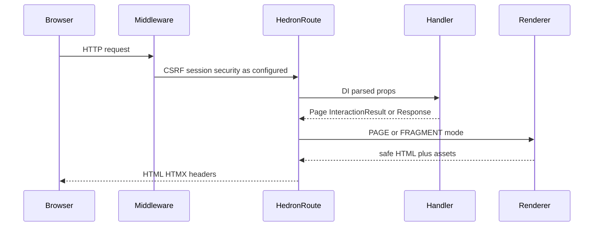

# Architecture overview

Hedron is typed, server-rendered UI for Python web apps. The flagship `hedron` package
extends FastAPI; `hedron-core` renders portable components; Flask/Django adapters share
the same renderer without FastAPI.

## Request lifecycle (FastAPI)



1. The request enters ordinary FastAPI/Starlette middleware (sessions, CORS, your auth).
2. `HedronRoute` uses FastAPI for parsing, dependency injection, and exceptions.
3. Built-in security profiles validate CSRF on unsafe methods when enabled.
4. Your `@app.page` / `@app.component` / `@app.action` handler returns a `Page`,
   `InteractionResult`, model, or explicit response.
5. Hedron selects **PAGE** (full document) or **FRAGMENT** (region HTML) from HTMX
   headers and declared `FragmentRegion` policy — unauthorized targets fail closed.
6. `hedron-core` builds a node tree, collects assets, and serializes escaped HTML.
7. The response may include approved HTMX headers from `InteractionResult`.
8. The browser (HTMX) swaps markup; optional SSE/WebSocket helpers observe or push
   updates (FastAPI flagship; polling remains the Supported fallback).

### Flask / Django

Adapters (`hedron_route` / `hedron_view`, `respond`, `interaction_response`) authorize
fragment/OOB policy and merge validated HTMX headers, then call the same renderer. Host
middleware owns sessions/CSRF/auth. Official HTMX SSE helpers are FastAPI-only in 0.10.

## PAGE vs FRAGMENT

| Mode | When | Typical return |
|---|---|---|
| PAGE | Navigation / full document | `Page(...)` |
| FRAGMENT | `HX-Request` targeting a declared region | `InteractionResult(content=..., region_id=...)` |

Rendering a component never implies a public route — only `@page` / `@component` /
`@action` (or adapter equivalents) expose HTTP endpoints.

## Security placement

- **Contextual escaping** is default in the renderer.
- **CSRF** runs on unsafe methods when using a built-in profile (`standard` / `strict`).
  Seed tokens with `csrf_token_for_request` (re-exported from `hedron`).
- **`SafeUrl` / `TrustedHtml` / `Secret`** mark trust boundaries in types.
- Application authz and persistence remain your responsibility.

## Assets and builds

- Development may compile scoped CSS and serve package static assets.
- Production expects `hedron build` manifests (`HEDRON_ENV=production`); missing
  manifests refuse to start (`HED-BUILD-0003`).
- Fingerprinted app assets: `/hedron-assets/`. Bundled HTMX: `/hedron-static/`.
- Application developers do not need Node.js.

## Multi-worker and live transports

- In-memory session/job state does not span workers — use sticky sessions or an
  external store.
- SSE/WebSocket: configure reverse-proxy buffering and timeouts. Full load/proxy
  backpressure evidence is still Deferred in [What's ready](guides/whats-ready.md); prefer polling when
  that proof is required. See [Deployment](guides/deployment.md) and
  [Live interaction](guides/live-interaction.md).

## Package boundaries

```text
hedron                         FastAPI flagship and beginner API
├── hedron-core                models, components, renderer, registry protocols
├── FastAPI / Starlette        routing, DI, security, ASGI, responses
└── optional integrations      Explorer, data, charts, sample plugins

hedron-flask ──> hedron-core   Flask adapter (Beta Supported; no FastAPI)
hedron-django ─> hedron-core   Django adapter (Beta Supported; Django >=5.2,<6)
hedron-jinja ──> hedron-core   optional .hdj format
```

`hedron-core` does not import application-framework or transport types. Distribution
rules: [Project layout](https://github.com/eddiethedean/hedron/blob/main/docs/PROJECT_LAYOUT.md).

## Shared registry

A sealed registry snapshot feeds rendering, routing, OpenAPI, Explorer, assets, CLI,
and diagnostics. Subsystems do not independently rediscover components.

## Architectural invariants

- Rendering never implies route exposure.
- Request props never default to all component props.
- Host-framework security remains authoritative per adapter.
- Rendering contains no hidden I/O.
- Secrets do not enter public metadata, identities, caches, or diagnostics.
- Every inference has an explanation and override.

## See also

[What’s ready](guides/whats-ready.md) · [Compatibility](COMPATIBILITY.md) ·
[Public API coverage](api/COVERAGE.md) · [Configuration](CONFIGURATION.md)
