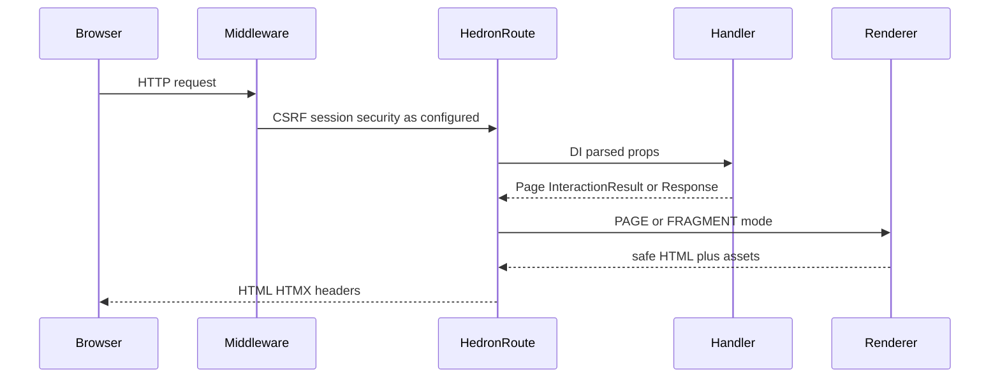
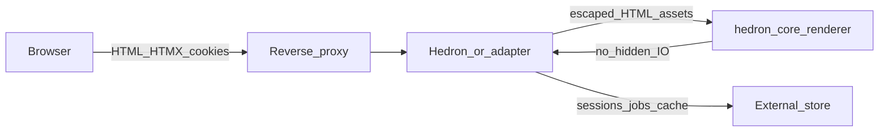

# Architecture overview

Hedron is typed, server-rendered UI for Python web apps. The flagship `hedron` package
extends FastAPI; `hedron-core` renders portable components; Flask/Django adapters share
the same renderer without FastAPI.

**Diligence entry:** [Enterprise diligence](guides/enterprise-diligence.md) · maturity:
[What’s ready](guides/whats-ready.md). This page is the system overview.

## Request lifecycle (FastAPI)



1. The request enters ordinary FastAPI/Starlette middleware (sessions, CORS, your auth).
2. `HedronRoute` uses FastAPI for parsing, dependency injection, and exceptions.
3. Built-in security profiles validate CSRF on unsafe methods when enabled.
4. Your `@app.page` / `@app.component` / `@app.action` handler returns a `Page`,
   `InteractionResult`, model, or explicit response.
5. Hedron selects **PAGE** (full document) or **FRAGMENT** (region HTML) from HTMX
   headers and declared `FragmentRegion` policy — unauthorized targets fail closed.
6. `hedron-core` builds a node tree, collects assets, and serializes escaped HTML.
7. The response may include approved HTMX headers from `InteractionResult`.
8. The browser (HTMX) swaps markup; optional SSE/WebSocket helpers observe or push
   updates (FastAPI flagship; polling remains the Supported fallback).

### Flask / Django

Adapters (`hedron_route` / `hedron_view`, `respond`, `interaction_response`) authorize
fragment/OOB policy and merge validated HTMX headers, then call the same renderer. Host
middleware owns sessions/CSRF/auth. Official HTMX SSE helpers are FastAPI-only and
**experimental** (`hedron.experimental`); polling is the Supported fallback.

## Trust boundaries



| Boundary | Hedron owns | You own |
|---|---|---|
| HTML escaping / `SafeUrl` / `TrustedHtml` / `Secret` | Contextual escaping and typed trust markers | What you mark trusted; authz of data |
| CSRF (built-in profiles) | Validate unsafe methods when enabled | Session secret, cookie hygiene, HTTPS |
| Fragment / OOB targets | Fail-closed allowlists | Declaring regions correctly |
| Authn / authz / tenancy | No IdP; job helpers fail closed when unscoped | Identity, roles, `auth_subject` / `tenant_id` |
| Persistence | Nothing | Databases, object storage, backups |
| Live SSE/WS | Experimental helpers only | Proxy buffering, backpressure — prefer polling |

Secrets must not enter public metadata, identities, caches, or diagnostics.

## PAGE vs FRAGMENT

| Mode | When | Typical return |
|---|---|---|
| PAGE | Navigation / full document | `Page(...)` |
| FRAGMENT | `HX-Request` targeting a declared region | `InteractionResult(content=..., region_id=...)` or Path-A `swap(...)` |

Rendering a component never implies a public route — only `@page` / `@component` /
`@action` / `@fragment` (or adapter equivalents) expose HTTP endpoints.

## Failure domains

| Domain | Symptom | Mitigation |
|---|---|---|
| Missing production build manifest | Refuse start (`HED-BUILD-0003`) | `hedron build` + `HEDRON_ENV=production` |
| In-memory jobs/sessions + multiple workers | Lost status / sticky bugs | Redis / Celery / RQ + shared prefix |
| Unscoped job HTTP status | Fail closed | Pass `auth_subject` / `tenant_id` |
| Wrong `HX-Target` | HTTP **403** | Declare `FragmentRegion` / `app.region` |
| CSRF missing on POST | HTTP **403** | Seed token on GET; include field/header |
| Chart satellite older than `0.2.0` on 0.38 | Resolver conflict / downgrade | Install `hedron[charts]>=0.50.0,<0.51` |

## Multi-worker, jobs, and inference

### Sessions and jobs across workers

- In-memory session or job state does **not** span processes — use sticky sessions or an
  external store (`RedisJobBackend`, `CeleryJobBackend`, or `RQJobBackend`).
- Every web process must call `set_job_backend(...)` with the same Redis prefix/TTL.
- Scope durable jobs with `auth_subject` / `tenant_id`; HTTP status helpers fail closed for
  unscoped jobs. See [Jobs](api/JOBS.md) and [Celery / RQ + Redis](guides/jobs-celery-rq.md).

### Supported status UX

Accepted work returns HTTP **202** with `Retry-After`. Prefer **`Poll`** +
`job_status_response` on every host. SSE / WebSocket helpers are FastAPI-flagship and
**experimental** — configure reverse-proxy buffering/timeouts, and prefer polling when
load/proxy backpressure proof is required ([What's ready](guides/whats-ready.md)).

### Inference placement (0.18)

`InferencePolicy` admits/queues work onto the same `JobBackend`. `ModelDemo` /
`InferenceWorkflow` never auto-publish callables as HTTP/MCP endpoints. Cancel maps
accepted requests to `JobBackend.request_cancel` with the **caller** identity after
`job_authorized_http` (never the stored owner). Details: [Inference](api/INFERENCE.md).

## Security placement

- **Contextual escaping** is default in the renderer.
- **CSRF** runs on unsafe methods when using a built-in profile (`standard` / `strict`).
  Seed tokens with `csrf_token_for_request` (re-exported from `hedron`).
- **`SafeUrl` / `TrustedHtml` / `Secret`** mark trust boundaries in types.
- Application authz and persistence remain your responsibility.
- Job observation over HTTP uses `job_authorized_http` (fail closed for unscoped jobs).

### Middleware and CSRF order (FastAPI)

Typical stack (outer → inner): host middleware (CORS, your auth) → session middleware →
Hedron CSRF validation on unsafe methods (when a built-in profile enables it) →
`HedronRoute` handler → renderer. CSRF strategies raise
[`CsrfValidationError`](api/EXCEPTIONS.md); hosts map that to HTTP **403**.
Pluggable strategies: [CSRF composition](api/CSRF_COMPOSITION.md).

### Fragment authorization (fail closed)

Declared `FragmentRegion` / `fragment_regions` allowlists authorize `HX-Target` (and OOB
updates). Wrong or missing targets fail closed with HTTP **403** — rendering a component
never implies a public fragment endpoint. Details: [Interaction](api/INTERACTION.md).

### Plugins and extras quarantine

Plugins register into the sealed registry before first render. Experimental specialty UI
(`CodeEditor` / `TerminalView` / joystick / device) require `hedron[experimental-ui]` and
do not register via plain `hedron[extras]` — see
[PRODUCTION_ARCHETYPE](api/PRODUCTION_ARCHETYPE.md). Data/charts extras participate in the
same render pipeline once imported; they do not bypass CSRF or fragment policy.

### Multi-tenant caution

Hedron does not invent tenancy. Scope durable jobs and caches with `auth_subject` /
`tenant_id` (or your store’s equivalent). In-memory session/job state does not span
workers — wrong scoping is an application bug, not a framework isolation guarantee.
Guide: [Multi-tenant isolation](guides/multi-tenant.md).

### Stable facade vs Beta APIs

A small **stable** facade is compatibility-protected on `0.x`
([STABLE_FACADE](api/STABLE_FACADE.md)). Most callable APIs remain compatibility level
`beta` even when the capability is **Supported**. Package maturity (Beta on PyPI) is a
third axis — pin versions.

## Adapter portability

| Surface | FastAPI (`hedron`) | Flask / Django adapters |
|---|---|---|
| Core render / built-ins | Yes | Same `hedron-core` renderer |
| `@page` / fragment policy | Yes | Adapter route helpers |
| Built-in CSRF profiles | Yes (facade) | Host CSRF + portable token patterns |
| Jobs / Poll | Yes | Yes (shared backends) |
| SSE / WS / focused streaming | Experimental flagship | Prefer polling — no official live helpers |
| Explorer / OpenAPI HTML | FastAPI-oriented | Limited / host-specific |

## Assets and builds

- Development may compile scoped CSS and serve package static assets.
- Production expects `hedron build` manifests (`HEDRON_ENV=production`); missing
  manifests refuse to start (`HED-BUILD-0003`).
- Fingerprinted app assets: `/hedron-assets/`. Bundled HTMX: `/hedron-static/`.
- Application developers do not need Node.js.

## Package boundaries

```text
hedron                         FastAPI flagship and beginner API
├── hedron-core                models, components, renderer, registry, inference demos/workflows
├── FastAPI / Starlette        routing, DI, security, ASGI, responses
└── optional integrations      Explorer, data, charts, extras, notebook, mcp, gradio, sample plugins

hedron-flask ──> hedron-core   Flask adapter (Supported capability; Beta package)
hedron-django ─> hedron-core   Django adapter (Supported capability; Django >=5.2,<6)
hedron-jinja ──> hedron-core   optional .hdj format
hedron-gradio ─> hedron-core   optional allowlisted Gradio client (Beta; bounded Supported inventory)
```

`hedron-core` does not import application-framework or transport types. Inference scheduling
(`InferencePolicy`) layers on durable `JobBackend` jobs; `ModelDemo` / `InferenceWorkflow` never
auto-publish callables. Distribution rules: [Project layout](https://github.com/eddiethedean/hedron/blob/main/docs/PROJECT_LAYOUT.md).

## Shared registry

A sealed registry snapshot feeds rendering, routing, OpenAPI, Explorer, assets, CLI,
and diagnostics. Subsystems do not independently rediscover components.

## Architectural invariants

- Rendering never implies route exposure.
- Request props never default to all component props.
- Host-framework security remains authoritative per adapter.
- Rendering contains no hidden I/O.
- Secrets do not enter public metadata, identities, caches, or diagnostics.
- Every inference has an explanation and override.

## See also

[What’s ready](guides/whats-ready.md) · [Compatibility](COMPATIBILITY.md) ·
[Enterprise diligence](guides/enterprise-diligence.md) ·
[Ship a Hedron app](guides/ship.md) · [Public API coverage](api/COVERAGE.md) ·
[Configuration](CONFIGURATION.md)
