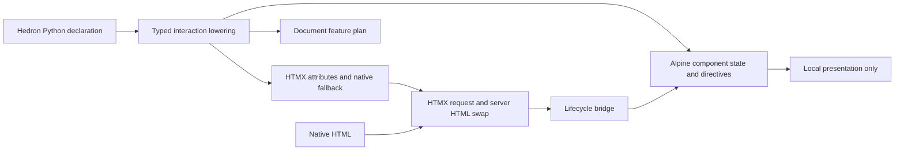

# HTMX/Alpine implementation refinement

**Status:** Deferred design input; unassigned to a release
**Scope:** Possible future minor transition and 2.0 cleanup
**Depends on:** [Hedron 1.0 HTMX/Alpine boundary](../api/HTMX_ALPINE_BOUNDARY_1_0.md) and the
[component usage inventory](HTMX_ALPINE_COMPONENT_COUNTS.md)

This plan turns the 1.0 HTMX/Alpine boundary into a smaller, more predictable implementation.
The boundary remains normative: Hedron owns the declaration and server truth, HTMX owns requests
and server HTML replacement, Alpine owns disposable browser-local presentation, and Hedron owns
only the lifecycle handoff between them.

Phase 1.1 is now assigned to first-class UI testing by
[RFC-0097](../rfcs/RFC-0097-FIRST-CLASS-UI-TESTING.md). Nothing in this document is authorized for
1.1. Typed lowering, runtime consolidation, compatibility shims, deprecations, default changes, and
2.0 removals require a separate accepted phase decision. Version references below describe the
original proposal and are retained only as migration design input.

The goal is not to add another client framework. It is to remove duplicate writers, make asset
demand explicit, and ensure that code written with Hedron has a clear native fallback.

## Target architecture

The lowering is the only place where an interaction becomes browser attributes. The runtime
modules do not infer application intent from arbitrary DOM attributes, issue parallel requests,
or compete to write the same property.

## Invariants and non-goals

The implementation must preserve these invariants:

1. Every server interaction has one declared request operation and one native fallback.
2. Every Alpine directive has an explicit owner; no standalone `x-on` expression may depend on an
   accidental ancestor scope.
3. A concern has one browser writer. In particular, Alpine and the lifecycle bridge cannot both
   own `hidden`, `disabled`, `aria-busy`, focus, announcements, or the same class state.
4. A page loads only the assets required by its declared features.
5. Server-rendered HTML remains understandable and usable with JavaScript disabled.
6. Client state is bounded, non-sensitive, disposable presentation—not domain or authorization
   state.

This plan does not include a client data layer, client-side routing, response-script execution,
automatic Alpine hydration of arbitrary application objects, a Web Component wrapper for every
control, or a second request API. Those would increase the authority surface without improving
the 1.0 contract.

## Release and compatibility policy

### 1.0.x

Patch releases are limited to correctness, security, and compatibility fixes. They must not
remove generated attributes or change the ownership of an existing component unless the current
behavior is demonstrably unsafe. A standalone interaction-scope defect may be fixed in a patch if
the fix makes the server output self-contained and preserves the public constructor.

### Future minor transition (version unassigned)

1. Introduce the typed lowering and generic HTMX builder behind the existing public facades.
2. Add explicit scope ownership and native-first component options.
3. Keep `Hx`, `Interaction.to_attributes()`, `data-hedron-after-load`, and the current asset
   entry points as compatibility shims with diagnostics and migration documentation.
4. Keep the fallback Alpine artifact available, but classify it as a compatibility implementation
   rather than a complete Alpine runtime. New features must target the official pinned Alpine
   runtime and documented Alpine APIs.
5. Emit opt-in deprecation warnings in development and CI; do not emit noisy warnings for normal
   production requests.

### 2.0 cleanup

After one documented transition cycle and a migration report from the test suite:

- remove the generic partial Alpine interpreter;
- remove global delegated widget controllers and the `alpineOwnsTabs()` probe;
- remove direct `htmx.ajax()` use from Hedron-owned modules;
- remove the legacy `data-hedron-after-load` path;
- remove the raw `Interaction.to_attributes()` contract in favor of typed lowering;
- remove compatibility-only default Alpine bindings from basic native controls; and
- keep `Hx` only if the compatibility audit shows that its alias is still useful, otherwise remove
  it with a documented replacement.

The 2.0 removals require a migration guide, a codemod or mechanical search recipe where practical,
and a release-note entry for every removed public or generated contract.

## Workstreams

### W0 — Establish the contract and evidence baseline

**Dependencies:** none.

**Outputs:**

- A fixture corpus covering local, request, combined, native-only, Alpine-only, and HTMX-only
  components.
- A machine-readable inventory of generated `hx-*`, `x-*`, `data-hedron-*`, asset-plan entries,
  and browser owners.
- A compatibility table for 1.0, 1.1, and 2.0 behavior.
- Baseline browser traces for Chrome, Firefox, and WebKit, including JavaScript-disabled cases.

**Acceptance:** the inventory can identify every maintained raw `hx-*` emission, every Alpine
root, every direct request call, and every component with more than one writer.

### W1 — Make interaction scope and lowering explicit

**Dependencies:** W0.

**Implementation:**

- Add an internal `InteractionLowering` result containing typed Alpine facts, typed HTMX facts,
  native fallback facts, metadata, and demand information.
- Make the canonical local/combined API require an explicit Alpine owner. The owner may be a
  typed `AlpineAttrs` scope attached to the same element or an explicit component scope declared
  by the parent. Do not infer a scope from an arbitrary ancestor.
- For a standalone local interaction, require initial state when the expression reads local state.
  The compiler must synthesize a bounded `x-data` scope or fail with a diagnostic explaining how
  to provide one.
- Keep `Interaction.to_attributes()` as a compatibility wrapper around the lowering during an
  admitted transition.
- Add `AlpineExpression.not_()` (or the equivalent unary-expression node) so expressions such as
  `open = !open` are represented by the expression model rather than hand-built strings.
- Have the HTML normalizer merge typed lanes once and reject duplicate writers.

**Acceptance:**

- A standalone local interaction is self-contained, or construction fails clearly before render.
- Combined interactions produce one initiating event and at most one request dispatch.
- Duplicate `x-*`/`hx-*` ownership is rejected in unit tests and diagnostics identify both writers.
- Existing 1.0 render fixtures remain stable unless the fixture explicitly opts into the new
  canonical form.

### W2 — Generalize and centralize HTMX attributes

**Dependencies:** W1.

**Implementation:**

- Introduce a generic `HtmxAttrs`/`HtmxRequestAttrs` builder for links, controls, widgets, and
  interactions. It must validate method, URL/route identity, target, swap, select, trigger,
  sync, history, indicator, and fallback policy.
- Make `Hx` a compatibility alias or factory over that builder.
- Route every built-in through the builder, including select controls, maps, live widgets, and
  interaction handles.
- Add a maintained-source check that rejects raw `hx-*` dictionaries outside the builder and
  approved compatibility fixtures.

**Acceptance:** there is one validation implementation for HTMX attributes; raw construction is
absent from maintained built-ins; malformed targets, swaps, triggers, and URLs fail at build time.

### W3 — Adopt native-first controls

**Dependencies:** W1; W2 for controls that also submit requests.

**Implementation:**

- Make text inputs, text areas, selects, checkboxes, radio groups, and toggle controls native-only
  by default.
- Add explicit opt-in enhancement recipes for masks, character counts, local filtering, reveal,
  or other browser-local behavior. The opt-in must be visible in Python source and reflected in the
  document feature plan.
- Keep Alpine where it adds meaningful local behavior: dialogs, tabs, file/directory selection
  presentation, and richer disclosure. Use native `
/
` for the default expander;
  make Alpine collapse animation opt-in.
- Render inactive tab panels with a correct initial `hidden` state and preserve no-JS usability.

**Acceptance:** a basic form emits no Alpine demand and works with JavaScript disabled; enhancement
recipes have focused browser tests; the generated HTML remains accessible before initialization.

### W4 — Consolidate Alpine behavior on official component APIs

**Dependencies:** W1 and W3.

**Implementation:**

- Define small `Alpine.data()` components for the supported interactive widgets. Each component
  owns only its local state and its local DOM projection.
- Move tabs, disclosure, password reveal, nav presentation, and local toast behavior out of global
  delegated listeners and into those component scopes.
- Give dialog behavior one owner: either a small Alpine component using native `<dialog>` methods
  or a deliberately native dialog module. It must own open/close, top-layer behavior, focus return,
  and cleanup exactly once.
- Remove `alpineOwnsTabs()` and other DOM probes used to decide which runtime wins.
- Use documented Alpine lifecycle APIs for initialization and teardown. Do not add new private
  Alpine-internals calls.

**Acceptance:** every supported widget has one owner recorded in the inventory; swapping or
  restoring a subtree does not duplicate handlers, observers, focus moves, or announcements; the
  official Alpine runtime passes the same component behavior tests in all supported browsers.

### W5 — Reduce the Hedron browser runtime to a lifecycle bridge

**Dependencies:** W2 and W4.

**Implementation:**

- Replace `data-hedron-after-load` and direct `window.htmx.ajax()` calls with declarative HTMX
  triggers or a server-emitted `HX-Trigger-After-Swap` event consumed by a typed `hx-trigger`.
- Remove request initiation from `hedron-ui.mjs`; it may coordinate documented lifecycle events,
  operation identity, and bounded presentation handoff only.
- Centralize HTMX event subscriptions in one bridge with one finalizer for success, failure,
  abort, timeout, and removal.
- Keep a single source artifact in `hedron-core`; package the same artifact for `hedron` rather
  than maintaining byte-identical copies.
- Treat `hedron-disclose.mjs` as a compatibility-only specialist asset. Demand-load it only when
  its tag or explicit capability is present; do not create another general widget runtime.

**Acceptance:** no Hedron-owned module calls `htmx.ajax`, no bridge performs server HTML insertion,
and a response fragment cannot install scripts or plugins. Asset and lifecycle tests prove that
the bridge initializes and cleans up exactly once.

### W6 — Make concurrency and stale-result handling authoritative

**Dependencies:** W5.

**Implementation:**

- Express request concurrency through typed `hx-sync` policies (`drop`, `abort`, `replace`, or
  `queue`) wherever possible.
- Assign an operation identity and generation at request start. Carry it through before-request,
  after-request, response/error, swap, settle, abort, and timeout events.
- Make terminal cleanup idempotent and ignore terminal events for superseded generations.
- Cover overlap, abort, timeout, network failure, server error, removal during request, OOB swap,
  and history restoration in a reusable browser race corpus.

**Acceptance:** busy indicators, action phases, focus, and announcements cannot be reverted by an
  older request; every started operation reaches exactly one terminal state; no counter remains
  stuck after abort or timeout.

### W7 — Make assets demand-driven and bounded

**Dependencies:** W1, W3, W4, and W5.

**Implementation:**

- Compute the document feature plan from typed demands:
  - native-only: no HTMX, Alpine, UI, or disclose assets;
  - HTMX demand: HTMX plus the minimal lifecycle bridge;
  - Alpine demand: pinned official Alpine CSP assets and admitted plugins plus the Alpine bridge;
  - specialist element demand: only the selected element asset.
- Preserve an explicit `include_ui_modules` compatibility override during an admitted transition.
- Fingerprint and package one canonical copy of each asset.
- Add byte budgets and a manifest diff check so an unrelated component cannot silently pull in the
  entire browser runtime.

**Acceptance:** feature-off pages contain no optional browser assets; each demand combination has
  an asset-plan test; all script sources are pinned, integrity-checked where applicable, and cannot
  be introduced by a response fragment.

### W8 — Migration, documentation, and release gates

**Dependencies:** all workstreams.

**Implementation:**

- Publish a migration table mapping legacy `Hx`, `Interaction.to_attributes()`, after-load hooks,
  default Alpine bindings, and custom disclose usage to their admitted replacements.
- Add development diagnostics with stable codes for missing Alpine scope, duplicate writers,
  unsupported raw HTMX attributes, legacy after-load usage, and compatibility-runtime usage.
- Add a support matrix for Python, FastAPI, Pydantic, HTMX, Alpine, browser engines, and optional
  backends. Test both minimum and latest supported dependency sets.
- Make browser, adapter, optional-backend, and asset-plan checks explicit release gates. A skipped
  gate must be reported as unsupported evidence, never as a green pass.
- Update the public boundary document and the generated component count report whenever the
  ownership model changes.

**Acceptance:** a release candidate cannot pass while a required gate is skipped, the migration
   guide covers every deprecation, and the support matrix is reproducible from CI.

## Ordered delivery sequence

| Phase | Work | Exit condition |
|---|---|---|
| 0 | W0 baseline and compatibility fixtures | Inventory and browser baseline are checked in |
| 1 | W1 typed lowering and explicit scopes | Standalone/combined scope and duplicate-writer tests pass |
| 2 | W2 generic HTMX builder | All maintained HTMX output uses one validator |
| 3 | W3 native-first controls | Basic forms need no Alpine and retain no-JS behavior |
| 4 | W4 official Alpine components | Each widget has one local owner and swap cleanup is proven |
| 5 | W5 lifecycle bridge and after-load migration | No direct Hedron request path or duplicate runtime owner remains |
| 6 | W6 concurrency and W7 asset demand | Race corpus and feature-off asset budgets pass |
| 7 | W8 release evidence | Support matrix, migration guide, and all required gates pass |
| 8 | 2.0 cleanup | Only after an admitted compatibility period and migration audit |

Phases 1–3 should land before expanding component coverage. Otherwise new components would encode
the old raw-attribute and implicit-scope patterns and increase the migration surface.

## Verification matrix

### Static and Python checks

- typed lowering and expression AST unit tests;
- raw `hx-*` and direct request-call source checks;
- duplicate-writer and feature-demand validation;
- public API and deprecation tests;
- package import, wheel, and asset-manifest checks;
- minimum/latest dependency matrix and supported adapter matrix;
- strict typing and warning-budget checks.

### Browser checks

- Chrome, Firefox, and WebKit for local, request, and combined interactions;
- JavaScript disabled;
- Alpine unavailable, HTMX unavailable, CSP/SRI refusal, and slow initialization;
- HTMX swap, OOB, history, removal, and restoration paths;
- dialog, tabs, disclosure, file selection, and native-form accessibility;
- overlap, abort, timeout, network failure, and stale-response races;
- mobile viewport and keyboard/focus behavior.

### Security checks

- no arbitrary response scripts or plugin registration;
- no `fetch`, XHR, or `htmx.ajax` request path outside the declared transport;
- request URL, method, target, swap, and synchronization are typed and validated;
- local state is bounded and excludes secrets and authoritative domain data;
- CSP/SRI and asset-plan mismatch behavior is deterministic;
- diagnostics and traces redact tokens, form secrets, and response bodies.

## Release gates

Any future minor transition is ready only when all of the following are true:

1. `Interaction` lowering has explicit scope ownership and no duplicate writers.
2. Generic `HtmxAttrs` validates every maintained HTMX declaration.
3. Basic native controls do not demand Alpine by default.
4. Hedron-owned UI code has no direct request initiation.
5. Every interactive widget has one documented owner and exactly-once cleanup.
6. Concurrency tests prove stale results cannot corrupt current presentation.
7. Feature-off pages load no optional browser assets.
8. Required browser, adapter, optional-backend, dependency, security, and typing gates are
   explicit and green.
9. The versioned migration guide and support matrix are published with the release.

The 2.0 cleanup is ready only when the compatibility diagnostics show no in-tree use of the paths
being removed and the migration audit covers downstream-facing public APIs.
