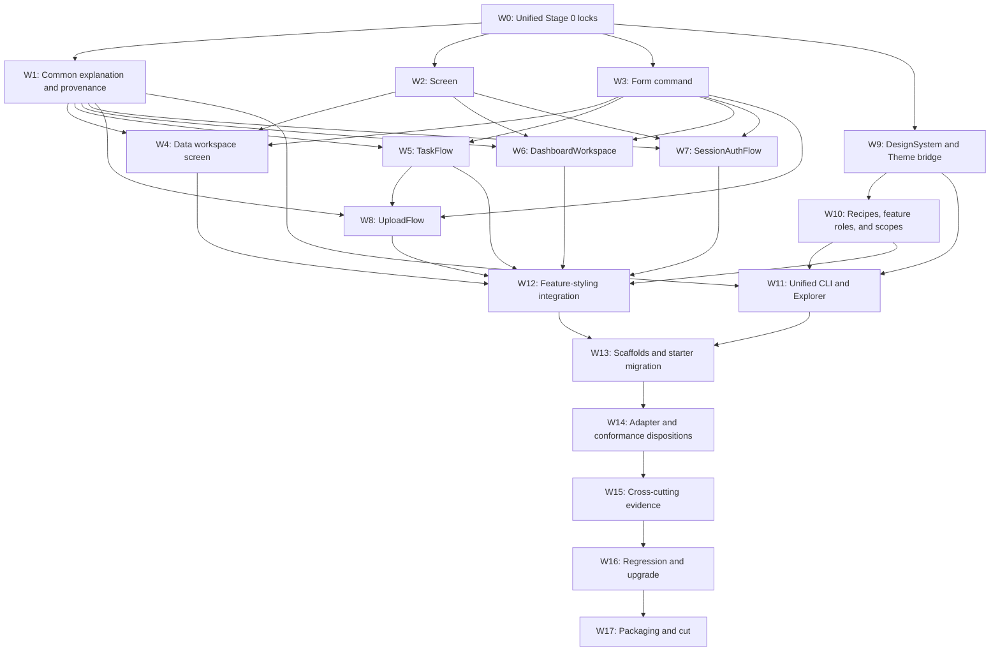

# Implementation plan: phase 0.58 progressive feature and styling authoring

**Status:** Published / Verified in-tree (`v0.58.0`; tag/PyPI deferred)  
**Decision/RFC:** D-101 / D-102 / D-105 / [RFC-0085](../rfcs/RFC-0085-PROGRESSIVE-FEATURE-AUTHORING.md)

**Target:** `v0.58.0`  
**Runtime changes:** delivered (W1–W17)

This document divides the unified RFC-0085 feature-and-styling design into cuttable implementation
work. It is not the Stage 0 contract lock. Exact signatures, schemas, diagnostic codes, numeric
budgets, precedence, host dispositions, and tracking are frozen by D-102/D-105 against the
completed in-tree 0.57 cut.

## Consume shipped authorities; do not fork

| Shipped authority | 0.58 use |
|---|---|
| `Hedron.page`, `Page`, 0.54/0.57 shell/layout/presentation | `screen` lowering |
| `FragmentHandle`, `ActionHandle`, `refresh`, patches | Generated view/command surfaces |
| `FormBody`, `Control`, `TypeSchema`, outcomes/effects | `form_command` and facade forms |
| `InteractionCatalog`, descriptors, projections | Explanation and graph facts |
| `FeatureProvider`, `FeatureBundle`, inclusion/ejection | All multi-surface facades |
| `DataWorkspace`, bounded sources/query | Complete CRUD workspace screen |
| `JobBackend`, durable helpers, `Poll` | `TaskFlow` |
| Interaction graph/cache/binding plans | Dashboard filter/panel mechanics |
| Session, CSRF, redirect, timeout, security-plane contracts | `SessionAuthFlow` |
| Upload/download fields, budgets, cleanup, safe responses | `UploadFlow` |
| `Theme`, built-in themes, `compile_palette`, contrast validation | `DesignSystem` theme bridge and brand compiler |
| Built-in component props and `hedron_core.builtins.appearance` | Semantic recipe lowering and generated feature roles |
| Stable `data-hedron-*` markers and first-party CSS | Explicit `StyleScope` theme/mode/density boundary |
| `StyleSymbols`, component `styles.css`, style contracts | Advanced override and partial ejection targets |
| CSS AST compiler, cascade-layer build, asset/CSP manifests | Deterministic external styling output and policy evidence |
| `AppScenario`, conformance fixtures, Explorer services | Facade scenarios and tooling |

There is no `hedron.easy` package, facade registry, alternate request dispatcher, hidden client
store, generated ORM layer, second serializer, parallel theme registry, CSS-in-Python declaration
language, runtime style injector, selector generator, design-editor runtime, or browser state store.

## Dependency order



W2 and W3 are the first feature vertical slice. W9 is the first styling vertical slice. W4–W8 may
proceed concurrently after W1 is locked; W10 consumes the stable component-prop vocabulary. W11
uses one shared plan/provenance service, and W12 is mandatory before any generated feature claims
styling support. There is no separate styling cut or post-0.58 integration audit.

## Stage 0 artifact packet (W0)

Create during Stage 0 against Published/Verified in-tree `v0.57.0`:

| Planned artifact | Locks |
|---|---|
| `progressive-authoring-inventory-058.toml` | Symbols, modules, maturity, surface names |
| `progressive-lowering-058.toml` | Facade → existing primitive mappings and forbidden authorities |
| `feature-explanation-058.toml` | Versioned redacted explanation/source-map schema |
| `progressive-host-disposition-058.toml` | FastAPI/Flask/Django/core/sim/conformance claims |
| `progressive-security-058.toml` | Required explicit callbacks/policies and fail-closed cases |
| `progressive-scaffolds-058.toml` | Template file/dependency/behavior inventory |
| `progressive-starter-docs-058.toml` | Every starter/beginner/quick-start/golden-path example and its required facade |
| `styling-authoring-inventory-058.toml` | Design symbols, groups, recipe families, scopes, and CLI |
| `styling-lowering-058.toml` | Design facade → Theme/props/markers/style-contract/build mapping |
| `design-system-schema-058.toml` | Versioned plan, provenance, diff, preview, and style source maps |
| `styling-brand-058.toml` | Coordinated palette algorithm, trusted inputs, contrast, adjustment behavior |
| `style-recipe-catalog-058.toml` | Families, compatible props/components, and generated-feature semantic roles |
| `styling-precedence-058.toml` | Explicit override/recipe/scope/design/theme/base conflict rules |
| `styling-host-disposition-058.toml` | Core/host/Jinja/elements/ecosystem/sim/conformance claims |
| `styling-visual-matrix-058.toml` | Gallery fixtures, engines, modes, viewports, and delta policy |
| `styling-starter-docs-058.toml` | Every styling starter and its required highest abstraction |
| `styling-budgets-058.toml` | Reject-not-slice counts, bytes, latency, ratios, and unused-cost locks |
| `styling-security-058.toml` | Trusted inputs, CSP/assets, static tooling, ejection, semantic boundaries |
| `upgrade-fixtures-058.md` | Source fixtures from final `v0.57.0` and expected behavior |
| `progressive-tracking-058.toml` | Single W0–W17 workstream/gate authority |
| `release-gate-0.58.toml` | Exact gate states and evidence ownership |

Stage 0 also freezes diagnostic families, generic slots, exact signatures, finite surface and
recipe names, feature/design schemas, styling precedence, ejection layout, adapter dispositions,
benchmark corpora, and numeric limits. No runtime symbols or version bump land in W0.

## W1 — explanation, named surfaces, and safe ejection substrate

### Module map

| Module | Responsibility |
|---|---|
| `hedron_core.feature_explanation` | Portable frozen explanation/source-map values; no callbacks/import execution |
| `hedron.features` | Compile explanation from bundles/catalog/descriptors; named surface lookup |
| `hedron_core.bundles` | Preserve current `FeatureProvider`/`FeatureBundle` authority; additive metadata only |
| `hedron.cli.commands.explain` | Human/JSON explanation and feature-level graph projection |
| `hedron.cli.commands.eject` | Per-surface selection, source map, parity check, current path/overwrite safety |
| Explorer service | Render the same explanation; no independent query model |

### Required behavior

- A facade/provider declares a finite mapping of semantic surface name to existing handle/page/form
  description.
- Inclusion remains atomic. Explanation before inclusion describes a provider plan without invoking
  callbacks; explanation after inclusion derives route/effect facts from registered authorities.
- Differences between declared and registered facts are errors, not merged guesses.
- Callable names are module/qualified-name metadata only; explanation never uses `repr(callback)`.
- Dependencies and authorization are described by stable redacted identifiers, never secret values.
- Optional package absence is represented as an explicit unmet capability, not an import crash.
- Ejection may select the whole feature or one named surface. It writes explicit Python, a source
  map, and a generated parity scenario under a project-local directory.
- Ejected code uses public APIs and bounded pins, contains no captured request/user/secret state,
  passes format/type/import checks, and reproduces the selected scenario before success is reported.
- Existing `hedron eject features:<id>` output stays accepted; richer output is additive.

### Tests

- static explanation proves zero callback/data-source invocation;
- descriptor/catalog/bundle/explanation differential tests;
- redaction corpus from 0.56;
- optional-package absence and late-registration failures;
- path traversal, symlink/project-root, overwrite, hostile names, and collision tests;
- generated-source import, format, type, native/HTMX behavior, and source-map determinism;
- repeated explanation/ejection produces byte-identical output for equivalent sealed apps.

## W2 — `screen` and `ScreenHandle`

### Proposed files

- `hedron.app.screens` — handle, descriptor, wrapper, metadata conflict validation;
- `hedron.app.pages` — additive `Hedron.screen` forwarding;
- `hedron.routing` — reuse existing page route registration and reverse lookup;
- `hedron-core` shell/layout components — consume only; no new screen runtime.

### Lowering

```text
@app.screen(path, title, layout, shell, dependencies)
    → validate explicit metadata
    → normalize NodeLike | bounded sequence | Page
    → Page(existing 0.57 layout/shell, title=title)
    → existing @app.page route
    → ScreenHandle descriptor/catalog/navigation facts
```

### Edge cases

- empty return uses an explicit empty state or fails according to Stage 0 disposition;
- generators/unbounded iterables are rejected;
- an explicit `Page` with conflicting title/head/shell/page options fails;
- duplicate screen name/path and unsafe local links use existing routing diagnostics;
- dependencies remain FastAPI dependencies and are not evaluated during registration/explanation;
- a screen link cannot bypass its route dependency; navigation visibility is not authorization;
- nested components do not gain addressability;
- page errors retain ordinary host behavior.

### Evidence

- static, sequence, explicit Page, async handler, dependency, mount/root-path, 404/500 paths;
- title/head/landmark/heading/navigation/a11y semantics;
- strict CSP, zero application CSS, no-JS, HTMX navigation, print/zoom/RTL/forced colors;
- existing `@app.page` snapshots unchanged.

## W3 — `form_command`

### Proposed files

- `hedron.app.form_commands` — model discovery, decorator config, effect/outcome conflict checks;
- `hedron.type_authoring` — reuse `FormBody` compilation; additive helper only if required;
- `hedron.handles.ActionHandle` — no generic arity change; existing `.form()` remains authority.

### Registration algorithm

1. Inspect the function without calling it.
2. Identify exactly one direct supported Pydantic model parameter not marked as a dependency.
3. Reject ambiguity, unsupported generics/forward refs, competing FastAPI body/form markers, or a
   missing form model.
4. Compile that parameter through the existing `FormBody` metadata and `TypeSchema` adapter.
5. Compile conservative native controls from Pydantic plus explicit `Control`/override metadata.
6. Build the ordinary `ActionHandle`/route through `Hedron.command`.
7. Attach declared refresh/update/success/outcome facts through existing effect machinery.

### Effect rules

- A handler returning `None` or an ordinary domain outcome may receive decorator-declared effects.
- An effect-bearing return must be compatible with the declaration.
- An explicit response/`InteractionResult` mixed with decorator effects is rejected unless Stage 0
  locks a single non-ambiguous merge rule.
- Multiple primary updates, undeclared targets, cross-app handles, cycles, and excess fan-out retain
  existing failures.
- Non-HTMX success follows the explicit local fallback; there is no inferred Referer redirect.

### Evidence

- all supported control kinds/encodings and closed unsupported inventory;
- nested/tagged validation, aliases, defaults, safe retention, sensitive/file fields;
- native form, HTMX form, CSRF missing/mismatch, 415, 422, redirect, and error focus;
- dependencies/authorization execute once with correct lifetime;
- explicit `@app.command`/`FormBody` parity and unchanged existing signatures;
- type-checker inference for the returned `ActionHandle`.

## W4 — complete `DataWorkspace` screen

### Proposed files

- `hedron_data.workspace` — `with_screen`, named forms/screen, complete surface metadata;
- `hedron_data.workspace_presenter` — 0.57 screen/layout/resource/table composition;
- flagship materializer — page route creation without changing source portability;
- scaffold/example — authorized in-memory development source plus production replacement notes.

### Required states

| Surface | States |
|---|---|
| Screen/list | loading, rows, empty, invalid query, forbidden, source unavailable |
| Detail | found, not found, forbidden, conflict/stale |
| Create/edit | initial, invalid, forbidden, conflict, success |
| Delete | absent by default; explicit confirmation/policy/action/tests when enabled |

### Invariants

- source is explicit and already authorized;
- list queries retain current page/sort/filter/projection bounds;
- model fields do not silently become writable, searchable, sortable, or visible;
- detail/create/edit paths use stable typed identity and avoid sensitive URL material;
- mutation refreshes are declared and server-confirmed by default;
- a custom surface may replace one generated surface with no remaining hidden dependency;
- full feature/per-surface ejection remains runnable;
- no ORM manager/relation/transaction/tenant/delete discovery.

### Evidence

- in-memory, SQLAlchemy, Django QuerySet, and unsupported source dispositions;
- auth/tenant isolation, query injection, stale revision, conflict, empty and large bounded pages;
- native/HTMX create/edit; delete denied/explicit; no nested interactive row errors;
- three-engine responsive/a11y/long-content coverage from 0.57;
- generated/ejected behavior parity.

## W5 — `TaskFlow`

### Proposed files

- `hedron.jobs.flow` — `TaskFlow`, provider/materializer, outcomes;
- `hedron.jobs.scope` — immutable typed `JobScope` and dependency adapter;
- `hedron.jobs.presentation` — task ticket/status/result/cancel components;
- existing backend helpers — consume; no new queue/worker.

### Request lifecycle

```text
native/HTMX form
    → form_command validation + authorization
    → JobScope dependency
    → payload callback
    → configured JobBackend.submit
    → opaque ticket + status URL
    → scoped status_view + bounded Poll
    → terminal authorized result or generic failure
    → optional explicit scoped cancel_command
```

### Failure matrix

| Failure | Required behavior |
|---|---|
| No durable backend in production | Existing production gate/refusal |
| Backend unavailable on submit | Typed unavailable outcome; no fake ticket |
| Missing/unauthorized job | Non-enumerating response shape |
| Subject/tenant mismatch | Deny status/cancel/result with no stored-owner substitution |
| Poll after terminal | Stop polling and render stable terminal state |
| Result expired/missing | Explicit expired/unavailable state |
| Cancel unsupported/race | Honest requested/refused/already-terminal state |
| Disconnect | No scope leak; backend work follows backend policy |

### Evidence

- InMemory tests and Redis/Celery/RQ bridge contract lanes where already supported;
- multi-worker identity/cancel/status and backend failure fixtures;
- polling amplification budget and terminal stop in three engines;
- no-JS refresh/status/result path;
- result download authorization and redaction;
- explicit existing job helper parity.

## W6 — `DashboardWorkspace`

### Proposed files

- `hedron.dashboard.models` — filter/panel/provider configuration;
- `hedron.dashboard.workspace` — feature materialization;
- `hedron.dashboard.presentation` — screen, filter summary, panel states;
- interaction graph/binding modules — consume; no alternate callback runtime.

### Data ownership model

- One typed filter model is serialized to bounded safe query parameters.
- One explicit request-bound loader receives the validated filters and dependencies.
- The loader returns a typed/declared snapshot. It may perform I/O; panel renderers may not.
- Named panel renderers receive the snapshot and return `NodeLike`.
- Panels compile to ordinary bound refreshable views; optional chart/data/map packages are opaque
  content from the workspace's perspective.
- Filter submission updates local history and a bounded declared set of panels.

### Edge cases

- sensitive filters are rejected from URL mode; Stage 0 may define an explicit session-backed
  advanced alternative but cannot silently choose it;
- loader failures produce declared whole-dashboard or per-panel behavior;
- stale overlapping filter requests cannot replace newer canonical content;
- panel cycles, unknown dependencies, duplicate names, unbounded iterables, excess fan-out, and
  unsupported history values fail registration/request validation;
- caching is explicit and keyed by validated safe filters plus authorization context where allowed;
- export is a separate authorized action.

### Evidence

- metrics/chart/table/map panel neutrality;
- URL reload/share/back/forward and mounted-path behavior;
- slow/stale/cancelled/error panel loads and cache separation;
- keyboard/reading order/alternative content/loading announcements;
- explicit InteractionGraph/ChartInteraction escape parity;
- large but bounded dashboard performance corpus.

## W7 — `SessionAuthFlow`

### Proposed files

- `hedron.auth.flow` — provider, typed result/outcomes, generated surfaces;
- `hedron.auth.session_codec` — explicit bounded principal reference codec;
- existing login CSRF/rate/session timeout/redirect modules — consume only.

### Generated surfaces

- login screen and `login_command`;
- `logout_command`;
- current-principal dependency/helper;
- generic authentication failure and session-expired presentation;
- optional account summary/logout chrome using 0.57 components.

### Required application inputs

- credentials model;
- `authenticate` callback returning a closed success/denied result;
- principal reference serializer and loader;
- explicit after-login/logout local destinations;
- rate-limit policy/provider required by the Supported production profile;
- session timeout/rotation policy or documented standard profile.

### Excluded

OIDC discovery/callback product, password hashing/storage, registration, recovery, verification,
MFA, role/permission/tenant inference, account lockout business policy, and identity-provider UI.

### Evidence

- login CSRF, session fixation/rotation, generic failure, rate limiting, safe redirect, cache;
- missing/disabled/deleted principal, timeout, logout, multi-worker session behavior;
- sensitive credentials absent from URL/catalog/explanation/ejection/logs;
- native/HTMX flows and auth dependency protection;
- adapters explicitly disposed; no claim that platform login equals application identity.

## W8 — `UploadFlow`

### Proposed files

- `hedron.files.flow` — provider, store/result protocols, named surfaces;
- existing `hedron.upload` / builtins files — policy authority and components;
- optional `TaskFlow` adapter for durable post-upload processing.

### Lifecycle

1. authorize and reserve request/parser budgets;
2. validate form/CSRF/field metadata and stream to application storage callback;
3. application returns a closed stored/quarantined/rejected result;
4. cleanup reservations/temp artifacts on every terminal path;
5. render accepted/quarantined/rejected result;
6. optionally submit an explicit `TaskFlow` payload referencing an opaque stored artifact;
7. authorize any later download independently.

### Evidence

- size/count/type/filename/path/content mismatch and parser budget adversarial corpus;
- cancellation, disconnect, storage failure, scanning pending/rejected, cleanup, retry;
- tenant/auth separation, result/download reauthorization, no raw path/credential disclosure;
- native multipart, HTMX enhancement, progress fallback, keyboard/a11y;
- display limits equal enforcement authority;
- optional task composition has no captured temporary path after request cleanup.

## W9 — `DesignSystem`, coordinated brand compiler, and `Theme` bridge

### Public seam

`hedron_core.design_system` owns immutable portable `DesignSystem`, `StyleRecipe`, plan, diff, and
provenance values. `DesignSystem.brand(...)` accepts a normalized name, one 3/6-digit hexadecimal
accent, and finite density/geometry/typography/elevation/motion/navigation presets. It emits light
and dark semantic sets together using `hedron.brand-palette/1`, validates locked contrast/focus
pairs, and either reports a deterministic adjustment or fails with remediation. Compilation has no
network, filesystem, request, platform color-engine, or callback dependency.

The implementation order is:

1. validate trusted application configuration and reject unknown/unbounded values;
2. normalize the base from `default_theme()` or an explicit `Theme`;
3. compile the light and dark palettes together and record seed/generated/inherited provenance;
4. apply finite typed design groups to existing `Theme` fields/tokens;
5. validate contrast, token completeness, assets, and CSS/build policy;
6. canonicalize a `hedron.design-system-plan/1` and digest it; and
7. return an ordinary `Theme` plus immutable recipe metadata for authoring-time use.

`DesignSystem.from_theme` and `to_theme` must preserve semantic and emitted-CSS parity when no new
choice is applied. `Hedron(theme=...)` widens only to `str | Theme | DesignSystem | None`, normalizes
an object to the existing registered theme name before lifespan composition, and retains
`app.state.hedron_theme` as authority. It does not create `app.state.hedron_design`, silently enable
default styles, or add a second registry/lifespan field.

### Required evidence

- fixed seed vectors including white, black, gray, hostile strings, and unsatisfied contrast;
- deterministic output across process, platform, absolute path, and import order;
- exact built-in/default-theme regression and `Theme.extend` round trips;
- light/dark, forced-color, reduced-motion, print, RTL, zoom, and long-content fixtures;
- missing/duplicate theme, design-count/token-count/plan-size, and asset-policy failures;
- zero import/asset/network cost when the API is unused.

## W10 — semantic recipes, generated feature roles, scopes, and precedence

### Recipes

The v1 recipe families are exactly `control`, `surface`, `data`, `status`, and `content`. Each
contains only catalogued semantic Hedron values for existing optional component props whose default
is `None`. `DesignSystem.apply(recipe, component)` resolves a same-family inheritance chain of at
most four, clones through the existing component model before render, fills only unset eligible
props, and returns the same component type. The input is never mutated; no wrapper DOM, runtime
lookup, selector, CSS declaration, URL, callback, or semantic state is introduced.

The ten built-ins—`primary_action`, `secondary_action`, `destructive_action`, `page_surface`,
`form_surface`, `data_surface`, `dashboard_panel`, `dense_data`, `inline_status`, and `metadata`—map
to the named feature roles frozen in `style-recipe-catalog-058.toml`. They are presentation
defaults, never authorization or destructive-meaning signals. A generated facade must declare its
role ID in the same plan as its surface ID; it must not look up a global mutable catalog at render.

### Explicit scope

`StyleScope` emits one explicit `div` boundary with only theme, color-mode, and density markers.
Those values lower to the current first-party variables/selectors. V1 intentionally excludes
scope-wide recipe defaults, arbitrary variables, ambient context, lifecycle JavaScript, DOM
reordering, and content hiding because those would introduce hidden descendant mutation or
specificity authority.

### Locked precedence

Strongest to weakest:

1. explicit component prop, explicit named-surface replacement, or application-owned scoped CSS;
2. the explicitly applied component recipe;
3. the nearest explicit `StyleScope` theme/mode/density marker;
4. the application `DesignSystem` default;
5. the resolved existing `Theme`; and
6. first-party baseline CSS.

At the same level, conflicts reject rather than depend on mapping/import order. A feature override
always remains stronger than a built-in semantic role. Recipe application and scope markup are
differentially compared with their explicit prop/marker equivalents.

### Tests

- every catalogued component/property pair and every rejected family/field combination;
- clone identity/type, explicit-value win, frozen input, inheritance cycle/depth/collision;
- all ten generated-feature roles across screen/form/workspace/task/dashboard/auth/upload surfaces;
- explicit surface replacement before and after design selection;
- nested scope, child override, fragment replacement, no-JS, and strict-CSP output;
- proof that route/effect/security/state/DOM order/accessibility facts do not change.

## W11 — unified CLI and Explorer

One service powers both surfaces:

- list facades/features and named surfaces;
- explain declared versus registered lowering;
- render route/effect/security/limitation graphs;
- preview screens/forms/states with synthetic explicit inputs only;
- run attached scenarios;
- eject one surface or complete feature safely;
- diff facade and ejected descriptors/scenarios;
- explain a `hedron.design-system-plan/1` with token/group/recipe/component/asset provenance;
- preview the fixed, data-free design gallery in light/dark and locked conformance modes;
- semantically diff inputs, tokens, groups, recipes, components, assets, and emitted output;
- check brand contrast, theme schema, recipes, scopes, style contracts, assets, CSP, budgets, and
  the zero-application-CSS profile;
- eject a whole design, one group, recipe, or component to public `Theme` Python, explicit props,
  markers, style-contract CSS, manifests, and parity tests;
- diagnose where the advanced primitive API is required.

Explorer remains development/secured according to existing policy. CLI/Explorer never executes an
auth hook, data loader, worker, store callback, remote request, or mutation merely to inspect.
Preview uses only versioned gallery fixtures and never application data. All projections consume
the same canonical feature/design plans and report the same digests; none reconstructs authority.

Ejection is project-root-only, no-overwrite by default, project-relative in its source maps, and
rejects traversal, symlink escape, hostile names, private markup/selectors, absolute paths, captured
runtime values, and output-budget overflow. Combined feature ejection offers two explicit modes:
preserve semantic recipe references, or resolve them to existing public props and `Theme`/scoped
CSS. Both must pass the same scenario, DOM, policy, build, and plan-digest parity checks.

## W12 — feature and styling integration

This workstream makes the two abstraction families one authoring system:

- every generated feature component carries a finite semantic role from
  `style-recipe-catalog-058.toml`; a missing or incompatible role is a contract failure;
- the feature explanation links a surface/component fact to its design-plan target and provenance,
  without embedding a second copy of the styling plan;
- built-in roles apply only to recipe-eligible `None` defaults; explicit facade configuration,
  component props, `FeatureOverrides`, and complete named-surface replacements win;
- design changes may alter only presentation facts. Routes, dependencies, effects, forms,
  authorization, tenancy, persistence, destructive meaning, jobs, upload policy, DOM/reading order,
  accessible names, and state remain byte/semantic-equivalent;
- CLI/Explorer traverses from a feature surface to its role, recipe, resolved prop, theme token,
  asset, and source-map entry using shared logical IDs;
- whole/per-surface feature ejection composes atomically with whole/partial style ejection;
- the mixed-level reference application proves one generated feature, one named feature override,
  one recipe, one scope, and one fully explicit region coexist without an application mode switch.

`LOWER-058`, `RECIPE-058`, `EXPLAIN-058`, and `REGRESS-058` all own differential integration
checks. Styling is not considered delivered if it works only on hand-written components, and a
feature facade is not considered delivered if its starter output bypasses the new design ladder.

## W13 — scaffolds and documentation

### Template matrix

| Template | Teaches | Production caveat made visible |
|---|---|---|
| `minimal` | built-in theme, screen, refreshable view, optional brand graduation | session secret/profile and deployment check |
| `crud` | brand, authorized DataWorkspace, `data_surface`, named override | persistence/transactions/auth/delete ownership |
| `dashboard` | brand, typed filters/panels, `dashboard_panel`, scope | URL sensitivity/cache/fan-out |
| `task` | brand, form submit, action/status roles, durable polling | replace development backend; run workers |

Each template has a bounded pin, one-page README, tests, `hedron check`, and an “inspect → override
→ eject” exercise. Generated apps use the shortest safe `Hedron(...)` constructor supported by
production gates; they do not expose every default option.

### Documentation deliverables

- migrate every maintained starter, beginner, quick-start, golden-path, minimal, first-app,
  theming, and scaffold example to the highest applicable 0.58 feature **and styling** abstractions;
- inventory at least the root/flagship README first apps, `docs/getting-started`, beginner cookbook
  and recipe entries, starter single-file examples, generated scaffold snapshots, and affected
  package quick starts in `progressive-starter-docs-058.toml` and
  `styling-starter-docs-058.toml`;
- keep primitive examples only when a page explicitly teaches the primitive or shows the lowered/
  ejected equivalent, and label those sections Advanced, Explicit, Lower-level, or Under the hood;
- preserve historical release notes and upgrade fixtures as historical evidence rather than
  silently modernizing their source;
- rewritten ten-minute first app using `screen`;
- built-in theme first, then `DesignSystem.brand`, semantic recipes only when intent repeats,
  `style explain`/preview, explicit scope/override, partial eject, and finally advanced `Theme`,
  style-contract, scoped-CSS, cascade, and compiler material;
- minimal form command guide without `Annotated` ceremony, followed by explicit equivalent;
- CRUD, dashboard, task, session auth, and upload tutorials;
- a single authoring-level comparison page;
- one before/facade/lowered/ejected four-column reference per feature;
- troubleshooting keyed by facade and underlying diagnostic;
- explicit “what Hedron still does not own” section in every workflow guide;
- API stability and migration notes; existing advanced guides remain first-class.

### DX measurement

The gate records, for representative tasks, application-owned lines/symbols/concepts before and
after, first successful render/form/CRUD/task time in a scripted clean environment, diagnostic
actionability, and whether ejected code is understandable without private internals. These are
product measurements, not marketing claims or a reason to hide required policy.

`DX-058` also runs both documentation inventories as one check. Missing files, a starter example
using a lower-level feature or styling spelling when a matching abstraction exists, or an unlabeled
primitive-first path fails the gate. An exception must name the example's explicit teaching purpose
and cannot be used merely to avoid migrating it.

## W14 — adapters, conformance, simulation, and optional packages

Stage 0 assigns every facade a disposition:

| Facade | FastAPI | Flask | Django | portable render | sim |
|---|---|---|---|---|---|
| Screen | candidate Supported | explicit adapter spelling | explicit adapter spelling | Page/layout subset | candidate |
| Form command | candidate Supported | disposition required | disposition required | schema/form subset | candidate |
| Data workspace screen | candidate Supported | disposition required | disposition required | component/source subset | bounded subset |
| TaskFlow | candidate Supported polling | disposition required | disposition required | job values only | synthetic only |
| Dashboard workspace | candidate Supported | composition disposition | composition disposition | panels/render | bounded subset |
| Session auth flow | candidate Supported | likely Deferred/host-specific | likely Deferred/host-specific | none | synthetic only |
| UploadFlow | candidate Supported | disposition required | disposition required | field/result values | synthetic only |

The table is intentionally non-normative until Stage 0. A host is not marked Supported unless
native routing, CSRF, dependency/session authority, fallback, tests, and documentation match its
framework. Portable fixtures prove only their declared subset.

Styling dispositions use the same honesty rule. `hedron-core` owns portable design values, brand
compilation, recipes, scopes, and schemas. FastAPI may accept a `DesignSystem` in `Hedron`; Flask
and Django consume the compiled theme/markers through explicit adapter spelling. Jinja consumes
compiled themes and markers but gains no recipe template DSL. Elements and optional data/chart/map
packages consume existing tokens/style contracts and only catalogued recipe families. Explorer is
development/secured; sim is a declared gallery subset; conformance owns schema/disposition
fixtures, not a CSS renderer.

## W15 — cross-cutting release evidence

### Test layers

1. Unit: validation, normalization, descriptors, palette/recipe/scope lowering, source maps.
2. Differential: facade/design versus explicit primitive behavior/catalog/markup/policy/CSS.
3. Integration: FastAPI routes, dependencies, sessions, backends, sources, storage.
4. Browser: Chromium/Firefox/WebKit; native/HTMX; focus/history/polling/uploads.
5. Accessibility: semantic/keyboard/announcement/contrast/zoom/motion/color/RTL/long-content.
6. Security: auth/tenant/CSRF/redirect/URL/upload/CSP/assets/ejection/exposure/redaction corpus.
7. Conformance: declared portable/adapter subsets only.
8. Visual: the fixed three-engine light/dark/forced-color/motion/print/RTL/zoom design matrix.
9. Performance: registration, brand compile, inspection/diff/preview, render, CSS size, fan-out,
   polling, ejection, and optional imports/assets.

### Required representative applications

- hello/status beginner app;
- notes CRUD with explicit authorization and persistence adapter;
- sales dashboard with filters, metric/chart/table panels and stale request fixture;
- durable report task with exact subject+tenant scope and result download;
- session login plus protected workspace and logout/timeout;
- upload-to-quarantine plus durable processing and authorized result;
- mixed-level app using facades alongside one explicit region/interaction/response;
- every app shown with a built-in theme and representative branded design/semantic roles;
- ejected equivalents for at least one surface and complete feature, preserving and resolving style
  abstractions.

## W16 — regression and unified upgrade evidence

Run the single `upgrade-fixtures-058.md` corpus from Published/Verified in-tree `v0.57.0`. It covers
all existing explicit feature and styling authorities plus combined generated surfaces. Existing
theme hashes remain unchanged unless an application opts into a generated design or a fixture
records an intentional first-party correction. No app is auto-rewritten or auto-opted into a
facade, design, recipe, or scope. Rollback to explicit pages/handles/`Theme`/props/scoped CSS must
remove all new dependencies, metadata, and assets without route or output drift.

## W17 — packaging and release rehearsal

Build clean wheels; test every new public import and all optional packages present/absent; generate
and run all four scaffolds; validate both starter inventories and every docs link; verify canonical
schemas/golden plans/build manifests/source maps; prove unused abstractions add zero asset/import
cost; run all twenty commands from `release-gate-0.58.toml`; then update train metadata only after
every row is Verified. All new APIs remain Beta. Registry publication/tagging follows the existing
release authorization and is not implied by this plan.

## Gate-to-workstream matrix

| Gate | Primary workstreams |
|---|---|
| `CONTRACT-058` | W0 |
| `LOWER-058` | W1–W12 |
| `SCREEN-058` | W2 |
| `FORM-058` | W3 |
| `RESOURCE-058` | W4 |
| `TASK-058` | W5 |
| `DASH-058` | W6 |
| `FLOW-058` | W7–W8 |
| `BRAND-058` | W9, W15 |
| `THEME-058` | W9, W12, W16 |
| `RECIPE-058` | W10, W12 |
| `SCOPE-058` | W10, W15 |
| `EXPLAIN-058` | W1, W11–W12 |
| `VISUAL-058` | W11, W15 |
| `A11Y-058` | W2–W10, W12–W16 |
| `SECURITY-058` | W1–W12, W15–W16 |
| `ADAPTER-058` | W14 |
| `REGRESS-058` | W12, W16 |
| `DX-058` | W11–W13, including both complete starter inventories and migration checks |
| `PKG-058` | W17 |

## Cut discipline

- Stage 0 uses the Published/Verified in-tree `v0.57.0` source, not an earlier 0.56 or intermediate
  0.57 planning state.
- Do not add runtime symbols or bump versions in the Stage 0 refine.
- Do not mark a feature or styling facade Supported with missing native fallback, explanation,
  named overrides, ejection, security/CSP, accessibility, visual, or disposition evidence.
- Do not absorb OIDC, universal ORM CRUD, worker/scheduler, storage/scanning service, client state
  runtime, or automatic external projection to keep a gate green.
- Split an unready facade to an explicit later phase through a decision/RFC revision; do not leave
  Deferred rows in the 0.58 cut.
- Cut `v0.58.0` only with all twenty gates Verified, unified upgrade fixtures from `v0.57.0`, and
  truthful Beta/package/registry metadata.
