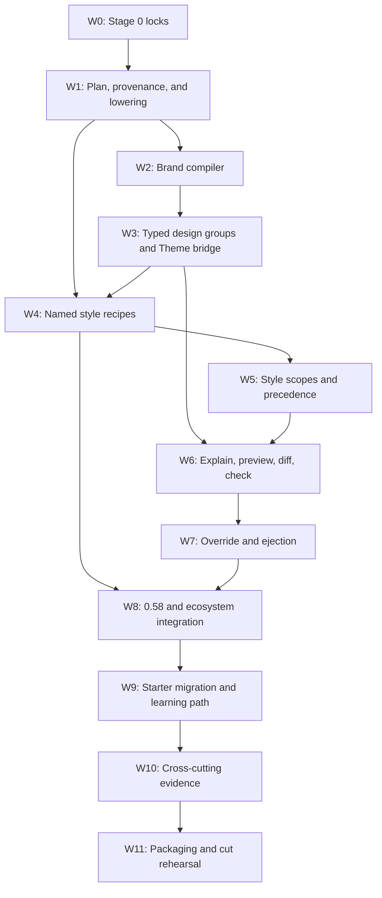

# Implementation plan: phase 0.59 progressive styling authoring

**Status:** Conditionally Stage 0 Refined; implementation blocked on predecessor audit  
**Decision/RFC:** D-103 / D-104 / [RFC-0086](../rfcs/RFC-0086-PROGRESSIVE-STYLING-AUTHORING.md)  
**Target:** `v0.59.0`  
**Required predecessor:** Published/Verified in-tree `v0.58.0` (not yet satisfied)  
**Runtime changes authorized now:** none

D-104 freezes public names, signatures, schemas, diagnostic families, numeric budgets, host
dispositions, tracking, starter adoption, and evidence commands against the shipped 0.57 runtime
plus D-102's exact 0.58 contracts. Because 0.58 is not implemented, no Stage 1 work may begin until
Published/Verified `v0.58.0` exists and W0 records a no-drift predecessor audit or an accepted D-104
amendment.

## Consume shipped authorities; do not fork

| Existing authority | 0.59 use |
|---|---|
| `Theme`, `default_theme`, `aurora_theme`, `Theme.extend` | Resolved theme and compatibility authority |
| `compile_palette`, contrast/theme validation | Seed and measurable accessibility foundations |
| `hedron_core.builtins.appearance` | Closed recipe vocabulary and stable markers |
| Built-in component props and 0.57 first-party CSS | Recipe lowering and default presentation |
| `StyleSymbols`, component `styles.css`, style contracts | Advanced component customization/ejection |
| CSS AST compiler and cascade-layer build | Deterministic external output |
| Asset manifest, CSP, egress, provenance | Fonts/images/styles policy and explanation |
| CLI `theme check`, `style check`, Explorer services | Shared check/preview/diff projections |
| 0.58 feature explanation, named surfaces, ejection | Style linkage and generated-surface integration |
| AppScenario/conformance/simulation/browser harnesses | Portable and end-to-end evidence |

There is no parallel theme registry, CSS-in-Python property language, runtime style injector,
selector generator, design editor runtime, or browser state store.

## Dependency order



W2–W3 produce the first useful vertical slice: create a branded design, compile it to `Theme`,
register it, build, and render a representative page. W4–W5 add reuse and local graduation only
after the base lowering is stable. Tooling consumes the shared plan rather than reconstructing it.

## W0 — Stage 0 contract packet

D-104 performs an early conditional Stage 0 refine. When Published/Verified in-tree `v0.58.0`
exists, W0 inventories the final generated-surface and explanation/ejection seams and compares them
to this packet before unlocking Stage 1.

| Planned artifact | Locks |
|---|---|
| `styling-authoring-inventory-059.toml` | Symbols, modules, maturity, groups, recipe families, CLI |
| `styling-lowering-059.toml` | Facade → Theme/props/markers/style-contract/build mapping and forbidden authorities |
| `design-system-schema-059.toml` | Versioned plan, provenance, diff, and explanation fields |
| `styling-brand-059.toml` | Trusted inputs, palette outputs, modes, failure/remediation behavior |
| `style-recipe-catalog-059.toml` | Families, compatible components, values, inheritance, 0.58 semantic roles |
| `styling-precedence-059.toml` | Explicit prop/recipe/scope/design/theme/base conflict rules |
| `styling-host-disposition-059.toml` | Core/FastAPI/Flask/Django/Jinja/elements/sim/conformance claims |
| `styling-visual-matrix-059.toml` | Gallery fixtures, engines, modes, viewports, delta policy |
| `styling-starter-docs-059.toml` | Every styling starter and required highest abstraction |
| `styling-budgets-059.toml` | Reject-not-slice counts, bytes, p95, ratios, unused-cost locks |
| `styling-security-059.toml` | Trusted inputs, CSP/assets, static tooling, ejection, semantic boundaries |
| `styling-tracking-059.toml` | Workstream/issue/gate ownership and accepted destinations |
| `styling-predecessor-audit-059.toml` | Final 0.58 seam comparison and explicit Stage 1 unlock |
| `upgrade-fixtures-059.md` | Final 0.58 source/output fixtures and expected migration |
| `release-gate-0.59.toml` | Exact commands, evidence owners, states, and cut policy |

D-104 also freezes diagnostic namespaces, rejection behavior, maximum design groups, recipes,
inheritance depth, output size, build/preview budgets, ejection layout, public export tiers, and
optional dependency boundaries. It adds no runtime symbols and changes no package version.

## W1 — portable plan, provenance, and one lowering path

### Responsibilities

| Area | Responsibility |
|---|---|
| Portable design values | Frozen, serializable, import-light inputs and resolved plan |
| Compiler | Validate, resolve inheritance/defaults, produce one ordinary `Theme` and recipe plan |
| Provenance | Record preset, generated, inherited, override, recipe, scope, and ejected sources |
| Manifest bridge | Attach design facts to existing theme/build/catalog manifests without duplication |
| Explanation | Redacted static projection shared by Python, CLI, Explorer, and conformance |

### Required invariants

- Compilation is pure over trusted configuration and performs no network, filesystem discovery,
  route invocation, component callback, request lookup, or registry mutation.
- Registration/build are explicit later steps and reuse current registry/build lifecycle.
- A resolved plan has a versioned schema and stable logical IDs independent of absolute paths,
  object identity, timestamps, and import order.
- Every output token/property records a source chain to a trusted input, preset, base theme, or
  deterministic compiler decision.
- Plans contain no raw callables, secret values, request data, arbitrary object `repr`, private
  selectors, or remote resource contents.
- The existing `Theme` is the emitted semantic token authority; the plan cannot override CSS after
  `Theme`/build compilation through a hidden channel.

### Tests

- deterministic serialization and fingerprints;
- schema unknown/missing/version behavior;
- no callback/network/registry side effects during compile/explain;
- provenance accuracy for defaults, generation, inheritance, explicit overrides, and recipes;
- differential plan→Theme→emitted-CSS facts;
- malicious names/values, deeply nested inputs, collisions, and optional-package absence.

## W2 — brand and coordinated mode compiler

### Pipeline

```text
trusted name + accent + optional finite choices
    → validate identifiers and seed color
    → derive semantic hue/neutral candidates
    → solve light token pairs against locked contrast targets
    → solve dark token pairs independently but coherently
    → derive focus/danger/border/muted/on-color pairs
    → record adjustments and provenance
    → run current theme/conformance validators
    → return resolved portable plan
```

### Required behavior

- One accent produces a complete result without raw token maps.
- Light and dark modes are compiled together; neither inherits an unrelated brand color silently.
- The compiler distinguishes the requested accent from an adjusted semantic accent and reports the
  delta/remediation.
- Algorithm v1 accepts only `#rgb` and `#rrggbb`; additional color formats require a later accepted
  contract and equivalent contrast/security behavior.
- Danger/success/warning/info meanings use locked semantic families and are not naively hue-rotated
  into indistinguishable or culturally asserted meanings.
- Focus tokens pass their separate target and remain visible in forced colors.
- Stable output does not depend on platform color libraries or browser interpolation.
- Unsupported/impossible combinations fail rather than shipping a visually similar but
  inaccessible fallback.

### Evidence corpus

- saturated, desaturated, near-white, near-black, red/green/blue, and boundary-ratio seeds;
- light/dark contrast and focus pair matrix;
- color-vision simulation as advisory evidence, never the only semantic proof;
- deterministic repeated compilation across supported Python versions;
- hostile strings and CSS breakout characters;
- snapshot review of representative seed families without accepting arbitrary visual drift.

## W3 — typed design groups and the `Theme` bridge

D-104 selects exact public types. The implementation must preserve these group boundaries:

| Group | Finite beginner values | Explicit escape |
|---|---|---|
| Color/brand | 3/6-digit hex seed | `Theme.tokens`/`modes`/`palette` |
| Typography | system stacks, scale/measure roles | registered font assets + token overrides |
| Geometry | square/soft/rounded family | validated `Theme.shape` values |
| Density | existing compact/comfortable/spacious | explicit component density |
| Elevation | flat/subtle/layered family | validated elevation map |
| Motion | standard/calm/none while honoring user preference | explicit motion tokens/scoped CSS |
| Navigation | compact/default/wide | validated navigation width |

### Theme interop

- `to_theme()` returns a fully resolved existing `Theme`.
- Existing themes may be used as a base/import without lossy reconstruction.
- Registration uses `register_theme_instance`/the existing registry lifecycle.
- `Hedron(theme="name")` remains valid; `theme=Theme(...)` registers/selects that Theme and
  `theme=DesignSystem(...)` lowers/registers/selects its Theme before the existing lifespan. No
  second app-state field becomes authority.
- `default_styles=False` rejects incompatible high-level assumptions or requires an explicit
  disposition. It is never silently re-enabled.
- Generated provenance metadata lives beside, not inside, CSS values when adding it would alter
  existing CSS hashes.

### Compatibility tests

- default/aurora theme outputs remain golden;
- existing `Theme.extend` maps and registration behavior remain unchanged;
- custom 0.58 themes import as bases and emit byte-equivalent CSS when no new choices are applied;
- app config/env theme selection and page/subtree theme selection keep precedence;
- duplicate/sealed registry, unknown theme, invalid values, and build failure behavior remain
  aligned with existing diagnostics.

## W4 — named, family-scoped style recipes

### Data model

Each recipe contains:

- stable name and compatible family;
- optional parent recipe within the same family;
- a finite mapping of existing semantic presentation fields;
- description and provenance safe for tooling;
- declared 0.58 facade roles where applicable;
- no CSS declarations, selectors, arbitrary class names, URLs, HTML, or callbacks.

D-104 locks control, surface, data, status, and content families. Field and layout recipes are
Deferred because their 0.57 component props do not provide a shared optional presentation surface
that can distinguish an omitted value from a legacy non-`None` default. Component compatibility
comes from `style-recipe-catalog-059.toml`, not duck-typing constructor parameter names.

### Resolution

1. Look up the recipe in the sealed design catalog.
2. Validate component/facade role compatibility.
3. Resolve bounded acyclic same-family inheritance.
4. Merge recipe values from weakest parent to strongest child.
5. Apply explicit component values last.
6. Feed the result through existing component constructors/appearance validators.
7. Emit existing markup and markers with recipe provenance in the static plan only.

### Tests

- every supported family/component/value combination;
- explicit-prop precedence and unchanged constructor defaults;
- unknown recipe, wrong family, cycles, depth, duplicate name, and conflicting aliases;
- no additional DOM, JS, asset, or runtime registry lookup after compile;
- equality between recipe-lowered output and hand-written existing props;
- 0.58 generated-surface semantic roles and per-surface override precedence;
- third-party component Supported/unsupported dispositions.

## W5 — explicit style scopes and precedence

### Locked boundary

D-104 selects a dedicated semantically neutral `StyleScope` that emits one explicit `div` with
`data-hedron-style-scope`. It accepts only registered `theme`, `color_mode=light|dark`, and existing
`density` values. The boundary has predictable inheritance, valid HTML, no landmark, and no
screen-reader or keyboard behavior. Scope recipe defaults, context variables, decorators,
thread-locals, implicit request scope, and descendant component mutation are forbidden.

### Required cases

- application design default with no scope;
- one compact data scope in a comfortable application;
- nested scope with one explicit child override;
- scoped built-in theme preview;
- fragment replacement preserving markers without lifecycle JavaScript;
- print, forced-color, RTL, long-content, and narrow-viewport behavior;
- ejection of the scope to explicit existing markers/props.

### Precedence proof

Machine-readable cases cover:

```text
explicit component/scoped CSS
    > explicit component recipe
    > nearest scope theme/density
    > design application default
    > resolved Theme
    > first-party baseline
```

Equal-level conflicts, incompatible recipes, missing recipes, and nested theme/scope
boundaries receive exact diagnostics rather than selector-specificity surprises.

## W6 — one explain/preview/diff/check toolchain

### Shared services

- plan query/filter and provenance lookup;
- semantic diff by token/group/recipe/scope/component impact;
- diagnostic execution using current theme, contrast, style-contract, asset, and CSP checks;
- finite gallery fixture assembly;
- JSON/text/SARIF where existing diagnostic serializers support them;
- Explorer view and static CLI artifact over the same services.

### Explain

Shows trusted inputs, generated/adjusted values, modes, groups, recipes, scopes, affected style
contracts, assets, limitations, and exact lowering. It does not expose secrets, callable reprs,
private selectors, or full filesystem paths.

### Diff

Compares semantic values and likely public component families, not minified CSS lines alone. It
separates input changes, compiler-derived changes, and emitted-output changes. Equivalent resolved
output produces an empty semantic diff.

### Preview

Uses the locked gallery and declared sample content only. It never mounts as a production route by
default and never imports application data. Explorer access retains current security modes. Static
output is project-local, fingerprinted, and safe to delete/regenerate.

### Check

Composes current `theme check`, `style check`, visual conformance, style-contract, asset/CSP, and
new design/recipe diagnostics rather than replacing or disagreeing with them.

## W7 — local override and safe ejection

### Ejection targets

| Target | Output |
|---|---|
| Whole design | Explicit resolved Theme + recipe definitions + manifest/source map/tests |
| Design group | Reviewable `Theme.extend` overrides with provenance comments |
| Recipe | Explicit compatible component props or public helper values |
| Scope | Existing explicit boundary markers/props |
| Component override | Owned `styles.css`, public symbols/parts/tokens contract, build registration |

### Safety

- project root is explicit and resolved;
- paths and logical names reject traversal, absolute escape, symlink escape, device names, and
  collisions;
- no overwrite without the existing explicit force contract;
- generated CSS uses only public style contracts and current AST compiler;
- no request/user/secret values or absolute source paths;
- repeated ejection is deterministic;
- generated source formats/imports/builds and passes the selected visual/contract parity scenario;
- partial ejection does not detach unrelated design groups from future high-level changes.

## W8 — 0.58 and ecosystem integration

### 0.58 surfaces

Freeze semantic roles for generated surfaces without coupling style to business behavior:

- screen/page surface and page header;
- primary/secondary/destructive actions;
- form and validation surface;
- data list/detail/editor surfaces;
- dashboard metric/data/chart panels;
- task status/result states;
- auth form and generic failure state;
- upload form/progress/result states.

Generated surfaces inherit design defaults/roles. Existing named surface and explicit prop
overrides win. Styling cannot change route, effect, security, storage, worker, or authorization
facts. Feature explanation references style-plan logical IDs.

### Package matrix

Inventory `hedron-core`, `hedron`, data, charts, maps, elements, extras, Jinja, Flask, Django,
Explorer, simulation, sample kit, notebook, conformance, and remote/portable projections as:

- native consumer of portable design/recipe contract;
- compiled-theme/marker consumer only;
- explicit adapter spelling;
- preview-only;
- unsupported with reason and destination.

No optional package becomes a transitive flagship dependency merely to participate in preview or
recipe catalogs.

## W9 — starter migration and progressive learning path

D-104 freezes `styling-starter-docs-059.toml` with every maintained:

- root/flagship/package README first app;
- getting-started page and beginner cookbook/recipe;
- minimal or golden-path single-file example;
- theme and zero-application-CSS tutorial;
- 0.58 generated scaffold and scaffold snapshot;
- affected package quick start;
- sample-kit/notebook/simulator beginner example.

Each entry records its current styling level, applicable 0.59 abstraction, migration owner,
purpose, and any accepted exception. `DX-059` fails when an inventoried starter teaches raw token
maps, repeated appearance bundles, or scoped CSS first despite an applicable higher abstraction.

Required teaching sequence:

1. built-in theme;
2. branded design from a small trusted input set;
3. one repeated intent extracted to a named recipe;
4. explain and preview;
5. one local scope or override;
6. eject one recipe/group;
7. resolved `Theme`, appearance props, style contracts, scoped CSS, and cascade layers.

Historical release notes and upgrade fixtures retain historical code. Documents whose purpose is
the primitive layer remain, but carry Advanced/Explicit/Lower-level/Under-the-hood labeling and
link back to the beginner route.

## W10 — cross-cutting evidence

### Accessibility

- locked contrast/focus matrices for generated and overridden light/dark pairs;
- keyboard focus visibility and order;
- screen-reader semantics and non-color/non-motion state communication;
- forced colors, reduced motion, print, RTL, 200% zoom, user text spacing, long content, narrow
  viewport, and OS/system preference behavior;
- preview itself is navigable, labeled, and not color-only.

### Security/CSP/privacy

- CSS breakout, selector injection, hostile token/recipe/name, URL/font/import, and resource-policy
  corpus;
- no request/user data path to CSS values or identifiers;
- no callbacks/network during compile/explain/preview/diff;
- strict `style-src 'self'`, no inline style requirement, external fingerprinted assets;
- private selector rejection and public style-contract enforcement;
- ejection traversal/symlink/overwrite/collision/secret/absolute-path tests.

### Visual/browser

- Chromium, Firefox, and WebKit at locked desktop/mobile sizes;
- default, aurora, representative generated brands, recipes, nested scope, and explicit override;
- controlled screenshot diff policy with semantic/DOM/computed-style facts beside pixels;
- HTMX fragment replacement and no-JS/native-page behavior.

### Performance

- cold/warm design compile and app build;
- emitted CSS/manifest delta;
- recipe resolution and page render overhead;
- static explanation/diff/preview size and latency;
- no asset/import overhead when only built-in themes or no 0.59 APIs are used;
- reject-not-slice ceiling behavior.

### Regression/upgrade

- final 0.58 theme, appearance, style-symbol, CSS build, theme-gallery, zero-CSS, and starter
  fixtures;
- existing explicit Theme/scoped-CSS applications unchanged;
- imported custom theme → design base → equivalent emitted output;
- 0.58 generated/ejected surfaces before and after design adoption;
- uninstall/rollback path leaves explicit styling usable.

## W11 — packaging and release rehearsal

- freeze public exports and Beta tiers without accidental stable-tier expansion;
- build clean wheels for every affected package;
- test optional dependencies present/absent and import-time isolation;
- install and run migrated 0.58 scaffolds plus branded-design and recipe examples;
- verify packaged first-party CSS, schemas, galleries, templates, and ejection resources;
- run all fifteen exact gate commands from `release-gate-0.59.toml`;
- update release metadata, status, compatibility, changelogs, upgrade docs, and registry truth only
  after all gates Verify;
- do not tag or upload without separate release authorization.

## Gate-to-workstream traceability

| Gate | Primary workstreams |
|---|---|
| `CONTRACT-059` | W0–W1 |
| `LOWER-059` | W1, W3–W5 |
| `BRAND-059` | W2 |
| `THEME-059` | W3 |
| `RECIPE-059` | W4 |
| `SCOPE-059` | W5 |
| `TOOLING-059` | W6 |
| `EJECT-059` | W7 |
| `A11Y-059` | W2–W6, W10 |
| `CSP-059` | W1–W7, W10 |
| `VISUAL-059` | W6, W8, W10 |
| `ADAPTER-059` | W8 |
| `REGRESS-059` | W3–W10 |
| `DX-059` | W6–W9, including complete starter inventory/migration |
| `PKG-059` | W11 |

## Cut strategy

The phase is intentionally vertical:

1. compile one brand to one existing Theme;
2. prove accessible coordinated modes and deterministic build output;
3. add typed design groups and Theme import/export compatibility;
4. add one control and one surface recipe end to end;
5. add explicit scope precedence;
6. ship shared explain/preview/diff/check;
7. prove partial ejection and 0.58 integration;
8. migrate all starter styling paths;
9. complete cross-package evidence and release rehearsal.

No later slice may compensate for a second styling authority in an earlier slice. If the first
vertical slice cannot lower cleanly to current `Theme` and build contracts, Stage 1 stops and the
RFC is revised before recipes or scopes are implemented.
