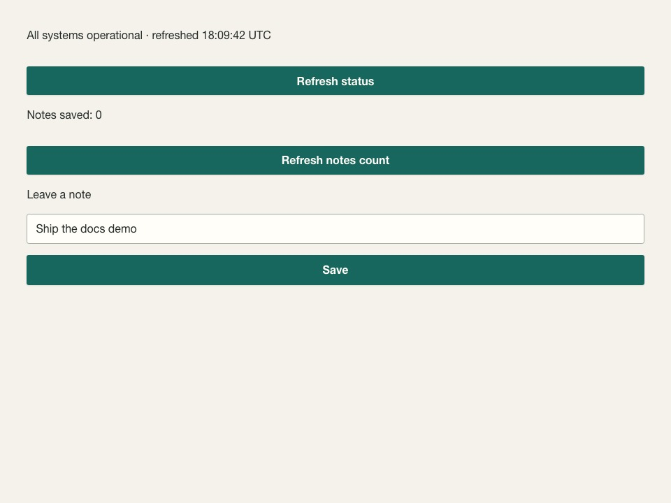

---
hide:
  - navigation
  - toc
---

<div class="hedron-hero" markdown>

<div class="hedron-eyebrow">Python-first UI framework · v0.24.0</div>

# Build typed FastAPI UIs in Python.<br><span class="hedron-gradient-text">HTMX fragments, no Node.</span>

Typed pages and HTMX fragment regions on FastAPI — CSRF profiles, DI, and multi-worker
job status without assembling a hand-rolled Jinja+HTMX stack.
{ .hedron-lede }

Unlike Streamlit’s script-rerun model, Hedron returns components from FastAPI routes and
swaps HTML fragments in place.
{ .hedron-lede }

**Often ~5–10 minutes** after Python and uv/pip are ready: install → `hedron new` →
open localhost:8000 → **Hello from hedron new** → click **Refresh status**.
{ .hedron-lede }

<div class="hedron-actions" markdown>
[Get started](getting-started/quickstart.md){ .md-button .md-button--primary }
[Try in Codespaces](examples/try-it.md){ .md-button }
[Why Hedron](guides/why-hedron.md){ .md-button }
</div>

<div class="hedron-signal-row">
  <span>Python 3.11–3.14</span>
  <span>FastAPI + HTMX</span>
  <span>No Node build</span>
</div>

</div>

## From zero to a rendered page

Prefer a clean virtualenv (Supported pins: FastAPI `>=0.141.1,<0.142`, Pydantic
`>=2.13.4,<2.14`). Pin production installs with `hedron>=0.24.0,<0.25`.

=== "uv (recommended)"

    Install [uv](https://docs.astral.sh/uv/getting-started/installation/) if needed
    (`curl -LsSf https://astral.sh/uv/install.sh | sh` on macOS/Linux).

    ```bash
    uvx --from "hedron>=0.24.0,<0.25" hedron new my-hedron-app
    cd my-hedron-app
    uv sync
    uv run uvicorn app:app --reload
    ```

=== "pip (venv)"

    ```bash
    python3 -m venv .venv && source .venv/bin/activate
    python -m pip install "hedron>=0.24.0,<0.25" "uvicorn[standard]"
    python -m hedron new my-hedron-app
    cd my-hedron-app && python -m pip install -e .
    uvicorn app:app --reload
    ```

!!! note "Install pin"

    Prefer a clean virtualenv — Hedron requires FastAPI `>=0.141.1,<0.142`
    (see [troubleshooting](guides/troubleshooting.md)). Pip needs two installs (CLI, then
    `pip install -e .` inside the scaffold) — [FAQ](guides/faq.md#why-install-hedron-twice-cli-then-project).

Open [http://127.0.0.1:8000](http://127.0.0.1:8000). You should see **Hello from hedron new**.
Click **Refresh status** — the page updates without a full reload. Hedron returns a small
HTML fragment; [HTMX](https://htmx.org) swaps it into the declared region.

### Try it (simulated)

=== "Demo"

    Docs simulation — no live server. Click **Refresh status** to swap the fragment.

    <!-- hedron-sim:hello-refresh -->

=== "Code"

    What `hedron new` writes as `app.py` (the real app, not the docs simulator):

    ```python title="app.py"
    import os
    from datetime import UTC, datetime

    from hedron import Hedron, Page, RefreshButton, Stack, Text, html, swap

    app = Hedron(
        title="Hedron App",
        security="standard",
        explorer="off",
        session_secret=os.environ.get("HEDRON_SESSION_SECRET", "replace-in-production"),
    )

    status = app.region("service-status", description="Live status panel")


    def status_panel():
        stamp = datetime.now(UTC).strftime("%H:%M:%S UTC")
        return html.div(
            Text(f"All systems operational · refreshed {stamp}"),
            id=status.id,
            role="status",
            aria={"live": "polite"},
        )


    @app.page("/")
    def home() -> Page:
        return Page(
            Stack(
                Text("Hello from hedron new"),
                status_panel(),
                RefreshButton.for_region(status, href="/status", label="Refresh status"),
            ),
            title="Home",
        )


    @app.fragment("/status", region=status)
    def refresh_status():
        return swap(status_panel())
    ```

`session_secret` and `security="standard"` appear even in Hello because sessions and CSRF
defaults are on by design — override via `HEDRON_SESSION_SECRET` in real apps.

Extras and troubleshooting: [installation](getting-started/installation.md).

## Beyond Hello — notes form

After [HTMX interactions](guides/htmx-interactions.md) and
[Minimal form](guides/minimal-form.md), the same scaffold posts a note with
`CsrfField()` and increments **Notes saved: N**:



## A backend-native way to build UI

<div class="hedron-grid">
  <div class="hedron-card">
    <span class="hedron-card__icon" aria-hidden="true">⌁</span>
    <strong>Typed composition</strong>
    <p>Compose pages from Python components and validated props. Your editor, type checker, and tests stay in the loop.</p>
  </div>
  <div class="hedron-card">
    <span class="hedron-card__icon" aria-hidden="true">ϟ</span>
    <strong>FastAPI + HTMX</strong>
    <p>Return full pages or targeted fragments from ordinary routes. Keep dependency injection, OpenAPI, and async I/O.</p>
  </div>
  <div class="hedron-card">
    <span class="hedron-card__icon" aria-hidden="true">◇</span>
    <strong>Secure-by-default boundaries</strong>
    <p>Contextual escaping, CSRF validation, safe URL types, and conservative cache behavior.</p>
  </div>
</div>

## Next steps

1. [Build your first app](getting-started/quickstart.md) — celebrate Refresh, then edit Hello
2. [What is HTMX](getting-started/what-is-htmx.md) → [HTMX interactions](guides/htmx-interactions.md)
3. [Minimal form POST](guides/minimal-form.md) — form updates the notes counter
4. [Learning path](getting-started/learning-path.md)

<details markdown>
<summary>Package maturity and production pins</summary>

Hedron **0.24.0** is published (Beta packages — pin `hedron>=0.24.0,<0.25`).
Most APIs are compatibility level `beta`; see [What’s ready](guides/whats-ready.md) for
Supported vs Experimental. Also: [Why Hedron](guides/why-hedron.md) ·
[Evaluate Hedron](guides/evaluate.md).
</details>

## Designed for inspectability

Hedron does not hide the web platform. It gives Python applications a typed component
model while preserving ordinary HTML, CSS, HTTP, and FastAPI boundaries. Automatic
choices (cache, Explorer, assets) are inspectable and overrideable; components become
HTTP endpoints only when you address them explicitly.

[Read the architecture](ARCHITECTURE.md) · [Runnable examples](examples/runnable.md) ·
[Public roadmap](guides/roadmap.md)
