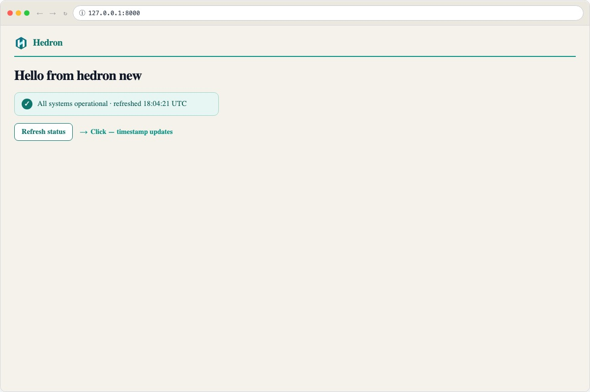

<div class="hedron-hero" markdown>

<div class="hedron-eyebrow">Python-first application platform · 0.58.0</div>

# Stay in Python. Build the whole application.

Move with the speed of Streamlit. Get the structure and composability teams reach for
React to provide—without creating a separate frontend stack.
{ .hedron-lede }

<div class="hedron-actions" markdown>
[Build your first app](getting-started/quickstart.md){ .md-button .md-button--primary }
[Migrate from Streamlit](guides/streamlit-migration.md){ .md-button }
[Evaluate Hedron](guides/evaluate.md){ .md-button }
</div>

Typed interfaces. Explicit interactions. Production-ready application architecture.
All in Python.
{ .hedron-proof }

<div class="hedron-signal-row">
  <span>Typed Python UI</span>
  <span>FastAPI foundation</span>
  <span>Server-driven interactions</span>
</div>

<div class="hedron-choice-grid">
  <a class="hedron-choice" href="guides/streamlit-migration/">
    <span>Coming from Streamlit</span>
    <strong>Keep Python. Gain application structure.</strong>
    <p>Move one workflow at a time from script reruns to explicit state, actions, and routes.</p>
  </a>
  <a class="hedron-choice" href="guides/why-hedron/">
    <span>Considering React</span>
    <strong>Keep composability. Skip the split stack.</strong>
    <p>Build reusable interfaces without creating a second frontend application and toolchain.</p>
  </a>
</div>

<div class="hedron-quickstart-label">Create an app in about 10 minutes</div>

About 10 minutes after Python 3.11+ and uv (or pip) are ready:

```bash
# Need uv? https://docs.astral.sh/uv/
uvx --from "hedron>=0.58.0,<0.59" hedron new my-hedron-app
cd my-hedron-app && uv sync && uv run uvicorn app:app --reload
# Open http://127.0.0.1:8000 and click Refresh status
```

Release status: [Current release and support](guides/current-release.md). Pins and extras:
[Installation](getting-started/installation.md). Before production:
[What’s ready](guides/whats-ready.md).

{ .hedron-hero-shot }

</div>

## Choose your starting point

Start with the path that matches the application you have today.

<div class="hedron-path">
  <a href="getting-started/quickstart/">
    <strong>Start a new application</strong>
    Scaffold a working FastAPI app, run it, and change your first screen.
  </a>
  <a href="guides/streamlit-migration/">
    <strong>Move beyond Streamlit</strong>
    Check fit, map state, convert a workflow, and plan an incremental cutover.
  </a>
  <a href="guides/plain-fastapi/">
    <strong>Add Hedron to FastAPI</strong>
    Mount typed pages and interactions beside routes you already operate.
  </a>
  <a href="guides/evaluate/">
    <strong>Evaluate for production</strong>
    Review maturity, security, ownership, deployment, and upgrade expectations.
  </a>
</div>

Using Flask, Django, VS Code, or Posit Workbench? [Choose your host and environment](getting-started/index.md#choose-your-path).
Need a focused pattern or fix? Open the [Cookbook](guides/cookbook.md) or [Troubleshooting](guides/troubleshooting.md).

## Python velocity, application architecture

<div class="hedron-grid">
  <div class="hedron-card">
    <span class="hedron-card__icon" aria-hidden="true">ϟ</span>
    <strong>FastAPI-native foundation</strong>
    <p>Keep dependency injection, OpenAPI, async I/O, ordinary routes, and explicit request boundaries.</p>
  </div>
  <div class="hedron-card">
    <span class="hedron-card__icon" aria-hidden="true">⌁</span>
    <strong>Composable Python UI</strong>
    <p>Build screens from typed components and validated props. Your editor, type checker, and tests stay in the loop.</p>
  </div>
  <div class="hedron-card">
    <span class="hedron-card__icon" aria-hidden="true">◇</span>
    <strong>Production-minded boundaries</strong>
    <p>Contextual escaping, CSRF validation, safe URL types, and conservative cache behavior.</p>
  </div>
  <a class="hedron-card" href="guides/streamlit-migration/">
    <span class="hedron-card__icon" aria-hidden="true">→</span>
    <strong>Grow without a rewrite</strong>
    <p>Convert one Streamlit workflow at a time or start with a structure designed to grow from day one.</p>
  </a>
</div>

## Next steps

1. [Build your first app](getting-started/quickstart.md) — celebrate Refresh, then edit Hello
2. [What is HTMX?](getting-started/what-is-htmx.md) — understand regions and HTML swaps
3. [HTMX interactions](guides/htmx-interactions.md) — add a second region
4. [Minimal form POST](guides/minimal-form.md) — form updates the notes counter
5. [Learning path](getting-started/learning-path.md)

Already building? Jump to the [Cookbook](guides/cookbook.md) for focused snippets or
[Troubleshooting](guides/troubleshooting.md) for symptom-first fixes.

<details markdown>
<summary>Package maturity and production pins</summary>

Hedron’s flagship and host-adapter packages are Beta. The latest installable PyPI pin is
`hedron>=0.58.0,<0.59`; the repository’s living tip is the published `0.58.x` train.
For production adoption, continue with
[What’s ready](guides/whats-ready.md) and [Evaluate Hedron](guides/evaluate.md).
</details>

## What you get (after Hello)

Typed pages and HTMX fragment regions on FastAPI, with CSRF profiles, dependency
injection, and multi-worker job status — without assembling a hand-rolled Jinja+HTMX
stack. See [Architecture](ARCHITECTURE.md).

## Designed for inspectability

Hedron does not hide the web platform. It gives Python applications a typed component
model while preserving ordinary HTML, CSS, HTTP, and FastAPI boundaries. Automatic
choices (cache, Explorer, assets) are inspectable and overrideable; components become
HTTP endpoints only when you address them explicitly.

[Read the architecture](ARCHITECTURE.md) · [Runnable examples](examples/runnable.md) ·
[What’s next](guides/whats-next.md)
